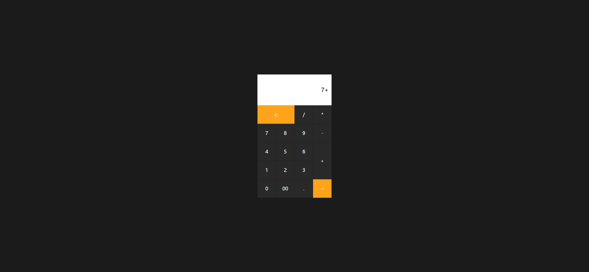

# Task Description: Calculator Webpage

Your job is to design a webpage that functions as a simple calculator. The calculator should have a user interface that allows basic arithmetic operations such as addition, subtraction, multiplication, and division. Below are the detailed requirements and resources needed to re-implement the webpage.

## Initial Webpage

The initial webpage should look like this:

This screenshot is rendered under a resolution of 1920x1080.

## Layout and Styling

1. **Body**:
   - The body should be centered both horizontally and vertically.
   - Use the `sans-serif` font family for all text.
   
2. **Calculator Form**:
   - Use the class name `calculator` for the form element.
   - The form should be displayed as a grid.

3. **Display Input**:
   - Use the class name `value` for the input element.
   
4. **Buttons**:
   - Use the class name `num` for all button elements.
   

## Interactions

### Clear Button
- Use class name `clear` for the clear button.
- Clicking this button should clear the input field.

### Number Buttons
- Use class name `num` for all number buttons.
- Clicking a number button should append the corresponding number to the input field.

### Operator Buttons
- Use class name `num` for all operator buttons.
- Clicking an operator button should append the corresponding operator to the input field.

### Equal Button
- Use class name `equal` for the equal button.
- Clicking this button should evaluate the expression in the input field and display the result.

## Screenshots of Interactions

2. **After Clicking 7**:
   
3. **After Clicking Plus**:
   
4. **After Clicking 8**:
   
5. **After Clicking Equal**:
   
5. **After Clicking Clear**:
   

These screenshots are rendered under a resolution of 1920x1080.

## Resources

- **Text Content**:
  - The text content for the buttons should be as follows:
    - Clear button: `c`
    - Division button: `/`
    - Multiplication button: `*`
    - Subtraction button: `-`
    - Addition button: `+`
    - Equal button: `=`
    - Number buttons: `0, 1, 2, 3, 4, 5, 6, 7, 8, 9, 00`
    - Decimal button: `.`

Follow these guidelines to re-implement the calculator webpage. Good luck!
