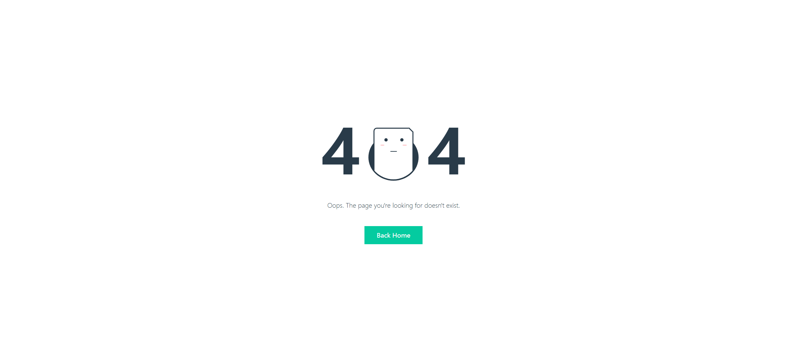
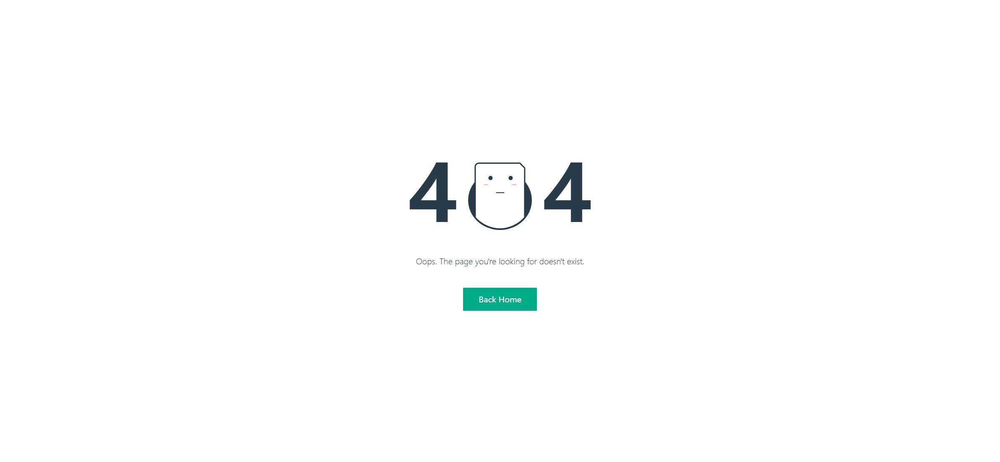

# Task Description for Re-implementing a 404 Error Page

Your job is to design a webpage that replicates a 404 error page with specific visual and interactive elements. The provided screenshots are rendered under a (1920, 1080) resolution.

## Initial Webpage

The initial webpage should look like this:

### Layout and Elements

1. **Wrapper**: 
   - Use a `div` with class `wrapper` to contain all elements.
   - The wrapper should be centered both vertically and horizontally.

2. **Error Section**:
   - Use a `div` with class `error` to contain the error message.
   - Inside the error section, there should be two `div` elements with class `number` displaying the number "4".
   - Between the two numbers, there should be an illustration.

3. **Illustration**:
   - Use a `div` with class `illustration` to contain the illustration.
   - Inside the illustration, there should be:
     - A `div` with class `circle`.
     - A `div` with class `clip` containing:
       - A `div` with class `paper` containing:
         - A `div` with class `face` containing:
           - A `div` with class `eyes` containing two `div` elements with classes `eye eye__left` and `eye eye__right`.
           - Two `div` elements with classes `cheeks cheeks__left` and `cheeks cheeks__right`.
           - A `div` with class `mouth`.

4. **Text**:
   - Use a `div` with class `text` to display the message: "Oops. The page you're looking for doesn't exist."

5. **Button**:
   - Use an `a` element with class `button` and text "Back Home".
   - The button should link to the homepage (use `href="#"`).

### Styling

- Ensure the following styles are applied:
  - **Body and HTML**: Set height to 100% and remove margins.
  - **Font**: Use "Lato" font-family, sans-serif.
  - **Wrapper**: Centered using flexbox.
  - **Error Section**: Flexbox layout with space between elements.
  - **Illustration**: Positioned elements to create the face illustration.
  - **Animations**: Blinking eyes using keyframes.

### Interaction

- **Hover Effect on Button**:
  - When hovering over the button, the background color should change.

## Interaction Screenshots

### After Hovering Over the Button

### Additional Notes

- Ensure all elements are styled and positioned as described.
- Use the specified class names and IDs for elements to ensure proper functionality and styling.
- The face illustration should have animated blinking eyes.
- The button should have a hover effect changing its background color.

By following this description, you should be able to re-implement the 404 error page accurately.
