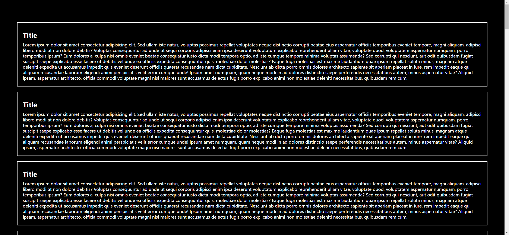
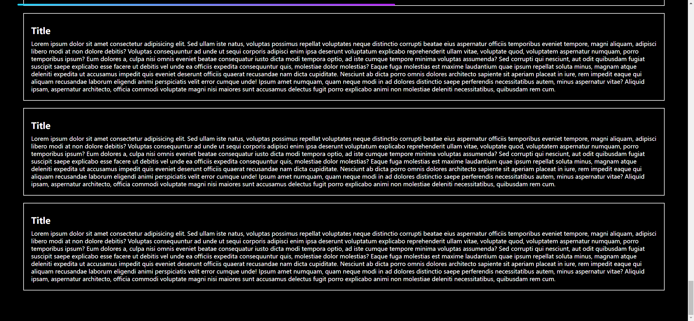

# Task Description: Implement a Webpage with a Scroll Indicator

Your job is to design a webpage that includes a scroll indicator at the top. The scroll indicator will show the progress of the page scroll. The initial webpage should look like this:



## Requirements

1. **HTML Structure**:
    - The webpage should have multiple sections, each containing a title and a paragraph of text.
    - The text content for each section is:
      ```html
      <section>
        <h1>Title</h1>
        <p>Lorem ipsum dolor sit amet consectetur adipisicing elit. Sed ullam iste natus, voluptas possimus repellat voluptates neque distinctio corrupti beatae eius aspernatur officiis temporibus eveniet tempore, magni aliquam, adipisci libero modi at non dolore debitis? Voluptas consequuntur ad unde ut sequi corporis adipisci enim ipsa deserunt voluptatum explicabo reprehenderit ullam vitae, voluptate quod, voluptatem aspernatur numquam, porro temporibus ipsum? Eum dolores a, culpa nisi omnis eveniet beatae consequatur iusto dicta modi tempora optio, ad iste cumque tempore minima voluptas assumenda? Sed corrupti qui nesciunt, aut odit quibusdam fugiat suscipit saepe explicabo esse facere ut debitis vel unde ea officiis expedita consequuntur quis, molestiae dolor molestias? Eaque fuga molestias est maxime laudantium quae ipsum repellat soluta minus, magnam atque deleniti expedita ut accusamus impedit quis eveniet deserunt officiis quaerat recusandae nam dicta cupiditate. Nesciunt ab dicta porro omnis dolores architecto sapiente sit aperiam placeat in iure, rem impedit eaque qui aliquam recusandae laborum eligendi animi perspiciatis velit error cumque unde! Ipsum amet numquam, quam neque modi in ad dolores distinctio saepe perferendis necessitatibus autem, minus aspernatur vitae? Aliquid ipsam, aspernatur architecto, officia commodi voluptate magni nisi maiores sunt accusamus delectus fugit porro explicabo animi non molestiae deleniti necessitatibus, quibusdam rem cum.</p>
      </section>
      ```
    - Repeat the above section structure 30 times.

2. **CSS Styling**:
    - The scroll indicator should be a fixed element at the top of the page with a gradient background.

3. **JavaScript Functionality**:

    - The scroll indicator should update its width based on the scroll progress of the page.

4. **Scroll Indicator**:
    - The scroll indicator should be a fixed element at the top of the page.
    - It should have a class name `scroll-indicator` and contain a child element with class name `progress`.
    - The width of the `progress` element should update dynamically as the user scrolls down the page.

## Interaction

- When the user scrolls the page, the scroll indicator should update to reflect the scroll progress.
- The final webpage after scrolling should look like this:



## Additional Information

- The provided screenshots are rendered under a resolution of 1920x1080.
- The scroll indicator should have a smooth transition effect when updating its width.
