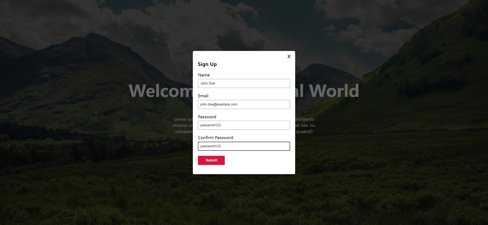

Your job is to design a webpage that includes a header section with a welcome message and a "Sign Up" button, which triggers a modal popup form when clicked. The initial webpage should be .

### Header Section
- The header should have a background image from the URL: `bg.png`.
- The header should contain a `div` with class `content-container` that centers its content both vertically and horizontally.
- Inside the `content-container`, there should be an `h1` element with the text "Welcome To The Real World".
- Below the `h1`, there should be a `p` element with the following text:
  ```
  Lorem ipsum dolor sit amet consectetur adipisicing elit. Error architecto minima unde minus laborum expedita eum inventore pariatur ab iste, hic voluptates enim odit reprehenderit aliquid est aut! Inventore, quaerat?
  ```
- There should be a button with class `cta-btn` and ID `open` that has the text "Sign Up".

### Modal Popup
- The modal should be contained within a `section` with class `modal-container` and ID `modal`. Initially, this section should be hidden.
- Inside the `modal-container`, there should be another `section` with class `modal`.
- The modal should have a close button with class `close-btn` and ID `close` that has the text "x".
- The modal should contain a `div` with class `modal-content`.
- Inside the `modal-content`, there should be an `h1` element with the text "Sign Up".
- Below the `h1`, there should be a `form` with class `modal-form` that contains the following fields:
  - A `div` containing a `label` for "Name" and an `input` with type `text`, ID `name`, placeholder "Enter Name", and class `form-input`.
  - A `div` containing a `label` for "Email" and an `input` with type `text`, ID `email`, placeholder "Enter Email", and class `form-input`.
  - A `div` containing a `label` for "Password" and an `input` with type `text`, ID `password`, placeholder "Enter Password", and class `form-input`.
  - A `div` containing a `label` for "Confirm Password" and an `input` with type `text`, ID `password2`, placeholder "Confirm Password", and class `form-input`.
  - An `input` with type `submit`, value "Submit", and class `submit-btn`.

### Interactions
- Clicking the "Sign Up" button should display the modal. The state after clicking the "Sign Up" button should be .
- The form fields should be filled with the following values:
  - Name: "John Doe"
  - Email: "john.doe@example.com"
  - Password: "password123"
  - Confirm Password: "password123"
  The state after filling the form should be .
- Clicking the close button should hide the modal. The state after closing the modal should be .

### Additional Notes
- The provided screenshots are rendered under a resolution of 1920x1080.
- The modal should have a smooth transition effect when appearing and disappearing.
- Clicking outside the modal should also close it.
- Use the following IDs and class names for elements:
  - Use ID `open` for the "Sign Up" button.
  - Use ID `modal` for the modal container.
  - Use ID `close` for the close button.
  - Use class name `content-container` for the container inside the header.
  - Use class name `cta-btn` for the "Sign Up" button.
  - Use class name `modal-container` for the modal container.
  - Use class name `modal` for the modal section.
  - Use class name `close-btn` for the close button.
  - Use class name `modal-content` for the content inside the modal.
  - Use class name `modal-form` for the form inside the modal.
  - Use class name `form-input` for the input fields inside the form.
  - Use class name `submit-btn` for the submit button inside the form.
