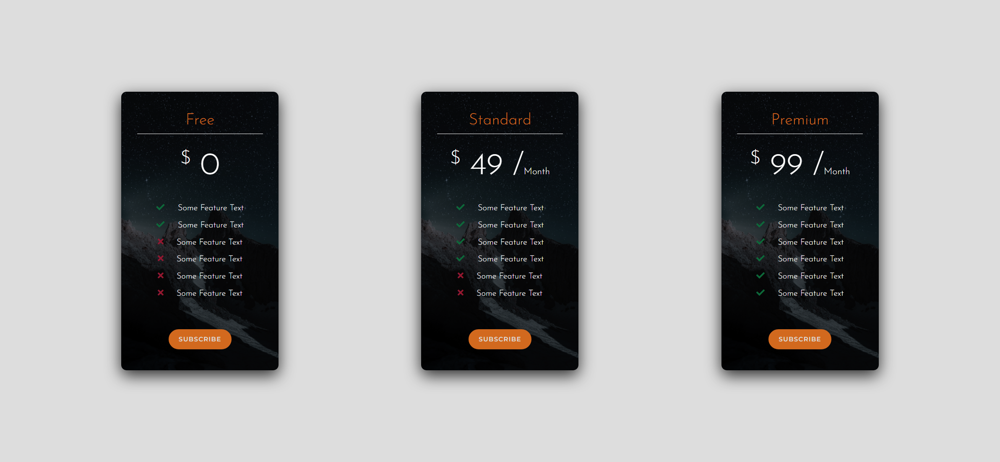

Your job is to design a webpage that displays pricing cards with different subscription plans. The webpage should have a responsive design and include hover effects on the cards. Below are the detailed instructions and resources needed to re-implement the webpage.

### Initial Webpage
The initial webpage should look like this:


### Resources
1. **Fonts**:
   - Use the Google Fonts `Josefin Sans` and `Montserrat`.
   - Include the following link in the `<head>` section of your HTML:
     ```html
     <link href="https://fonts.googleapis.com/css?family=Josefin+Sans:300,400,700|Montserrat:300,400,600" rel="stylesheet">
     ```

2. **Font Awesome**:
   - Use Font Awesome for the check and times icons.
   - Include the following link in the `<head>` section of your HTML:
     ```html
     <link rel="stylesheet" href="https://use.fontawesome.com/releases/v5.8.1/css/all.css" integrity="sha384-50oBUHEmvpQ+1lW4y57PTFmhCaXp0ML5d60M1M7uH2+nqUivzIebhndOJK28anvf" crossorigin="anonymous">
     ```

3. **Background Image**:
   
   - Use `images/bg.jpg` as the background image for the cards.

### Layout and Styling
- The webpage should have a container that takes up the full viewport height and width.
- Inside the container, there should be a wrapper for the cards that centers them both horizontally and vertically.
- Each card should have a header, body, and footer section.

#### Container
- Use class name `container` for the main container.

#### Cards Wrapper
- Use class name `cards-wrapper` for the wrapper that holds the cards.
- The wrapper should use flexbox to align the cards.

#### Card
- Use class name `card` for each card.
- The cards should have a background image (`images/bg.jpg`) with a linear gradient overlay.
- The cards should have a border-radius and a box-shadow.
- On hover, the cards should scale up and the box-shadow should become more pronounced.

#### Card Header
- Use class name `card-header` for the header section of each card.
- The header should include an `<h3>` tag for the plan name and an `<h1>` tag for the price.
- The plan name should use the `Josefin Sans` font and have a color of `chocolate`.

#### Card Body
- Use class name `card-body` for the body section of each card.
- The body should include a list of features, each with an icon indicating whether the feature is included or not.
- Use the `fas fa-check` class for included features and `fas fa-times` class for excluded features.

#### Card Footer
- Use class name `card-footer` for the footer section of each card.
- The footer should include a button with the text "Subscribe".
- The button should have a background color of `chocolate` and a border-radius

### Interactions
The following interactions were performed and screenshots were taken under a resolution of (1920, 1080):

3. **Hover over Free Card**:
   - The "Free" card was hovered over.
   - 

4. **Hover over Standard Card**:
   - The "Standard" card was hovered over.
   - 

### Text Content
- The text content for the cards is as follows:
  - **Free Plan**:
    - Price: `$0`
    - Features: 
      - Some Feature Text (included)
      - Some Feature Text (included)
      - Some Feature Text (excluded)
      - Some Feature Text (excluded)
      - Some Feature Text (excluded)
      - Some Feature Text (excluded)
  - **Standard Plan**:
    - Price: `$49 / Month`
    - Features: 
      - Some Feature Text (included)
      - Some Feature Text (included)
      - Some Feature Text (included)
      - Some Feature Text (included)
      - Some Feature Text (excluded)
      - Some Feature Text (excluded)
  - **Premium Plan**:
    - Price: `$99 / Month`
    - Features: 
      - Some Feature Text (included)
      - Some Feature Text (included)
      - Some Feature Text (included)
      - Some Feature Text (included)
      - Some Feature Text (included)
      - Some Feature Text (included)

### Additional Notes
- Ensure that the webpage is responsive and adjusts the layout for smaller screens.
- The hover effect should smoothly transition the card's scale and box-shadow.

By following these instructions, you should be able to re-implement the webpage with the same functionality and appearance.
