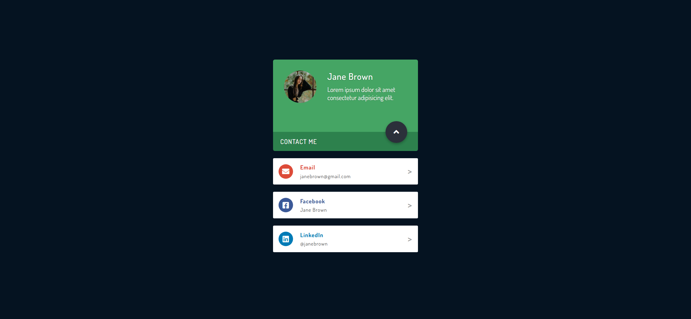

Your job is to design a webpage that displays a contact card for a person named Jane Brown. The webpage should have a button that, when clicked, reveals additional contact information. The initial webpage should be .

### Requirements

1. **HTML Structure**:
    - The webpage should have a `div` with class `container` that contains all the elements.
    - Inside the `container`, there should be a `div` with class `card`.
    - The `card` should contain:
        - A `div` with class `card-bio` that includes:
            - A `div` with class `img-wrapper` containing an `img` element with `src="images/person.jpg"` and `alt="Person"`.
            - A `div` with class `person-info` containing:
                - An `h3` element with the text "Jane Brown".
                - A `p` element with the text "Lorem ipsum dolor sit amet consectetur adipisicing elit."
            - A `button` with class `card-btn` containing:
                - A `span` with class `card-btn-contact` and the text "Contact Me".
                - An `i` element with class `fas fa-angle-up`.
        - A `div` with class `card-contact` containing an `h4` element with the text "Contact Me".
        - Three `div` elements with class `card-social` and additional classes `email`, `fb`, and `linkedin` respectively, each containing:
            - A `div` with class `icon-wrapper` containing an `i` element with appropriate classes for the icon.
            - A `div` with class `contact-details` containing:
                - An `h4` element with the appropriate contact method name.
                - A `p` element with the appropriate contact detail.
            - A `span` element with the text ">".
    - The contact details for each `card-social` div are:
        - Email: `janebrown@gmail.com`
        - Facebook: `Jane Brown`
        - LinkedIn: `@janebrown`

2. **CSS Styling**:
    - The webpage should use the font "Dosis" from Google Fonts.
    - The icons should be from Font Awesome.
    - The `person-info` should have specific font settings and colors.
    - The `card-btn` should have specific styles, including a transition effect.
    - The `card-contact` and `card-social` elements should have specific styles and transition effects.

3. **JavaScript Functionality**:
    - When the `card-btn` is clicked, it should toggle the class `change` on the `container`.
    - This will trigger animations to reveal the contact information.

4. **Resources**:
    - `images/person.jpg` is used for the profile picture.
    - The text content for the `person-info` paragraph is "Lorem ipsum dolor sit amet consectetur adipisicing elit."
    - The text content for the `card-contact` heading is "Contact Me".
    - The text content for the `card-social` elements are:
        - Email: `janebrown@gmail.com`
        - Facebook: `Jane Brown`
        - LinkedIn: `@janebrown`

5. **Interactions**:
    - The `card-btn` should have the class `card-btn`.
    - The `container` should toggle the class `change` when the `card-btn` is clicked.

The final webpage after clicking the "Contact Me" button should look like this: .

### Notes
- The provided screenshots are rendered under a resolution of 1920x1080.
- Ensure that all animations and transitions are smooth and match the provided screenshots.
