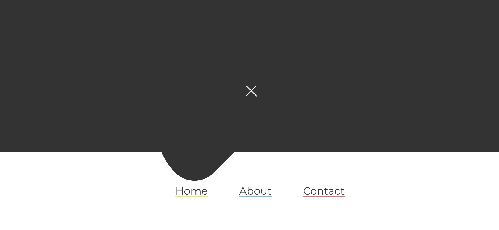
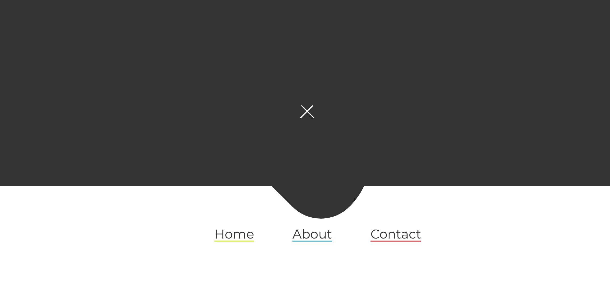
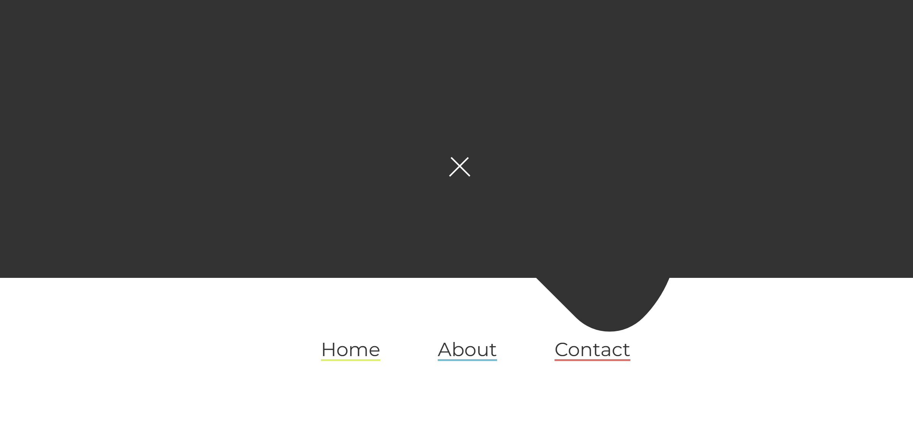

# Task Description: Re-implement the Pure CSS Gooey Menu Animation Webpage

Your job is to design a webpage that replicates the "Pure CSS Gooey Menu Animation" as described below. The webpage should have a hamburger menu that, when clicked, reveals a menu with three items: Home, About, and Contact. The menu items should have hover animations that move a background element.

The provided screenshots are rendered under a resolution of 1920x1080.

## Initial Webpage
The initial webpage should be a simple page with a hamburger menu icon centered on the screen. The initial webpage should look like this:

## Hamburger Menu
- The hamburger menu icon consists of three horizontal lines.
- When the hamburger menu is clicked, it should animate and rotate to form an "X" shape.
- The menu should slide up from the bottom of the screen, revealing three menu items: Home, About, and Contact.

## Menu Items
- The menu items should be centered horizontally and vertically within the menu container.
- When a menu item is hovered over, a background element should move to a specific position.

## Detailed Steps to Implement

1. **HTML Structure**:
    - Use a `<nav>` element with the class `menu__container` to contain the menu.
    - Inside the `<nav>`, include an `<input>` element of type `checkbox` with the ID `menu`.
    - Add a `<label>` element for the checkbox with a nested `
` element having the class `hamburger`.
    - Include an unordered list (`<ul>`) with the class `menu__list` containing three list items (`<li>`) with the class `menu__item`. Each list item should contain an anchor (`<a>`) element with the text "Home", "About", and "Contact" respectively.
    - Add a `
` element with the class `move__item` inside the `<ul>`.

2. **CSS Styling**:
    - Import the Montserrat font from Google Fonts.
    - Set the background to the Montserrat font.
    - Center the `menu__container` using CSS Grid.
    - Style the hamburger menu with three horizontal lines.
    - Add animations for the hamburger menu to rotate into an "X" shape when clicked.
    - Style the `menu__list` to slide up from the bottom of the screen when the hamburger menu is clicked.
    - Add hover animations for the menu items to move the `move__item` background element.

3. **Interactions**:
    - Clicking the hamburger menu should trigger the menu to slide up and reveal the menu items.
    - Hovering over each menu item should move the `move__item` background element to a specific position.

## Screenshots of Interactions

### After Clicking the Hamburger Menu
When the hamburger menu is clicked, the menu should slide up from the bottom, revealing the menu items. The webpage should look like this:

### Hovering Over "About" Menu Item
When hovering over the "About" menu item, the `move__item` background element should move to a specific position. The webpage should look like this:

### Hovering Over "Contact" Menu Item
When hovering over the "Contact" menu item, the `move__item` background element should move to a specific position. The webpage should look like this:

## Additional Details

- Use the ID `menu` for the checkbox element.
- Use the class name `menu__container` for the navigation container.
- Use the class name `hamburger` for the hamburger menu icon.
- Use the class name `menu__list` for the unordered list containing the menu items.
- Use the class name `menu__item` for each list item in the menu.
- Use the class name `move__item` for the background element that moves when hovering over menu items.

Ensure that all animations and transitions are smooth and visually appealing. The webpage should be responsive and work well on different screen sizes.
