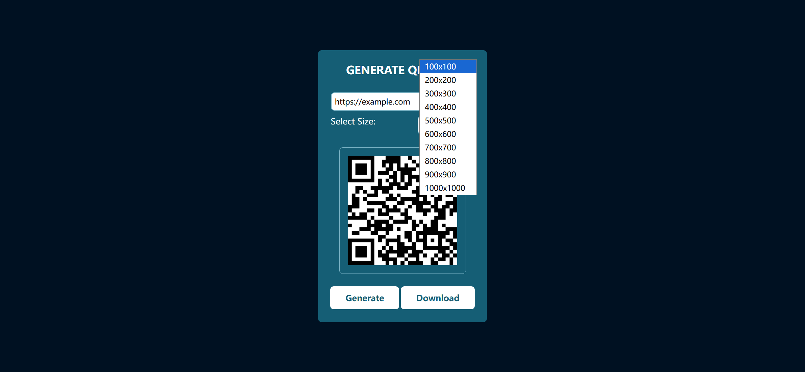

# Task Description: QR Code Generator Webpage

Your job is to design a webpage that allows users to generate and download QR codes. The webpage should have a user-friendly interface where users can input text or a URL, select the size of the QR code, generate it, and download it. Below are the detailed requirements and resources needed to re-implement the webpage.

## Initial Webpage
The initial webpage should look like this:


### Header
- The header should contain a title "Generate QR Code" with a font size of `26px`, centered text, and color `#fff`.
- Below the title, there should be an input field with a placeholder "Type your text or URL" and an ID `qr-text`.
- There should be a label "Select Size:" and a dropdown menu with an ID `sizes` containing the following options:
  - 100x100
  - 200x200
  - 300x300
  - 400x400
  - 500x500
  - 600x600
  - 700x700
  - 800x800
  - 900x900
  - 1000x1000

### Footer
- The footer should contain two buttons:
  - A "Generate" button with an ID `generateBtn`.
  - A "Download" button with an ID `downloadBtn` and a default download filename `QR_Code.png`.

### QR Code Display Area
- The QR code should be displayed in a div with a class `qr-body`.

## Interactions
### Enter Text
When the user enters text into the input field, it should look like this:


### Select Size
When the user selects a size from the dropdown menu, it should look like this:


### Generate QR Code
When the user clicks the "Generate" button, the QR code should be generated and displayed in the `qr-body` div. It should look like this:


## Resources
- The QR code generation is handled by the `qrcodejs` library. Include the following script in your HTML:
  ```html
  <script src="https://cdnjs.cloudflare.com/ajax/libs/qrcodejs/1.0.0/qrcode.min.js"></script>
  ```

## JavaScript Functionality
- The `generateBtn` should trigger the QR code generation.
- The `downloadBtn` should allow the user to download the generated QR code.
- Use the `qrcodejs` library to generate the QR code with the specified text and size.

## Screen Resolution
The provided screenshots are rendered under a resolution of 1920x1080.
