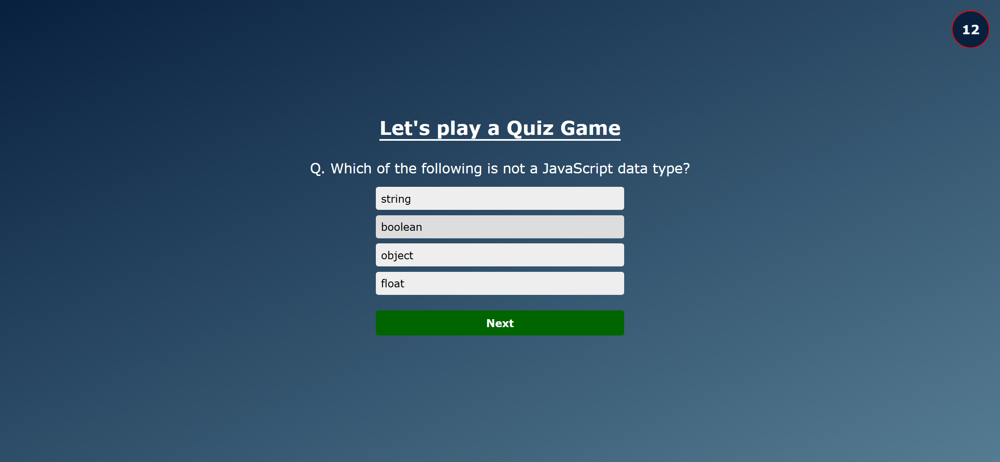
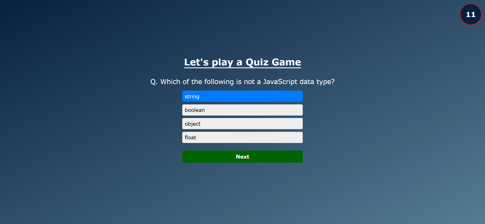
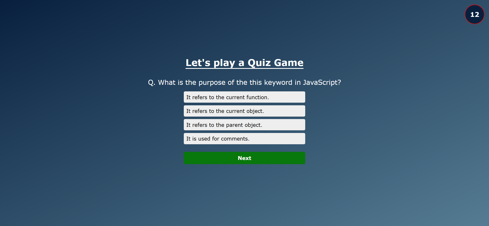

# Task Description for Re-implementing the Quiz App Webpage

Your job is to design a webpage that functions as a quiz application using HTML, CSS, and JavaScript. The webpage should have the following features and elements as described below. The provided screenshots are rendered under a resolution of 1920x1080.

## Initial Webpage
The initial webpage should look like this:

### Elements and Layout
1. **Alert Box**:
   - Use class name `alert` for the alert box.
   - Initially hidden and appears to show messages.

2. **Start Button**:
   - Use class name `startBtn` for the start button.
   - Text content: "Start".

3. **Container**:
   - Use class name `container` for the main container.
   - Initially hidden and becomes visible when the quiz starts.
   - Contains the quiz title, question, choices, next button, score card, and timer.

4. **Quiz Title**:
   - Use an `<h1>` tag inside the container.
   - Text content: "Let's play a Quiz Game".

5. **Question Box**:
   - Use class name `question` for the question box.

6. **Choices Box**:
   - Use class name `choices` for the choices box.
   - Each choice should be a `
` with class name `choice`.

7. **Next Button**:
   - Use class name `nextBtn` for the next button.
   - Text content: "Next".

8. **Score Card**:
   - Use class name `scoreCard` for the score card.

9. **Timer**:
   - Use class name `timer` for the timer.
   - Initially hidden and becomes visible when the quiz starts.

### Styles
- The font family should be Verdana, Geneva, Tahoma, sans-serif.
- The timer should have a pulsing animation.

### Interactions
1. **Start Button**:
   - Clicking the start button should hide the start button and display the container with the first question.
   - Screenshot after clicking start button:
     

2. **Selecting a Choice**:
   - Clicking on a choice should highlight it.
   - Screenshot after selecting a choice:
     

3. **Next Button**:
   - Clicking the next button should check the selected answer, show the next question, or display the score if the quiz is over.
   - Screenshot after clicking next button:
     

### Quiz Data
- The quiz should consist of an array of objects, each containing a question, choices, and the correct answer.
- Example questions:
  1. "Q. Which of the following is not a CSS box model property?"
     - Choices: ["margin", "padding", "border-radius", "border-collapse"]
     - Answer: "border-collapse"
  2. "Q. Which of the following is not a valid way to declare a function in JavaScript?"
     - Choices: ["function myFunction() {}", " let myFunction = function() {};", "myFunction: function() {}", "const myFunction = () => {};"]
     - Answer: "myFunction: function() {}"
  3. "Q. Which of the following is not a JavaScript data type?"
     - Choices: ["string", "boolean", "object", "float"]
     - Answer: "float"
  4. "Q. What is the purpose of the this keyword in JavaScript?"
     - Choices: ["It refers to the current function.", "It refers to the current object.", "It refers to the parent object.", " It is used for comments."]
     - Answer: "It refers to the current object."

### Animations
- Choices should have a fade-in animation when they appear.
- The timer should have a pulsing animation.

### Additional Requirements
- Ensure that the alert box displays messages for correct and incorrect answers.
- The timer should count down from 15 seconds for each question.
- If the timer reaches zero, prompt the user to restart the quiz.
