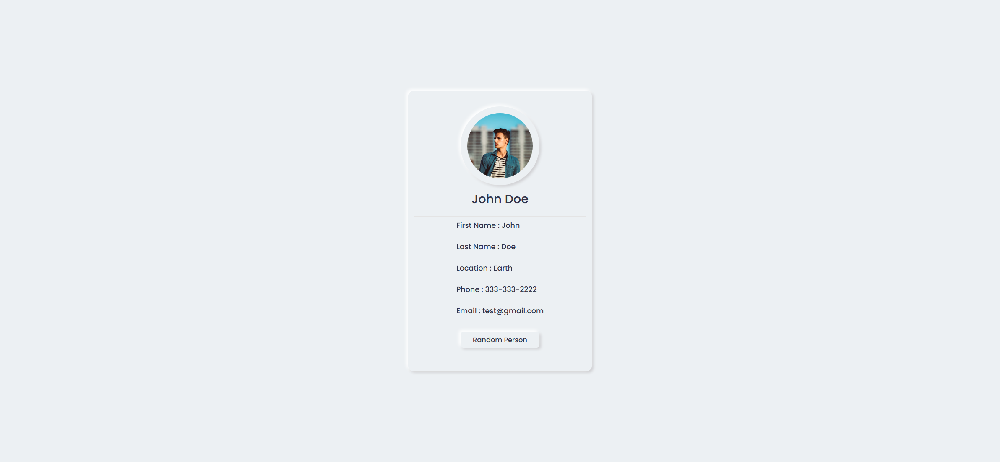
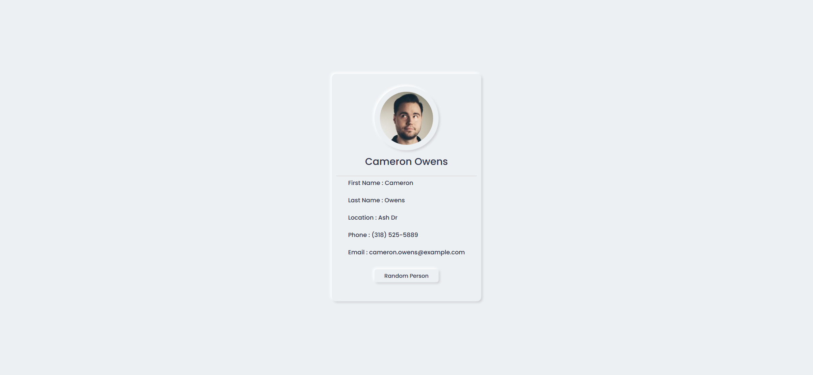

# Task Description: Re-implement the Random User Webpage

Your job is to design a webpage that displays a random user's information fetched from an API. The webpage should have a button that, when clicked, fetches and displays a new random user's information. The initial webpage should look like this:

## Requirements

### HTML Structure

1. **Wrapper Div**: 
   - Use a `div` with class `wrapper` to contain all elements.
   
2. **Image Area**:
   - Use a `div` with class `img-area` to contain the user's image.
   - Inside `img-area`, use another `div` with class `inner-area` to hold the `img` element.
   - The `img` element should have an ID `photo` and the initial source should be `resource1.png`.

3. **User Name**:
   - Use a `div` with ID `name` to display the user's full name. The initial text should be `John Doe`.

4. **Horizontal Line**:
   - Use an `hr` element with class `horizon` to separate the name from the other information.

5. **User Information**:
   - Use a `div` with class `info` to display the user's details.
   - Inside `info`, use `p` elements to display:
     - First Name: Use a `span` with ID `first` and initial text `John`.
     - Last Name: Use a `span` with ID `last` and initial text `Doe`.
     - Location: Use a `span` with ID `street` and initial text `Earth`.
     - Phone: Use a `span` with ID `phone` and initial text `333-333-2222`.
     - Email: Use a `span` with ID `email` and initial text `test@gmail.com`.

6. **Button**:
   - Use a `button` with ID `btn` and text `Random Person` to fetch a new random user.

### CSS Styling

- Use the Google Font `Poppins` for all text.
- The `inner-area` should be slightly smaller than `img-area` and also be a circle.
- The `img` inside `inner-area` should be fully contained and circular.

### JavaScript Functionality

- Use the provided JavaScript to fetch a random user from `https://randomuser.me/api/`.
- When the button with ID `btn` is clicked, fetch a new random user and update the following elements:
  - `name` with the user's full name.
  - `first` with the user's first name.
  - `last` with the user's last name.
  - `street` with the user's street name.
  - `phone` with the user's phone number.
  - `email` with the user's email.
  - `photo` with the user's picture.

### Interaction

- The initial webpage should look like the provided screenshot.
- When the button is clicked, the webpage should update to display a new random user's information. The updated webpage should look like this:

### Resources

- `resource1.png` is used for the initial user image.
- The text content for the initial user is:
  - Name: `John Doe`
  - First Name: `John`
  - Last Name: `Doe`
  - Location: `Earth`
  - Phone: `333-333-2222`
  - Email: `test@gmail.com`

### Notes

- The provided screenshots are rendered under a resolution of 1920x1080.
- Ensure that the elements have the correct IDs and class names as specified for auto-testing purposes.
