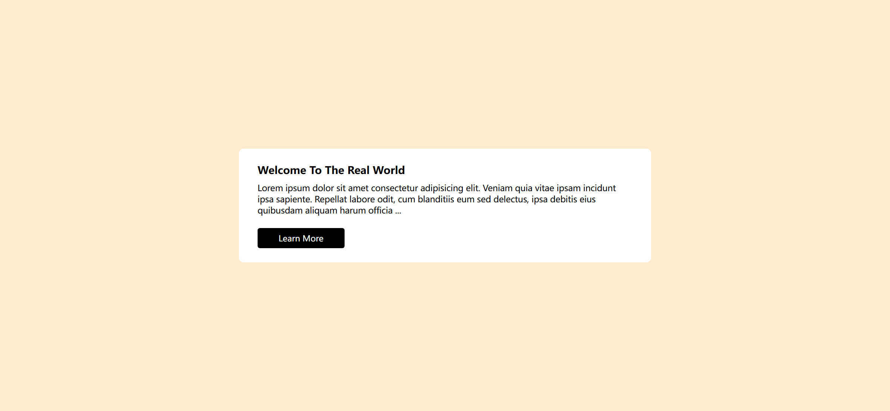
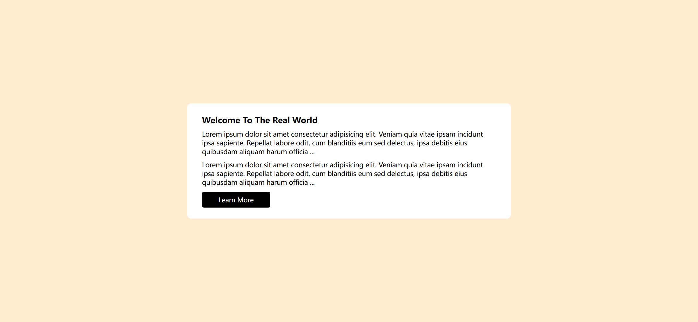

Your job is to design a webpage that features a "Read More / Read Less" functionality. The webpage should initially display a header with a title and a paragraph. Upon clicking the "Learn More" button, additional content should be revealed. Below are the detailed instructions to re-implement the webpage.

The initial webpage should be:



### HTML Structure

1. **Container**: Create a `div` with the class `container` to hold the content.
2. **Header**: Inside the container, create a `header` element.
3. **Title**: Inside the header, add an `h2` element with the text "Welcome To The Real World".
4. **Paragraphs**: Add two `p` elements with the class `para` inside the header.
   - The first paragraph should contain a `span` with the class `content-container-1` and the following text:
     ```
     Lorem ipsum dolor sit amet consectetur adipisicing elit. Veniam quia vitae ipsam incidunt ipsa sapiente. Repellat labore odit, cum blanditiis eum sed delectus, ipsa debitis eius quibusdam aliquam harum officia ...
     ```
   - The second paragraph should contain a `span` with the class `content-container-2` and the same text as above. Additionally, add a `button` with the class `btn` and the text "Learn More".

### CSS Styling

1. **Global Styles**: Apply the following styles globally:
   - Use `sans-serif` as the font-family.
2. **Body**: Style the `body` element with:
   - Background color of `blanchedalmond`.
   - Center content using flexbox.
6. **Hidden Content**: Initially hide the `content-container-2` class by setting `display` to `none`.

### JavaScript Functionality

1. **Toggle Content**: Use JavaScript to toggle the visibility of the `content-container-2` class when the button is clicked.
   - Select the `content-container-2` element and the button using `document.querySelector`.
   - Add a click event listener to the button that toggles the `toggle` class on the `content-container-2` element.

### Interaction

- When the "Learn More" button is clicked, the additional content should be revealed.
- The provided screenshots are rendered under a resolution of 1920x1080.

After clicking the "Learn More" button, the webpage should look like this:



### Element Identifiers

- Use class name `container` for the main container.
- Use class name `para` for the paragraphs.
- Use class name `content-container-1` for the first span.
- Use class name `content-container-2` for the second span.
- Use class name `btn` for the button.

By following these instructions, you should be able to recreate the webpage with the "Read More / Read Less" functionality.
