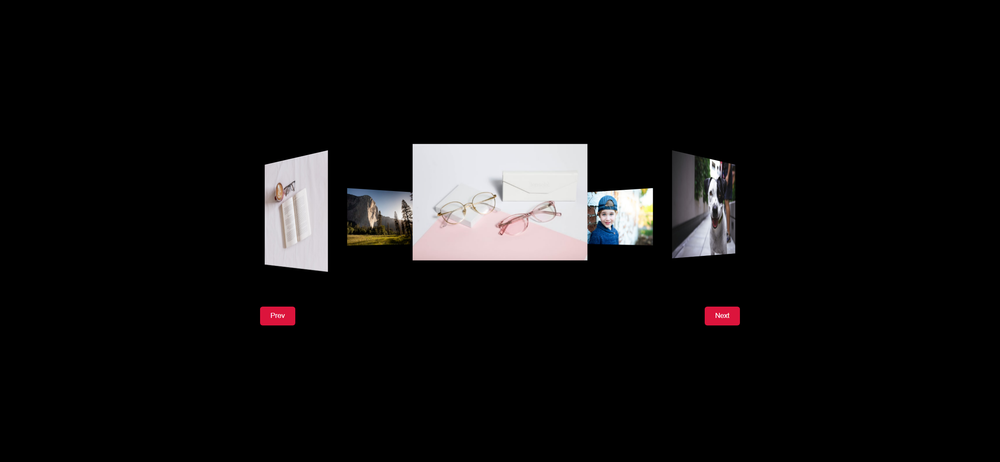
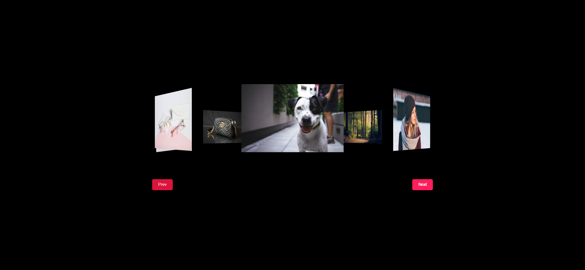
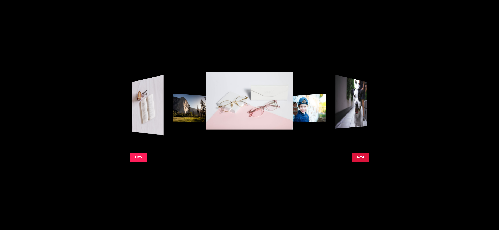

# Task Description: Rotating Gallery Webpage

Your job is to design a webpage that features a rotating image gallery with navigation buttons. The webpage should be responsive and visually appealing. Below are the detailed instructions to help you re-implement the webpage.

## Initial Webpage
The initial webpage should look like this:

## Resources
- Images: The following images are used in the gallery:
  - `resource1.png`
  - `resource2.png`
  - `resource3.png`
  - `resource4.png`
  - `resource5.png`
  - `resource6.png`
  - `resource7.png`
  - `resource8.png`

## Layout and Styling
- The webpage should have a black background.
- The main container for the images should have the class name `image-container`.
- Each image should be wrapped in a `span` element with a custom CSS property `--i` to indicate its position in the rotation.
- The buttons for navigation should be placed in a container with the class name `btn-container`.
- The buttons should have the class name `btn` and IDs `prev` and `next` for the previous and next buttons, respectively.

### CSS Details
- The body should be centered both vertically and horizontally.
- The `image-container` should have a 3D perspective and rotate along the Y-axis.
- Each `span` inside the `image-container` should be positioned absolutely and rotated based on the `--i` property.
- The buttons should be styled with a crimson background, white text, and rounded corners. They should also have a hover effect that increases their brightness.

## Interactions
- Clicking the "Next" button should rotate the gallery 45 degrees clockwise.
- Clicking the "Prev" button should rotate the gallery 45 degrees counterclockwise.
- The rotation should have a smooth transition effect.

## Screenshots
The provided screenshots are rendered under a resolution of 1920x1080.

### After Clicking "Next" Button

### After Clicking "Prev" Button

## Animation
- The rotation of the image gallery should have a transition duration of 0.7 seconds.

## Element Identifiers
- Use class name `image-container` for the main image container.
- Use class name `btn-container` for the button container.
- Use class name `btn` for the buttons.
- Use ID `prev` for the "Prev" button.
- Use ID `next` for the "Next" button.

By following these instructions, you should be able to recreate the rotating gallery webpage successfully.
