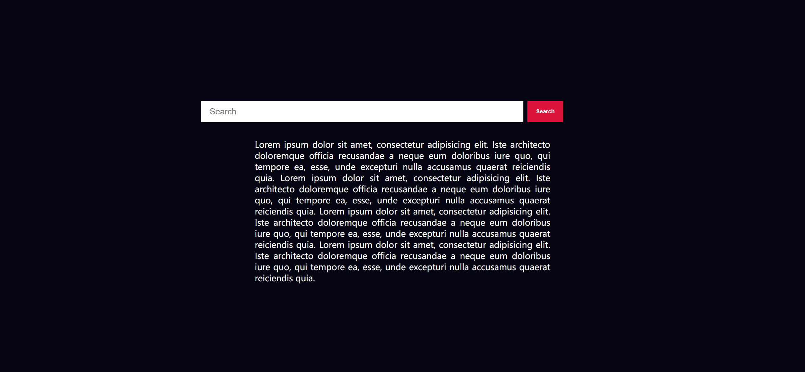
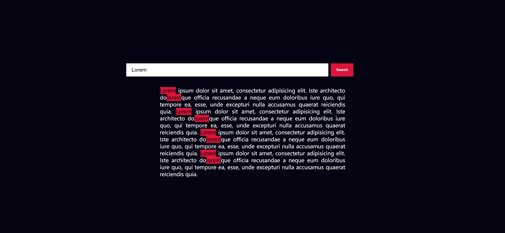

Your task is to design a webpage that allows users to search for a specific text within a paragraph and highlight the matching text. The webpage should have a search box, a search button, and a content area displaying a paragraph of text. The initial webpage should look like this:



### Requirements:

1. **HTML Structure**:
    - Create a `div` with the ID `searchBox` containing:
        - An `input` element with the ID `input` and placeholder text "Search".
        - A `button` element with the ID `searchBtn` and text "Search".
    - Create a `div` with the class `content-container` and ID `content` containing:
        - A `p` element with the ID `p` and the following text content:
            ```
            Lorem ipsum dolor sit amet, consectetur adipisicing elit. Iste architecto doloremque officia recusandae a neque eum doloribus iure quo, qui tempore ea, esse, unde excepturi nulla accusamus quaerat reiciendis quia. Lorem ipsum dolor sit amet, consectetur adipisicing elit. Iste architecto doloremque officia recusandae a neque eum doloribus iure quo, qui tempore ea, esse, unde excepturi nulla accusamus quaerat reiciendis quia. Lorem ipsum dolor sit amet, consectetur adipisicing elit. Iste architecto doloremque officia recusandae a neque eum doloribus iure quo, qui tempore ea, esse, unde excepturi nulla accusamus quaerat reiciendis quia. Lorem ipsum dolor sit amet, consectetur adipisicing elit. Iste architecto doloremque officia recusandae a neque eum doloribus iure quo, qui tempore ea, esse, unde excepturi nulla accusamus quaerat reiciendis quia.
            ```


3. **JavaScript Functionality**:
    - Add an event listener to the `searchBtn` that performs the following actions when clicked:
        - Retrieve the value from the `input` element.
        - If the input value is not empty, create a regular expression to match the input value (case-insensitive).
        - Replace the matching text in the `p` element with the same text wrapped in a `mark` element to highlight it.

### Interaction Steps:

1. **Enter Search Text**:
    - The user enters the text "Lorem" in the search input box. The webpage should look like this after entering the text:

    

2. **Click Search Button**:
    - The user clicks the search button. The webpage should look like this after clicking the search button:

    

### Notes:
- The provided screenshots are rendered under a resolution of 1920x1080.
- Ensure that the IDs and class names are used as specified for elements to ensure proper functionality and testing.
