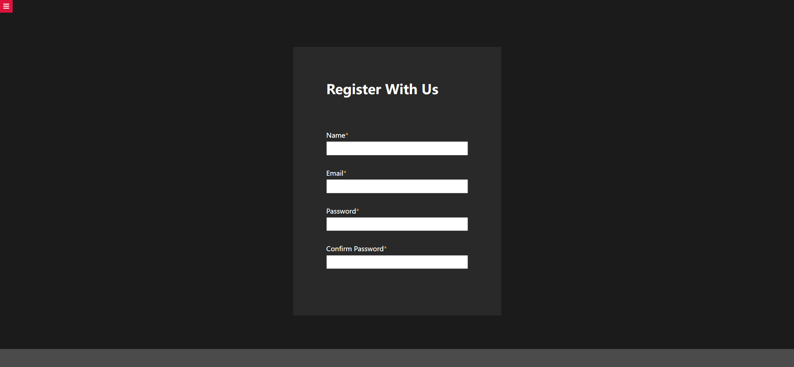
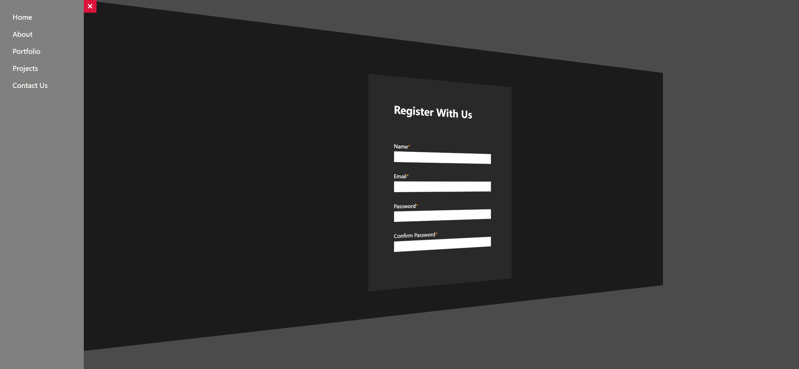

# Task Description: Sidebar Animation Webpage

Your job is to design a webpage that features a sidebar with animation and a registration form. The webpage should have the following functionalities and design elements:

## Initial Webpage

The initial webpage should look like this:



### Layout and Design

1. **Background and Font:**
   - Use a sans-serif font for the entire webpage.

2. **Sidebar:**
   - The sidebar should initially be hidden.
   - The sidebar should contain a list of links: "Home", "About", "Portfolio", "Projects", and "Contact Us".
   - Each link should be white and have no text decoration. On hover, the text should be underlined.
   - Use class name `sidebar` for the sidebar.
   - Use class name `active` to toggle the sidebar's visibility.

3. **Menu Button:**
   - The menu button should be positioned at the top right corner of the sidebar.
   - The button should contain two Font Awesome icons: a "bars" icon and a "times" icon.
   - Initially, the "bars" icon should be visible, and the "times" icon should be hidden.
   - When the sidebar is active, the "bars" icon should be hidden, and the "times" icon should be visible.
   - Use ID `menu` for the menu button.
   
4. **Content Area:**
   - The content area should have a 3D transformation effect when the sidebar is active.
   - Use class name `content` for the content area.
   - Use class name `active` to apply the transformation effect.

5. **Container:**
   - Use class name `container` for the container.

6. **Form:**
   - The form should contain fields for Name, Email, Password, and Confirm Password.

### Interactions

1. **Toggle Sidebar:**
   - Clicking the menu button should toggle the sidebar's visibility and apply the 3D transformation effect to the content area.
   - Use the provided JavaScript code to handle the toggle functionality.


### Screenshots

The provided screenshots are rendered under a resolution of 1920x1080.

- **Initial Webpage:** 
- **Sidebar Open:** 

### Resources

- Font Awesome for icons: 
  ```html
  <link
    rel="stylesheet"
    href="https://cdnjs.cloudflare.com/ajax/libs/font-awesome/6.1.1/css/all.min.css"
    integrity="sha512-KfkfwYDsLkIlwQp6LFnl8zNdLGxu9YAA1QvwINks4PhcElQSvqcyVLLD9aMhXd13uQjoXtEKNosOWaZqXgel0g=="
    crossorigin="anonymous"
    referrerpolicy="no-referrer"
  />
  ```

### IDs and Class Names

- Use ID `sidebar` for the sidebar.
- Use ID `menu` for the menu button.
- Use class name `content` for the content area.
- Use class name `container` for the container.
- Use class name `special` for the required field indicators.

Ensure that the webpage matches the provided screenshots and adheres to the described functionalities and design elements.
