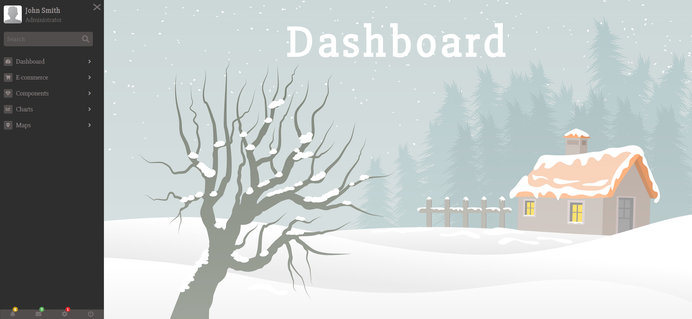

# Task Description for Re-implementing the Sidebar Webpage

Your job is to design a webpage with a sidebar navigation menu that can be toggled and expanded. The webpage should have a responsive design and include various interactive elements. Below are the detailed requirements and resources needed to re-implement the webpage.

## Initial Webpage
The initial webpage should look like this:

## Resources
- **Fonts**: Use the following Google Fonts:
  - `Roboto Slab` 
  - `Slabo 27px`
- **Icons**: Use Font Awesome icons from the following CDN:
  - `https://cdnjs.cloudflare.com/ajax/libs/font-awesome/5.11.2/css/all.css`
- **Images**:
  - `images/admin.png` is used for the admin profile picture in the sidebar.
  - `images/bg.png` is used as the background image for the main section header.

## Layout and Styling
- **Container**: The main container should have a class name `container`.
- **Sidebar**: The sidebar should have a class name `sidebar` and should be initially hidden off-screen. It should slide in when toggled.
- **Hamburger Menu**: The hamburger menu should have a class name `hamburger-menu` and contain three lines (`line-1`, `line-2`, `line-3`).
- **Admin Card**: The admin card should have a class name `card` and contain an image with class `admin-image`, a title with class `card-title`, and a subtitle with class `card-subtitle`.
- **Search Form**: The search form should have a class name `search-form`, an input with class `search-input`, and a button with class `search-button`.
- **Navigation List**: The main navigation list should have a class name `nav-list`. Each navigation item should have a class name `nav-item`, and each link should have a class name `nav-link`.
- **Sub-navigation List**: Each sub-navigation list should have a class name `subnav-list`, and each sub-navigation item should have a class name `subnav-item`.
- **Bottom List**: The bottom list should have a class name `bottom-list`, and each item should have a class name `bottom-item`.

## Interactions
- **Toggle Sidebar**: Clicking the hamburger menu should toggle the sidebar. Use the class `change` on the `container` to achieve this.
  
  - 
- **Expand Submenus**: Clicking on a navigation link should expand the corresponding submenu. Use the class `change` on the `nav-link` and `subnav-list` to achieve this.
  - **Dashboard Submenu Expanded**:
    
    
    

## Text Content
- **Admin Card**:
  - Title: `John Smith`
  - Subtitle: `Administrator`
- **Navigation Links and Submenus**:
  - **Dashboard**:
    - Dashboard 1
    - Dashboard 2
    - Dashboard 3
  - **E-commerce**:
    - Products
    - Orders
    - Credit Card
  - **Components**:
    - General
    - Icons
    - Tables
  - **Charts**:
    - Pie Chart
    - Line Chart
    - Bar Chart
  - **Maps**:
    - Google Maps
    - Open street map

## Animations
- **Sidebar Slide-in**: The sidebar should slide in from the left when toggled.
- **Hamburger Menu Animation**: The lines of the hamburger menu should transform into a cross when the sidebar is toggled.
- **Submenu Expansion**: The submenus should expand with a smooth transition.

## Responsive Design
- The sidebar width should adjust based on the screen size:
  - 15vw for screens wider than 1500px
  - 20vw for screens between 1200px and 1500px
  - 25vw for screens between 900px and 1200px
  - 30vw for screens between 700px and 900px
  - 50vw for screens between 400px and 700px
  - 100vw for screens narrower than 400px

## Resolution
The provided screenshots are rendered under a resolution of 1920x1080.

By following the above description, you should be able to re-implement the webpage with the same functionality and appearance.
