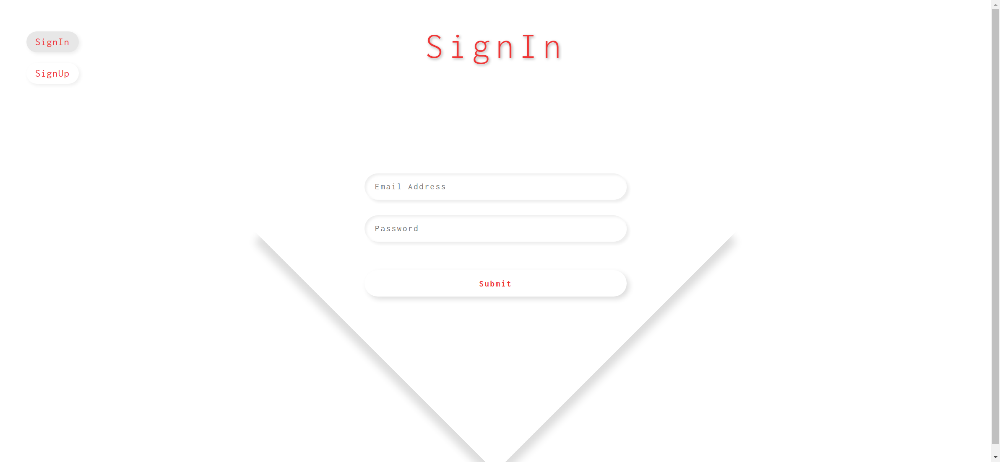
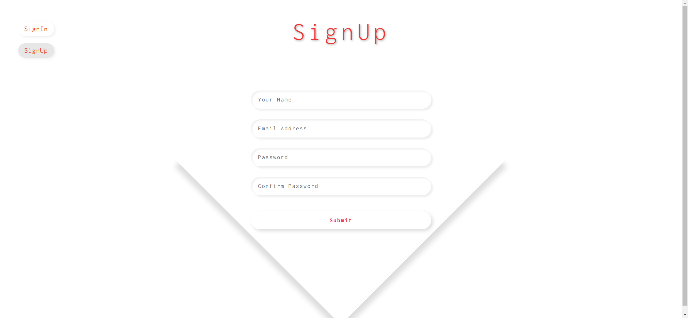
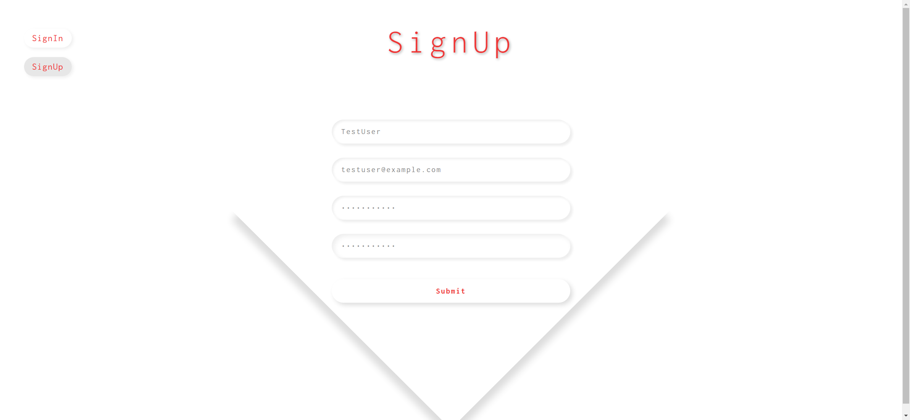
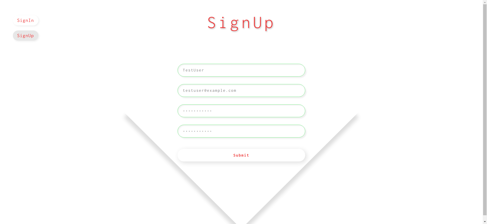

# Task Description: SignIn & SignUp Form Webpage

Your job is to design a webpage that includes a SignIn and SignUp form with interactive elements and animations. The webpage should look and behave as described below. The provided screenshots are rendered under a resolution of 1920x1080.

## Initial Webpage
The initial webpage should be as shown below:


### Fonts and Resources
- Use the Google Font "Inconsolata" with weights ranging from 200 to 900.
  ```html
  <link href="https://fonts.googleapis.com/css2?family=Inconsolata:wght@200;300;400;500;600;700;800;900&display=swap" rel="stylesheet">
  ```

### Layout and Elements
1. **Container**: 
   - Use class name `container` for the main container.
   - The container should be centered both vertically and horizontally.

2. **Heading**:
   - Use class name `heading` for the main heading.
   - The heading should contain two spans: 
     - Use class name `heading-span-1` for the first span with text "Sign".
     - Use class name `heading-span-2` for the second span with text "In".

3. **Buttons**:
   - Use class name `buttons` for the button container.
   - Use class name `signin-btn` for the SignIn button.
   - Use class name `signup-btn` for the SignUp button.

4. **Form Background**:
   - Use class name `form-bg` for the form background.

5. **Form**:
   - Use class name `form` for the form.
   - Use class name `sign-in` for the initial state of the form.
   - The form should contain input fields for username, email, password, and password confirmation.
   - Use class name `form-input-wrapper` for the wrapper of each input field.
   - Use class name `form-input` for the input fields.
   - Use class name `message` for the error message paragraphs.
   - Use class name `form-btn` for the submit button.

### Interactions and Animations
1. **SignUp Button Click**:
   - When the SignUp button is clicked, the container should have the class `change` added.
   - The heading text should change from "SignIn" to "SignUp".
   - The form should switch to the SignUp state.
   - The form should clear all input fields.
   - The webpage should look like this after clicking the SignUp button:
     

2. **Fill SignUp Form**:
   - Fill the form with the following details:
     - Username: TestUser
     - Email: testuser@example.com
     - Password: password123
     - Confirm Password: password123
   - The webpage should look like this after filling the SignUp form:
     

3. **Submit SignUp Form**:
   - When the form is submitted, it should validate the inputs.
   - If there are errors, display appropriate error messages.
   - The webpage should look like this after submitting the SignUp form:
     


### Form Validation
- **Username**: 
  - Required for SignUp.
  - Must be between 2 and 15 characters.
- **Email**: 
  - Required for both SignIn and SignUp.
  - Must be a valid email format.
- **Password**: 
  - Required for both SignIn and SignUp.
  - Must be between 5 and 25 characters.
- **Confirm Password**: 
  - Required for SignUp.
  - Must match the password.

### Error Messages
- Display error messages below the respective input fields if validation fails.
- Use class name `error` for the input wrapper when there is an error.
- Use class name `success` for the input wrapper when the input is valid.

### Additional Notes
- Ensure all animations and transitions are smooth.
- The form should reset and clear all inputs when switching between SignIn and SignUp.
