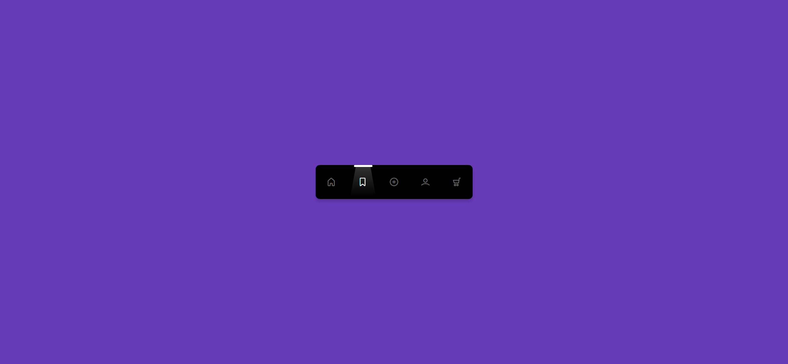

# Task Description: Sliding Spotlight Menu Bar Animation

Your job is to design a webpage that features a sliding spotlight menu bar animation. The initial webpage should look like this:

## Requirements

1. **HTML Structure**:
    - Create a `nav` element containing an unordered list (`ul`) with five list items (`li`).
    - Each list item should contain an anchor tag (`a`) with an icon inside it.
    - Use the following icons from the LineIcons library:
        - Home icon: `<i class="lni lni-home"></i>`
        - Bookmark icon: `<i class="lni lni-bookmark"></i>`
        - Add icon: `<i class="lni lni-circle-plus"></i>`
        - User icon: `<i class="lni lni-user"></i>`
        - Cart icon: `<i class="lni lni-cart"></i>`
    - Add a `div` with the class `spotLight` containing another `div` with the class `lightRay` inside the `nav` element.

2. **CSS Styling**:
    - Style the `nav` element with a black background, rounded corners, and a shadow.
    - The `ul` inside the `nav` should be displayed as a grid with five columns.
    - Each `li` should have padding and no list style.
    - The icons inside the anchor tags should have an opacity transition effect.
    - The `spotLight` div should be positioned absolutely and have a white background with a transition effect.
    - The `lightRay` div should have a gradient background and a clip-path to create a spotlight effect.

3. **JavaScript Functionality**:
    - Add an event listener to each anchor tag to handle the click event.
    - When an anchor tag is clicked, the `spotLight` div should move to the clicked anchor tag's position.
    - The clicked anchor tag should have the `active` class added to it, and the previously active anchor tag should have the `active` class removed.
    - The `spotLight` div should move smoothly to the new position with a transition effect.

## Interaction Screenshots

- After clicking the bookmark icon:
  

- After clicking the add icon:
  

## Additional Details

- The provided screenshots are rendered under a resolution of 1920x1080.
- Use the LineIcons library for the icons: `<link rel="stylesheet" href="https://cdn.lineicons.com/2.0/LineIcons.css">`
- Ensure the `spotLight` div has the class `spotLight` and the inner `div` has the class `lightRay`.
- For interactive elements, use the following class names:
  - Use class name `active` for the active anchor tags.
  - Use class name `spotLight` for the spotlight div.
  - Use class name `lightRay` for the inner spotlight ray div.
