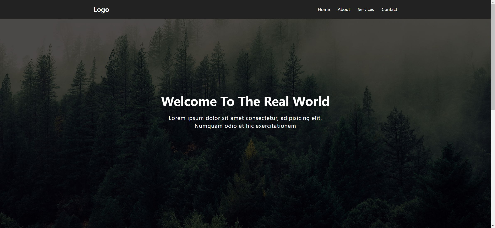
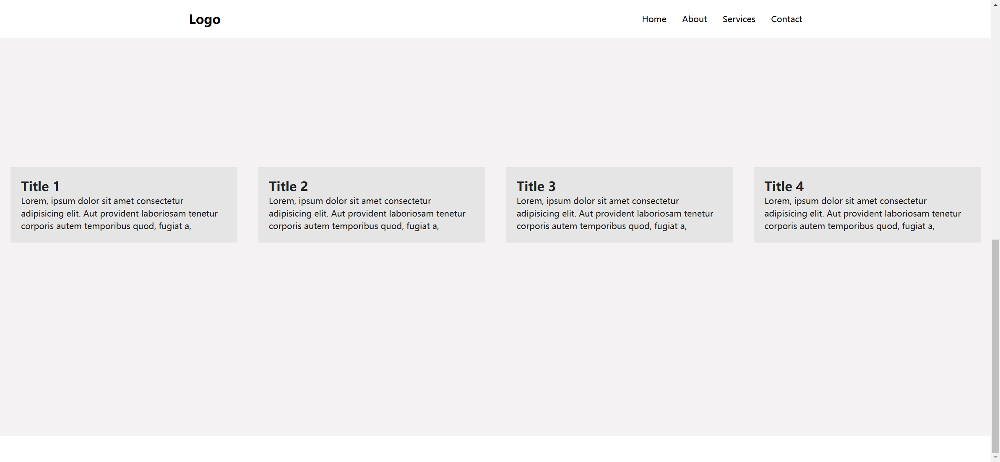

# Task Description: Sticky Navbar Webpage

Your job is to design a webpage with a sticky navigation bar that changes its style when the user scrolls down. The webpage should include a hero section with a background image and several content sections. The provided screenshots are rendered under a resolution of 1920x1080.

## Initial Webpage

The initial webpage should look like this:

## Resources

- **Background Image for Hero Section**: 
  - URL: `bg.png`
  - Usage: This image is used as the background for the hero section.
  
- **Text Content**:
  - Hero Section Heading: "Welcome To The Real World"
  - Hero Section Paragraph: "Lorem ipsum dolor sit amet consectetur, adipisicing elit. Numquam odio et hic exercitationem"
  - Content Section Titles: "Title 1", "Title 2", "Title 3", "Title 4"
  - Content Section Paragraphs: "Lorem, ipsum dolor sit amet consectetur adipisicing elit. Aut provident laboriosam tenetur corporis autem temporibus quod, fugiat a,"

## Layout and Styling

### Navigation Bar

- The navigation bar should be fixed at the top of the page.
- Use class name `nav` for the navigation bar.
- The navigation bar should contain a logo and a list of links: Home, About, Services, Contact.
- Use class name `logo` for the logo element.
- The navigation bar should have a transition effect for background color and link color changes.

### Hero Section

- The hero section should have a full-screen background image.
- Use class name `hero` for the hero section.
- The hero section should contain a heading and a paragraph.
- The text in the hero section should be centered both horizontally and vertically.

### Content Sections

- There should be four content sections.
- Use class name `content` for each content section.
- Each content section should contain a title and a paragraph.
- The content sections should be centered on the page with some padding and margin.

## Interactions

### Sticky Navbar

- When the user scrolls down the page, the navigation bar should change its background color to white and the link colors to black.
- Use class name `active` for the navigation bar when it is in the sticky state.

## Screenshots

### After Scrolling

After scrolling down the page, the webpage should look like this:

## JavaScript

- Implement a scroll event listener to add or remove the `active` class from the navigation bar based on the scroll position.
- Use the following logic for the scroll event:
  - If the scroll position is greater than the height of the navigation bar plus 150 pixels, add the `active` class to the navigation bar.
  - Otherwise, remove the `active` class from the navigation bar.

## Summary

- Use the provided resources and text content to design the webpage.
- Ensure the navigation bar becomes sticky and changes style upon scrolling.
- Follow the specified class names and IDs for elements to ensure proper functionality and styling.
- Refer to the provided screenshots for visual guidance.

Good luck with your implementation!
