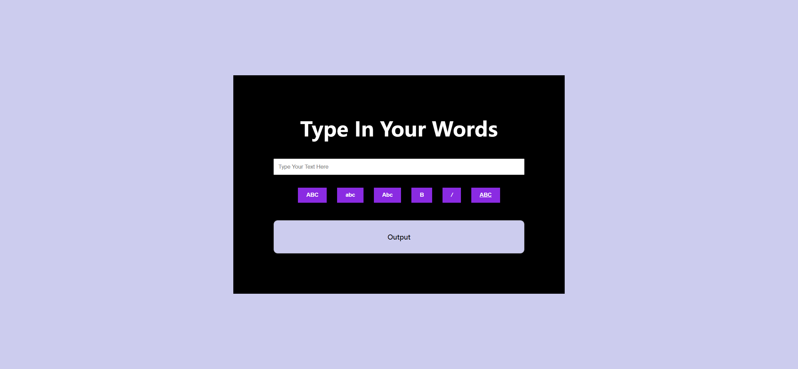
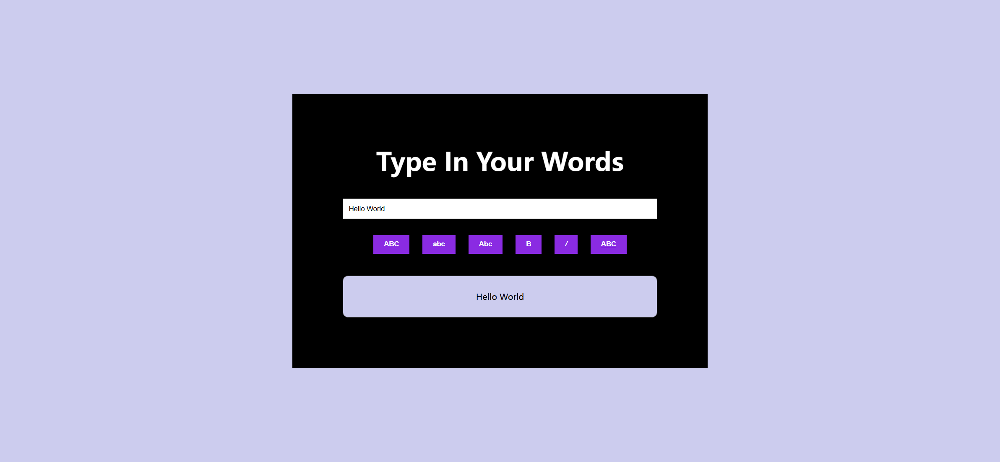

# Task Description: Text Formatter Webpage

Your job is to design a webpage that allows users to input text and format it using various buttons. The webpage should look and function as described below. The provided screenshots are rendered under a resolution of 1920x1080.

## Initial Webpage

The initial webpage should look like this:

### Layout and Styling

1. **Body**:
   - Center the content both horizontally and vertically.
   
3. **Header**:
   - Use the text "Type In Your Words".
   - Use a sans-serif font.
   
4. **Input Field**:
   - Use an input field with the placeholder "Type Your Text Here".
   
5. **Buttons**:
   - Use buttons with the following labels: "ABC", "abc", "Abc", "B", "/", "ABC".
   
6. **Output Field**:
   - Use a paragraph element with the initial text "Output".
   - Use a sans-serif font.

### Functionality

1. **Typing Text**:
   - When the user types in the input field, the text should appear in the output field.
   - Use ID `input-field` for the input field.
   - The initial state after typing should look like this:

   

2. **Uppercase Button**:
   - Use class name `uppercase` for the button.
   - When clicked, the text in the output field should transform to uppercase.
   - The state after clicking the uppercase button should look like this:

   

5. **Bold Button**:
   - Use class name `bold` for the button.
   - When clicked, the text in the output field should become bold.
   - The state after clicking the bold button should look like this:

   

6. **Italic Button**:
   - Use class name `italic` for the button.
   - When clicked, the text in the output field should become italic.
   - The state after clicking the italic button should look like this:

   

7. **Underline Button**:
   - Use class name `underline` for the button.
   - When clicked, the text in the output field should be underlined.

### Additional Notes

- Ensure that the buttons are interactive and apply the respective styles to the text in the output field.
- The provided screenshots should be used as a reference for the final implementation.
