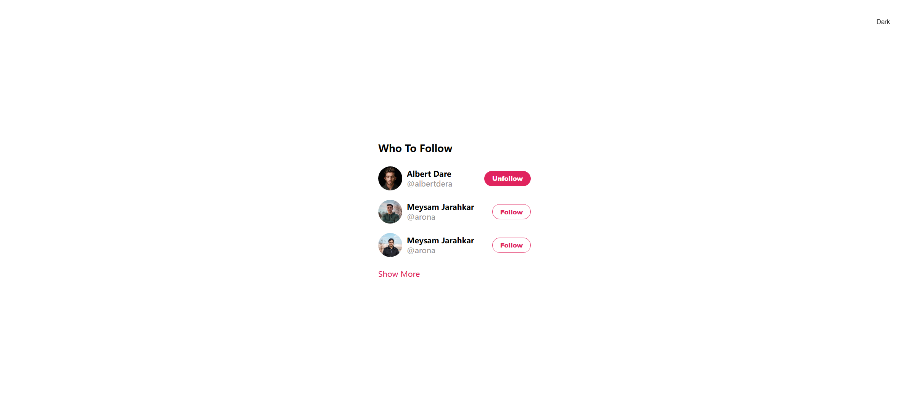

# Task Description: Re-implement the Twitter Follow Webpage

Your job is to design a webpage that mimics the functionality and appearance of a Twitter follow suggestion card. The webpage should include a theme toggle button, a card with profiles to follow/unfollow, and a "Show More" link. The provided screenshots are rendered under a resolution of 1920x1080.

## Initial Webpage
The initial webpage should look like this:

## Elements and Requirements

### Theme Toggle Button
- A button with the class `themer` that toggles between light and dark themes.
- The button text should change to "Light" when in dark mode and "Dark" when in light mode.
- The button should be positioned at the top-right corner of the page.

### Card
- A `div` with the class `card` that contains the following elements:
  - A title with the class `card-title` and text content "Who To Follow".
  - A horizontal divider with the class `divider`.
  - Three profile sections, each with the class `profile`, containing:
    - A profile picture with the class `profile-pic` and unique classes `img-one`, `img-two`, and `img-three` for different images.
    - Profile images should be sourced from `img1.png`, `img2.png`, and `img3.png`.
    - Profile information with the class `profile-info`, containing:
      - A display name with the class `display-name`.
      - A username with the class `username`.
    - A follow/unfollow button with the class `follow-button`. The button text should toggle between "Follow" and "Unfollow" when clicked.
  - A "Show More" link with the class `show-more`.

### Profile Information
- The first profile should have:
  - Display name: "Albert Dare"
  - Username: "albertdera"
- The second and third profiles should have:
  - Display name: "Meysam Jarahkar"
  - Username: "arona"

### Interactions
- Clicking the theme toggle button should switch between light and dark themes.
- Clicking the follow/unfollow button should toggle the button text and style.
- Hovering over a profile should change its background color.

### Screenshots of Interactions
2. **After Following/Unfollowing the First Profile:**
   
   
3. **After Following/Unfollowing the Second Profile:**
   
   
4. **After Following/Unfollowing the Third Profile:**
   
   

## CSS Requirements
- Define styles for the card, profile sections, buttons, and hover effects.
- Ensure the card is centered on the page with a fixed width of 360px and rounded corners.

## JavaScript Requirements
- Implement the theme toggle functionality.
- Implement the follow/unfollow button functionality.
- Ensure the hover effect works for profile sections.

## Resources
- Images: `img1.png`, `img2.png`, `img3.png`
- Text content for profiles:
  - Albert Dare: "Albert Dare", "albertdera"
  - Meysam Jarahkar: "Meysam Jarahkar", "arona"

Follow the above guidelines to re-implement the webpage. Good luck!
