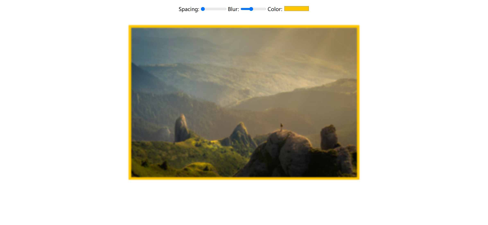
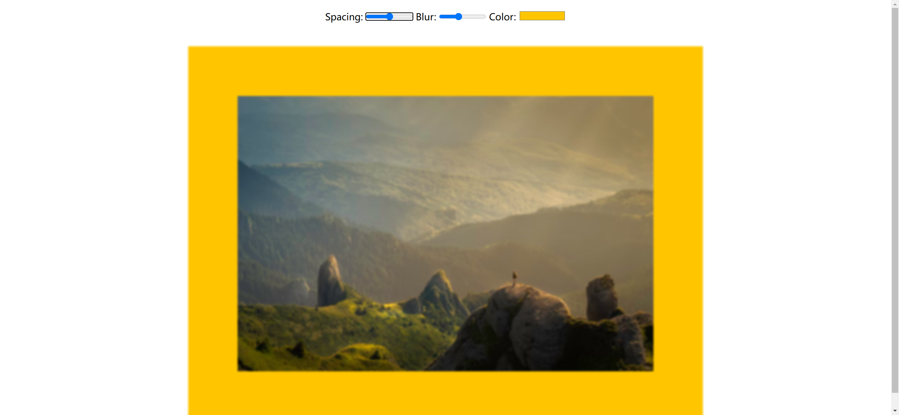
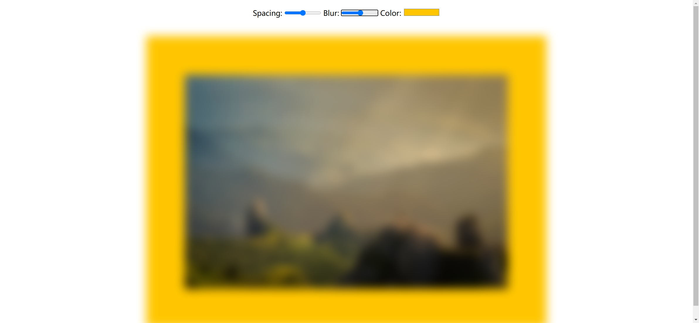

Your task is to design a webpage that allows users to dynamically update the CSS properties of an image using input controls. The webpage should look and function as described below. The provided screenshots are rendered under a resolution of 1920x1080.

### Initial Webpage
The initial webpage should look like this:

### Layout and Elements
1. **Container**: 
   - Use a `div` with class `container` to wrap all elements.
   
2. **Controls**:
   - Use a `div` with class `controls` to wrap the input elements.
   - Inside the controls div, include the following elements:
     - A label with text "Spacing:" and an input of type `range` with:
       - ID `spacing`
       - Name `spacing`
       - Minimum value of 10
       - Maximum value of 200
       - Default value of 10
     - A label with text "Blur:" and an input of type `range` with:
       - ID `blur`
       - Name `blur`
       - Minimum value of 0
       - Maximum value of 25
       - Default value of 10
       
       

3. **Image**:
   
   - Use an `img` element to display the image.
   - The image source should be: `bg.png`
   - The image should have a width of 100vh.
   - The image should have padding, background color, and blur filter applied using CSS variables.

### CSS Styling
- Apply the following styles:
  - For the container (`.container`):
    - Set text-align to center.
    - Use a sans-serif font family.

### JavaScript Functionality
- Select all input elements inside the controls div using the class `controls`.
- Add an event listener for the `change` event to each input element.
- Define a function `handleUpdate` that:
  - Checks if the input name is `base` and sets the suffix to an empty string, otherwise sets the suffix to `px`.
  - Updates the corresponding CSS variable with the new value and suffix.

### Interactions
1. **Change Spacing**:
   - When the spacing input is changed to 50, the webpage should look like this:
     

2. **Change Blur**:
   - When the blur input is changed to 15, the webpage should look like this:
     

   
   

By following the above description, you should be able to re-implement the webpage with the same functionality and appearance.
