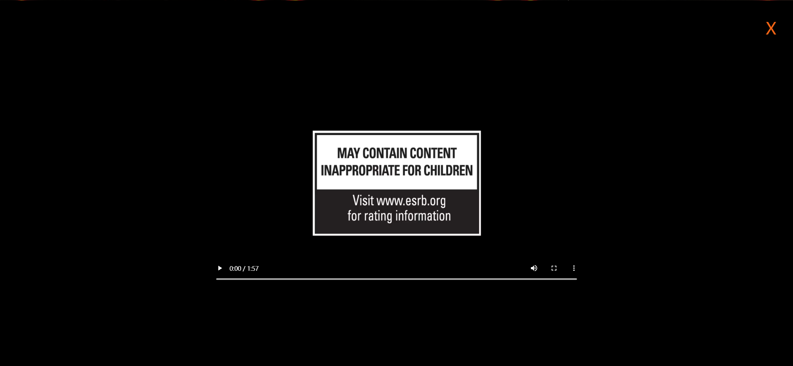

# Task Description: Re-implement the Movie Trailer Webpage

Your job is to design a webpage that allows users to view a movie trailer by clicking a play button and then close the trailer by clicking a close icon. The webpage should look and behave as described below.

## Initial Webpage

The initial webpage should be displayed as shown in the screenshot below:

### Resources

- `thumb-1920-597965.jpg`: This image is used as the background of the initial webpage.
- `play.png`: This image is used as the play button.
- `trailer.mp4`: This video file is used as the movie trailer.

### Layout and Styling

1. **Background Image**:
   - Use the image `thumb-1920-597965.jpg` as the background.
   - The background should cover the entire viewport height (`100vh`), be positioned at the top, not repeat, and be sized to cover the entire area.

2. **Play Button**:
   - Use the image `play.png` for the play button.
   - Add a bouncing animation to the play button with the following keyframes:
     - `0%`: `transform: translateY(0); animation-timing-function: ease-out;`
     - `50%`: `transform: translateY(-20px); animation-timing-function: ease-in;`
     - `100%`: `transform: translateY(0); animation-timing-function: ease-out;`
   - The animation should last 1 second and repeat infinitely.
   
3. **Trailer Container**:
   - The trailer container should be fixed at the center of the viewport.
   - It should have a black background (`#000`), cover the entire viewport, and be centered using `transform: translate(-50%, -50%);`.
   - The container should have an opacity transition of 0.7 seconds.
   - Initially, the trailer container should be hidden (`visibility: hidden; opacity: 0;`).

4. **Video**:
   - The video should be centered within the trailer container.
   

### Interactions

1. **Play Button Click**:
   - When the play button is clicked, the trailer container should become visible by removing the `active` class.

2. **Close Icon Click**:
   - When the close icon is clicked, the trailer container should be hidden by adding the `active` class.
   - The video should pause and reset to the beginning.

### Screenshots

- After clicking the play button, the webpage should look like this:

- After clicking the close icon, the webpage should return to the initial state:

### Additional Information

- The provided screenshots are rendered under a resolution of 1920x1080.
- Use the following class names and IDs for elements:
  - Use class name `image-container` for the div containing the background image.
  - Use class name `btn` for the play button image.
  - Use class name `trailer-container` for the div containing the video and close icon.
  - Use class name `close-icon` for the close icon.
  - Use class name `active` to control the visibility of the trailer container.

By following this description, you should be able to re-implement the webpage with the same functionality and appearance.
