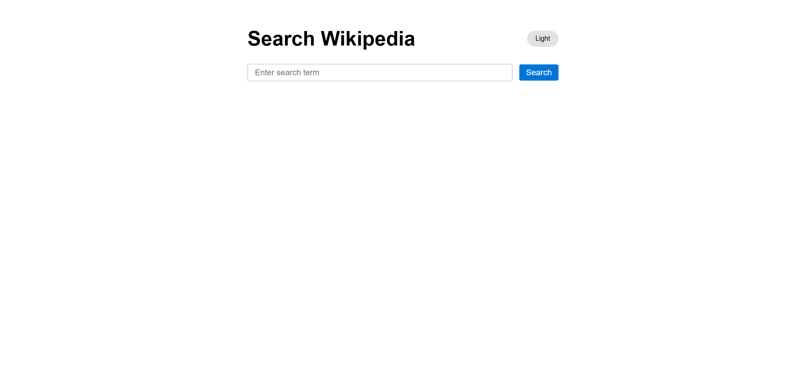
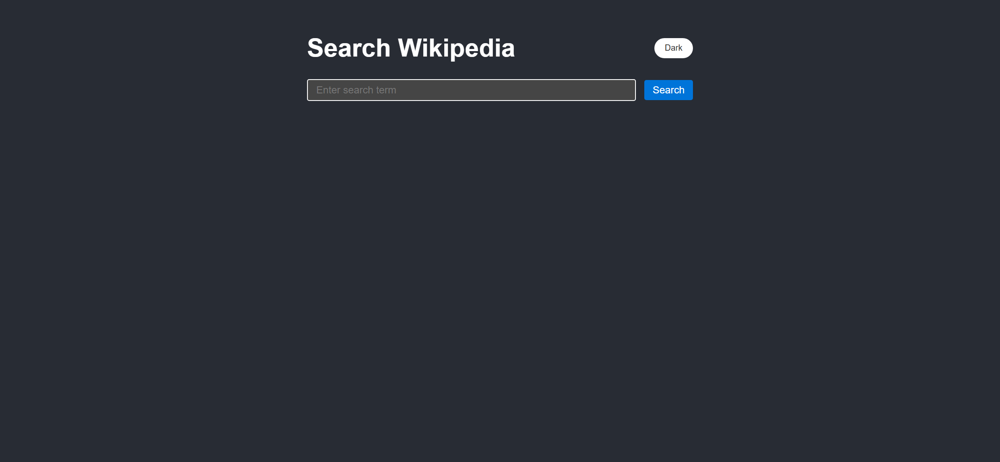
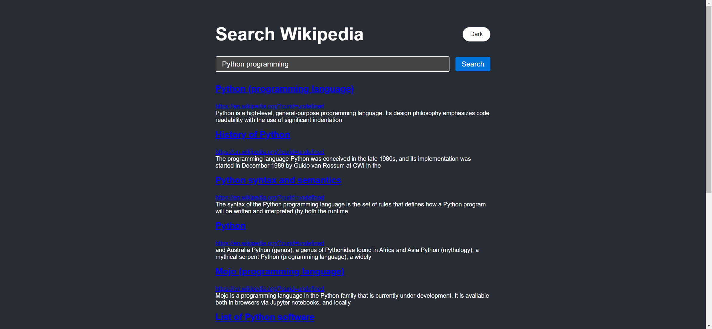

# Task Description: Wiki Clone Webpage

Your job is to design a webpage that mimics a simple Wikipedia search interface. The webpage should allow users to search for Wikipedia articles and toggle between light and dark themes. Below are the detailed requirements and resources needed to re-implement the webpage.

## Initial Webpage
The initial webpage should look like this:

### Layout and Structure
- The webpage should have a container with a maximum width of 800px, centered on the page.
- Inside the container, there should be a header section with the title "Search Wikipedia" and a theme toggler button.
- Below the header, there should be a search form with an input field and a submit button.
- The search results should be displayed below the search form.

### Elements and Styling
- Use the following IDs and class names for the elements:
  - Use ID `theme-toggler` for the theme toggler button.
  - Use ID `search-form` for the search form.
  - Use ID `search-input` for the search input field.
  - Use ID `search-results` for the search results container.
  - Use class name `result-item` for each search result item.
  - Use class name `result-title` for the title of each search result.
  - Use class name `result-link` for the link of each search result.
  - Use class name `result-snippet` for the snippet of each search result.
  - Use class name `spinner` for the loading spinner.

### Text Content
- The theme toggler button should initially display the text "Light".
- The search input field should have the placeholder text "Enter search term".
- The submit button should have the text "Search".

### CSS Styling
- Use Arial, sans-serif as the font family for the entire webpage.

## Interactions
### Theme Toggle
- Clicking the theme toggler button should switch between light and dark themes.

### Search Functionality
- When the user submits the search form, the webpage should display a loading spinner with the text "Loading ...".
- After fetching the search results from the Wikipedia API, the results should be displayed in the `search-results` container.
- Each result should include a title, a link to the Wikipedia page, and a snippet of the article.

## Screenshots
The provided screenshots are rendered under a resolution of 1920x1080.

### After Toggling Theme

### After Performing Search

## Resources
- Wikipedia API endpoint: `https://en.wikipedia.org/w/api.php?action=query&list=search&prop=info&inprop=url&utf8=&format=json&origin=*&srlimit=10&srsearch={search_term}`

Ensure that all elements and interactions are implemented as described. Good luck!
