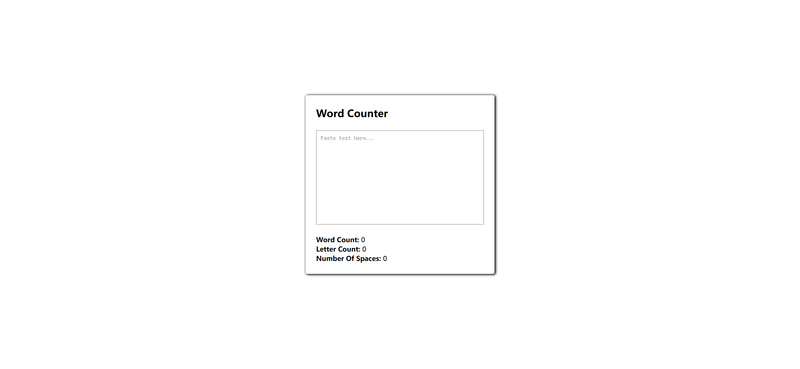
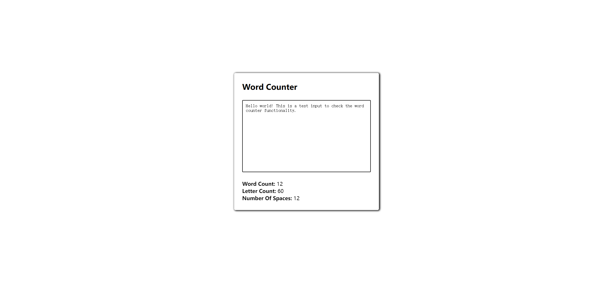

# Task Description: Word Counter Webpage

Your job is to design a webpage that functions as a word counter. The webpage should allow users to input text and then display the word count, letter count, and number of spaces in the input text. Below are the detailed requirements and resources needed to re-implement the webpage.

## Initial Webpage

The initial webpage should look like this:

### Layout and Styling

1. **Body**:
   - The body should have no margin.
   - Use a sans-serif font.
   - The body should be displayed as a flex container, centered both vertically and horizontally.
   
2. **Container**:
   - Use class name `container` for the main section.
   
3. **Title**:
   - Use class name `title` for the heading.
   
4. **Text Input**:
   - Use class name `text-input` for the textarea.
   - The textarea should not be resizable.

### Functionality

1. **Word Count**:
   - Use class name `word-count` for the span displaying the word count.
   - Initially, the word count should be 0.

2. **Letter Count**:
   - Use class name `letter-count` for the span displaying the letter count.
   - Initially, the letter count should be 0.

3. **Space Count**:
   - Use class name `space-count` for the span displaying the number of spaces.
   - Initially, the space count should be 0.

### Interactions

1. **Text Input**:
   - When text is input into the textarea, the word count, letter count, and space count should update in real-time.
   - Words are defined as sequences of characters separated by spaces or hyphens.
   - Words must meet the following criteria to be counted:
     - At least two characters long.
     - No character should appear three or more times consecutively.

### Screenshots

The provided screenshots are rendered under a resolution of 1920x1080.

- **After Inputting Text**:
  

### Resources

- **Text Content**:
  - The placeholder text for the textarea is "Paste text here...".
  - The title text is "Word Counter".
  - The labels for the counts are "Word Count: ", "Letter Count: ", and "Number Of Spaces: ".

### JavaScript Functionality

1. **Selectors**:
   - Use class name `text-input` to select the textarea.
   - Use class name `word-count` to select the word count span.
   - Use class name `letter-count` to select the letter count span.
   - Use class name `space-count` to select the space count span.

2. **Event Listener**:
   - Add an `input` event listener to the textarea to update the counts in real-time.

3. **Counting Logic**:
   - Split the input text by spaces or hyphens to count words.
   - Use regular expressions to count letters and spaces.
   - Apply the criteria for valid words as described above.
