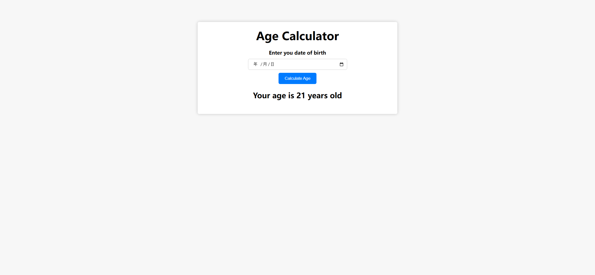
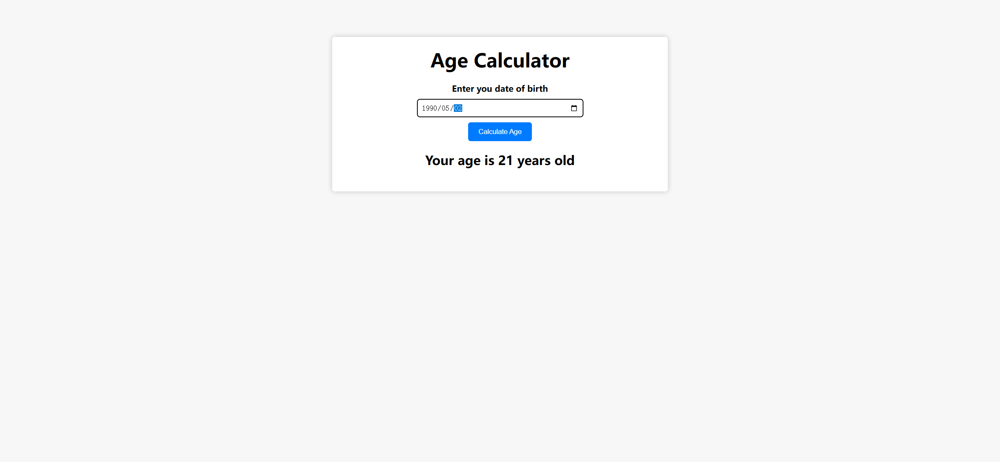
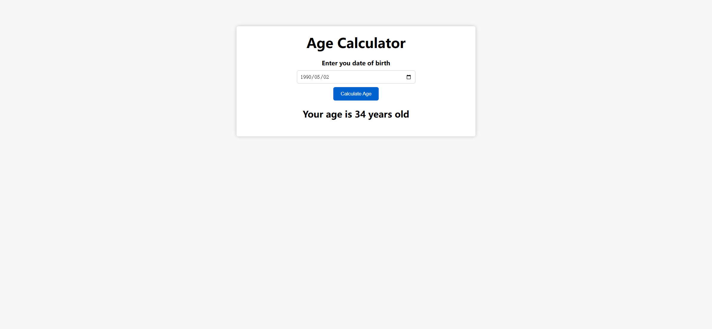

Your job is to design a webpage that functions as an Age Calculator. The webpage should allow users to input their date of birth and calculate their age based on the current date. Below are the detailed instructions to re-implement the webpage.

### Initial Webpage
The initial webpage should look like this:

### Layout and Styling
1. **Container**:
   - Use a `div` with class `container` to wrap the content.
   - The container should have a white background, a box shadow, padding, centered alignment, rounded corners, and a top margin.

2. **Heading**:
   - Use an `h1` element with the text "Age Calculator".
   
3. **Form**:
   - Use a `div` with class `form` to wrap the form elements.
   - The form should be centered and use a column flex layout.

4. **Label**:
   - Use a `label` element with the text "Enter your date of birth".
   - The label should be bold and have a bottom margin.

5. **Input**:
   - Use an `input` element with type `date` and ID `birthday`.
   
6. **Button**:
   - Use a `button` element with ID `btn` and text "Calculate Age".
   - The button should have a blue background, white text, no border, padding, rounded corners, a top margin, and a cursor pointer.
   - The button should change to a darker blue on hover.

7. **Result**:
   - Use a `p` element with ID `result` and initial text "Your age is 21 years old".

### Functionality
1. **Calculate Age**:
   - When the button with ID `btn` is clicked, the age should be calculated based on the date entered in the input with ID `birthday`.
   - If the input is empty, an alert should be shown with the message "Please enter your birthday".
   - The result should be displayed in the `p` element with ID `result` in the format "Your age is X years old" or "Your age is X year old" if the age is 1.

### JavaScript
1. **Event Listener**:
   - Add a click event listener to the button with ID `btn` to trigger the age calculation.

2. **Age Calculation**:
   - Implement a function `calculateAge` to handle the age calculation.
   - Implement a helper function `getAge` to compute the age based on the current date and the entered date of birth.

### Screenshots
The provided screenshots are rendered under a resolution of 1920x1080.

1. **After Entering Date**:
   - The webpage should look like this after entering the date of birth: 1990-05-02
   

2. **After Calculating Age**:
   - The webpage should look like this after clicking the "Calculate Age" button:
   

### Resources
- The text content "Your age is 21 years old" is used as the initial text for the result paragraph.
- The font "Montserrat" is used for the entire webpage.

### IDs and Class Names
- Use ID `birthday` for the date input element.
- Use ID `btn` for the calculate button.
- Use ID `result` for the result paragraph.
- Use class name `container` for the main container.
- Use class name `form` for the form container.
