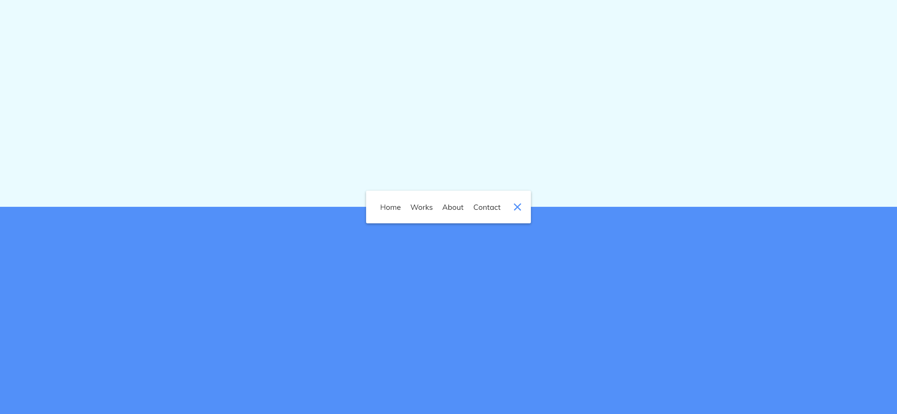

# Task Description: Animated Navigation Webpage

Your job is to design a webpage with an animated navigation menu. The webpage should have a toggle button that, when clicked, expands or collapses the navigation menu with a smooth animation. Below are the detailed requirements and resources needed to re-implement the webpage.

## Initial Webpage
The initial webpage should look like this:


## Expanded Navigation Menu
When the toggle button is clicked, the navigation menu should expand to show the menu items with a rotating animation:


## Requirements

### HTML Structure
- Create a `nav` element with the class `active` and ID `nav`.
- Inside the `nav` element, create an unordered list (`ul`) containing four list items (`li`). Each list item should contain an anchor (`a`) element with the following text:
  - Home
  - Works
  - About
  - Contact
- Add a button with the class `icon` and ID `toggle` inside the `nav` element. This button should contain two `div` elements with the classes `line line1` and `line line2`.

### CSS Styling
- Use the Google Font "Muli" for the webpage. Import it using the following URL:
  ```css
  @import url('https://fonts.googleapis.com/css?family=Muli&display=swap');
  ```
- Set the background color of the body to a gradient.
- Style the `nav` element with a white background, padding, border-radius, and box-shadow. 
- The `ul` inside the `nav` should transition its width from 0 to 100% when the `active` class is toggled.
- Each `li` inside the `ul` should have a rotating animation and opacity transition when the `active` class is toggled.
- Style the `icon` button with a white background and blue lines. The lines should rotate when the `active` class is toggled on the `nav`.

### JavaScript Functionality
- Add an event listener to the button with ID `toggle` that toggles the `active` class on the `nav` element when clicked.

### Resources
- The text content for the navigation links are:
  - Home
  - Works
  - About
  - Contact

### Interaction
- The provided screenshots are rendered under a resolution of 1920x1080.
- Use ID `nav` for the navigation element.
- Use ID `toggle` for the toggle button.
- Use class name `active` for the expanded state of the navigation.
- Use class name `icon` for the toggle button.
- Use class name `line` for the lines inside the toggle button.
- Use class name `line1` for the first line inside the toggle button.
- Use class name `line2` for the second line inside the toggle button.

### Animation Description
- The width of the `nav` element should transition over 0.6 seconds.
- The width of the `ul` inside the `nav` should transition over 0.6 seconds.
- Each `li` inside the `ul` should rotate 360 degrees and change opacity over 0.6 seconds.
- The lines inside the `icon` button should rotate 765 degrees in opposite directions over 0.6 seconds.

By following these instructions, you should be able to re-implement the animated navigation webpage as shown in the screenshots.
