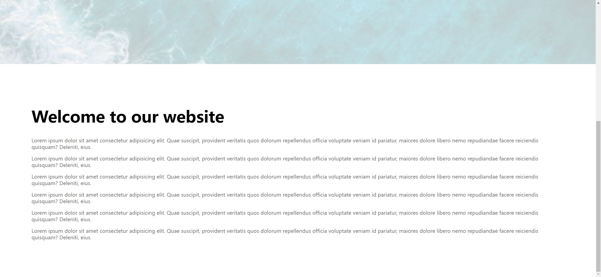

# Task Description: Background Image Scroll Effect Webpage

Your job is to design a webpage that features a background image with a scroll effect. The initial webpage should look like this:


## Requirements

1. **HTML Structure**:
    - The webpage should have a `div` with the class `bg-image` and id `bg-image` for the background image.
    - A `div` with the class `container` should contain the main content, including a heading and multiple paragraphs.

2. **CSS Styling**:
    - The `body` should have no margin and use a sans-serif font.
    - The `bg-image` should:
        - Cover the full width and height of the viewport (`100%` width and `100vh` height).
        - Use the background image from the path: `bg.png`.
        - Have a centered background position.
        - Have a fixed background attachment.
    - The `p` elements should have grey text color.
    - For screens with a maximum width of `500px`, the `container` padding should be reduced to `10px`.
    
3. **JavaScript Functionality**:
    - The background image should change its opacity and size based on the scroll position.
    - The opacity should decrease as the user scrolls down, calculated as `1 - window.pageYOffset / 900`.
    - The background size should decrease as the user scrolls down, calculated as `160 - window.pageYOffset / 12 + "%"`.
    - Use the ID `bg-image` for the background image element.

4. **Content**:
    - The heading should be: `Welcome to our website`.
    - Each paragraph should contain the following text:
      ```
      Lorem ipsum dolor sit amet consectetur adipisicing elit. Quae suscipit,
      provident veritatis quos dolorum repellendus officia voluptate veniam id
      pariatur, maiores dolore libero nemo repudiandae facere reiciendis
      quisquam? Deleniti, eius.
      ```

## Interaction

- When the user scrolls down the page, the background image should change its opacity and size accordingly.
- The provided screenshots are rendered under a resolution of (1920, 1080).

After scrolling down, the webpage should look like this:



## Additional Notes

- Ensure that the webpage is responsive and adjusts the padding for smaller screens as specified.
- The background image URL and text content are provided as resources and should be used exactly as specified.
