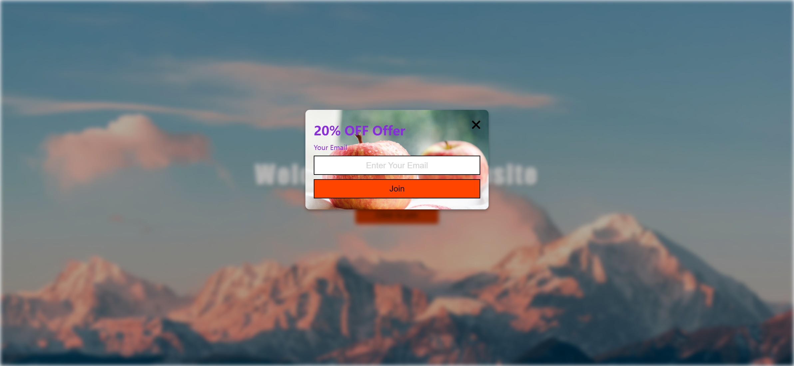

Your job is to design a webpage that features a blurred background popup. The webpage should have a button that, when clicked, displays a popup with a form to join an offer. The initial webpage should be . The provided screenshots are rendered under a resolution of 1920x1080.

### Initial Webpage
- The webpage should have a background image `bg1.png`.
- The main container should be centered both vertically and horizontally.
- The main heading should read "Welcome to our website".
- There should be a button with the text "Click to join".

### Popup
- The popup should initially be hidden.
- When the "Click to join" button is clicked, the background should blur and the popup should appear.
- The popup should have a background image `bg2.png`.
- The popup should contain:
  - A heading with the text "20% OFF Offer".
  - A label for the email input field with the text "Your Email".
  - An input field for the email with a placeholder "Enter Your Email".
  - A button with the text "Join".
  - A close icon (X) to close the popup.

### Interactions
- Clicking the "Click to join" button should blur the background and display the popup.
- Clicking the close icon should hide the popup and remove the blur from the background.

### Element Specifications
- Use class name `container` for the main container.
- Use class name `btn` for the "Click to join" button.
- Use class name `popup-container` for the popup container.
- Use class name `input` for the email input field.
- Use class name `popup-btn` for the "Join" button.
- Use class name `close-icon` for the close icon.

### Resources
- Background image for the main container: `bg1.png`.
- Background image for the popup: `bg2.png`.
- Font Awesome for the close icon: 
  ```html
  <link crossorigin="anonymous" href="https://cdnjs.cloudflare.com/ajax/libs/font-awesome/6.0.0-beta3/css/all.min.css" integrity="sha512-Fo3rlrZj/k7ujTnHg4CGR2D7kSs0v4LLanw2qksYuRlEzO+tcaEPQogQ0KaoGN26/zrn20ImR1DfuLWnOo7aBA==" referrerpolicy="no-referrer" rel="stylesheet"/>
  ```

### Screenshots
- After clicking "Click to join": 
- After closing the popup: 
