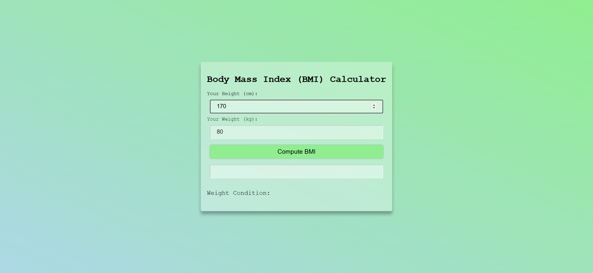
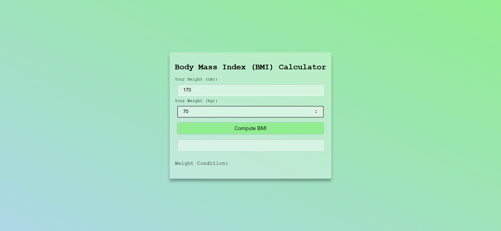
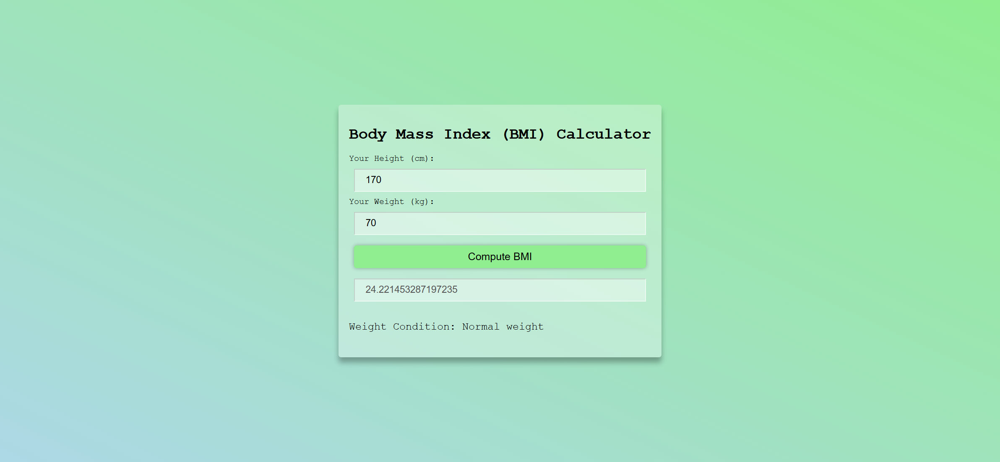

# Task Description: BMI Calculator Webpage

Your job is to design a webpage that functions as a Body Mass Index (BMI) Calculator. The webpage should allow users to input their height and weight, and then compute their BMI when a button is clicked. The BMI value and the corresponding weight condition should be displayed on the page.

## Initial Webpage

The initial webpage should look like this:

### Layout and Styling

- The webpage should have a background with a gradient from light green to light blue.
- The content should be centered both vertically and horizontally.
- Use the font family `'Courier New', Courier, monospace`.

### Container

- Use a `div` with class `container` to wrap the content.
- The container should have a semi-transparent white background, padding, and a box shadow.
- The container should be displayed as a column with flexbox.

### Heading

- Use an `h1` element with class `heading` for the title "Body Mass Index (BMI) Calculator".
- The font size should be 30px.

### Input Fields

- There should be two input fields for height and weight.
- Use class `input` for the input fields.
- The height input should have ID `height` and a placeholder "Enter your height in cm".
- The weight input should have ID `weight` and a placeholder "Enter your weight in kg".
- The input fields should have padding, a semi-transparent white background, and a border.

### Button

- Use a `button` element with class `btn` and ID `btn` for the "Compute BMI" button.
- The button should have a light green background, no border, padding, and a border-radius.
- The button should have a box shadow and a hover effect that increases the shadow.

### BMI Result

- Use an input field with class `input` and ID `bmi-result` to display the BMI result.
- This input field should be disabled.

### Weight Condition

- Use an `h4` element with class `info-text` to display the weight condition.
- The text "Weight Condition: " should be followed by a `span` with ID `weight-condition` where the condition will be displayed.

## Interactions

### Entering Height

When the user enters their height, the webpage should look like this:

### Entering Weight

When the user enters their weight, the webpage should look like this:

### Computing BMI

When the user clicks the "Compute BMI" button, the BMI value and weight condition should be displayed. The webpage should look like this:

## JavaScript Functionality

- Use JavaScript to handle the click event on the "Compute BMI" button.
- The function should calculate the BMI using the formula: `BMI = weight / (height * height)`, where height is in meters.
- Display the BMI value in the input field with ID `bmi-result`.
- Determine the weight condition based on the BMI value and display it in the `span` with ID `weight-condition`.

### Weight Conditions

- BMI < 18.5: "Under weight"
- 18.5 <= BMI <= 24.9: "Normal weight"
- 25 <= BMI <= 29.9: "Overweight"
- BMI >= 30: "Obesity"

## Screenshots

The provided screenshots are rendered under a resolution of 1920x1080.
