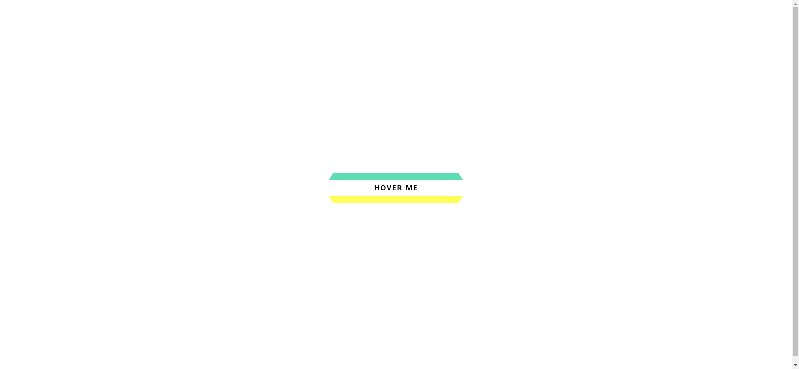

Your job is to design a webpage that includes a single interactive link with a hover effect. The initial webpage should be centered both vertically and horizontally. The link should have a unique hover animation that changes its background and text color. Below are the detailed instructions to re-implement the webpage.

### Initial Webpage
The initial webpage should look like this:

### Resources
- The text content for the link is "Hover Me".
- The webpage uses the `sans-serif` font family.

### Link Styling
- The link should have a relative position.
- The link should have a transition effect for all properties with a duration of 0.2s.
- The link should have a pseudo-element `:before` with the following properties:
  - Transition effect for all properties with a duration of 0.2s.
  - Transform origin should be `top`.
- The link should have another pseudo-element `:after` with the following properties:
  - Transition effect for all properties with a duration of 0.2s.
  - Transform origin should be `bottom`.

### Hover Effect
- When the link is hovered over, the following changes should occur:
  - The `:before` pseudo-element should move to `top: -6px` and `left: 0`, and rotate along the X-axis by 75 degrees.
  - The `:after` pseudo-element should move to `top: 6px` and `left: 0`, and rotate along the X-axis by -75 degrees.
  - The link text color should change to black (`#000`).

### Interaction
- The link should have the text "Hover Me".
- Use the tag name `a` for the link element.
- The hover effect should be visible when the link is hovered over.

### Final Webpage After Hover
The final webpage after hovering over the link should look like this:

### Notes
- The provided screenshots are rendered under a resolution of 1920x1080.
- Ensure that all transitions and animations are smooth and complete within the specified duration.

By following these instructions, you should be able to recreate the interactive webpage with the specified hover effect.
