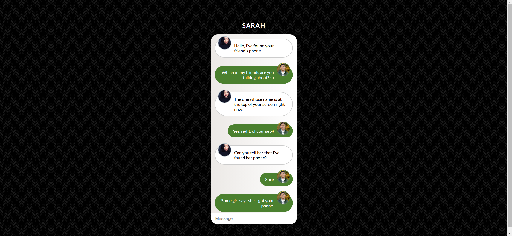
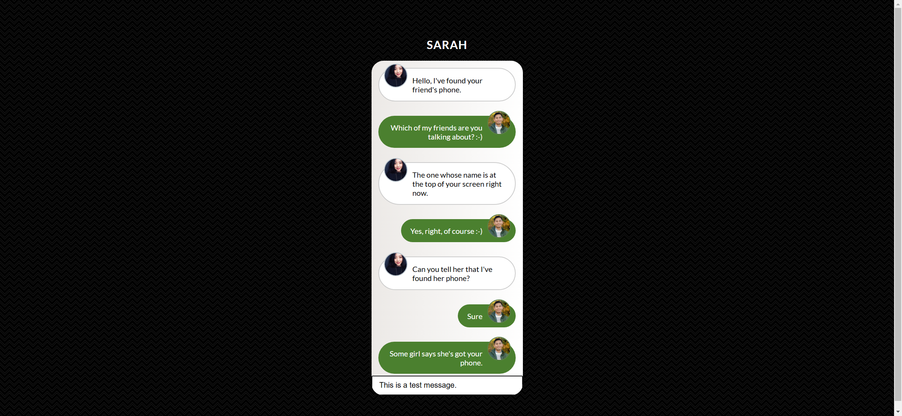

# Task Description: Re-implement a Chat Interface Webpage

Your job is to design a webpage that mimics a chat interface. The initial webpage should look like this:

The provided screenshots are rendered under a resolution of 1920x1080.

## Requirements

1. **HTML Structure**:
    - The webpage should have a title of "Chat Interface".
    - The main heading should be "Sarah".
    - There should be a chat container that holds the chat messages and an input field.

2. **CSS Styling**:
    - Use the Google Font "Lato".
    - The body should have a black background with a specific SVG pattern.
    - The main heading should have a white color with a text shadow and be uppercase.
    - The chat container should have a linear gradient background, rounded corners, and a box shadow.
    - Messages should be styled differently based on whether they are on the left or right.
    - Avatars should be circular and positioned correctly within the messages.
    - The input field should be styled to fit within the chat container.

3. **Resources**:
    - **Fonts**: 
        - Import the "Lato" font from Google Fonts.
    - **Images**:
        - `resource1.jpg` is used for the avatar of the left messages.
        - `resource2.jpg` is used for the avatar of the right messages.
    - **Text Content**:
        - The chat messages should have the following text:
            - "Hello, I've found your friend's phone."
            - "Which of my friends are you talking about? :-)"
            - "The one whose name is at the top of your screen right now."
            - "Yes, right, of course :-)"
            - "Can you tell her that I've found her phone?"
            - "Sure"
            - "Some girl says she's got your phone."

4. **Interactions**:
    - There should be an input field at the bottom of the chat container where users can type messages.
    - Use class name `text_input` for the input field.

## Detailed Specifications

- **HTML Elements**:
    - Use a `<h2>` tag for the main heading.
    - Use a `
` with class `chat-container` to wrap the chat messages and input field.
    - Use an unordered list `<ul>` with class `chat` to contain the chat messages.
    - Each message should be a list item `<li>` with class `message` and either `left` or `right` to indicate the side.
    - Use an `` tag with class `avatar` for the avatars in the messages.
    - Use a `
` tag to wrap the text content of each message.
    - Use an `<input>` tag with class `text_input` for the message input field.

## Interaction Example

After typing a message in the input field, the webpage should look like this:

