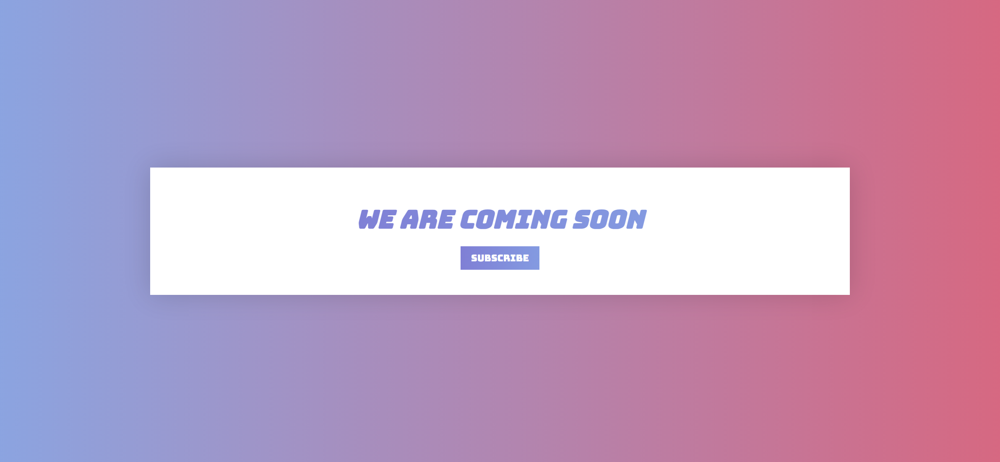
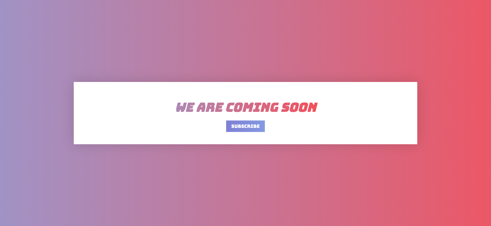
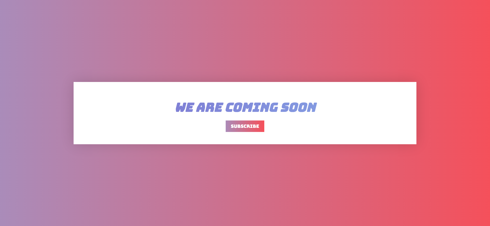

Your job is to design a webpage that displays a "Coming Soon" message with a subscription button. The webpage should have a gradient background animation and interactive elements that change on hover. Below are the details and requirements for re-implementing the webpage.

### Initial Webpage
The initial webpage should look like this:


### Resources
- **Font**: The webpage uses the "Bungee" font from Google Fonts. You can import it using the following URL.

### Layout and Styling
- The webpage should be centered both vertically and horizontally.
- The background should have a gradient animation that transitions from left to right over 20 seconds.
- The container should have a white background, some padding, and a box shadow.

### Elements
1. **Title**
   - Text: "We Are Coming Soon"
   - Use class name `title` for the title element.
   - The title should have a gradient text effect and change its background position on hover.
   - The title should look like this when hovered:
     

2. **Button**
   - Text: "Subscribe"
   - Use class name `btn` for the button element.
   - The button should have a gradient background that changes its position on hover.
   - The button should look like this when hovered:
     

### Animations
- **Background Animation**: The background should animate from left to right over 20 seconds and then alternate back.
  ```css
  @keyframes bg-animation {
    0% {
      background-position: left;
    }
    100% {
      background-position: right;
    }
  }
  ```
- **Title Hover Animation**: The title's background position should transition over 1 second.
- **Button Hover Animation**: The button's background position should transition over 350 milliseconds.

### Screen Resolution
The provided screenshots are rendered under a resolution of 1920x1080.

### Interaction
- **Hover over Title**: The title's background position should change on hover.
- **Hover over Button**: The button's background position should change on hover.
- **Click Subscribe Button**: Clicking the button should trigger a visual change.

By following these guidelines, you should be able to re-implement the webpage with the same look and feel as described.
