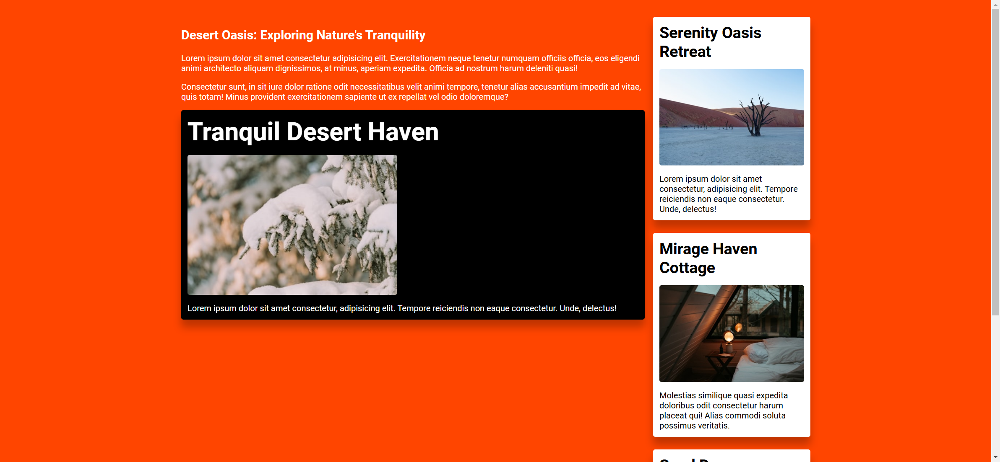
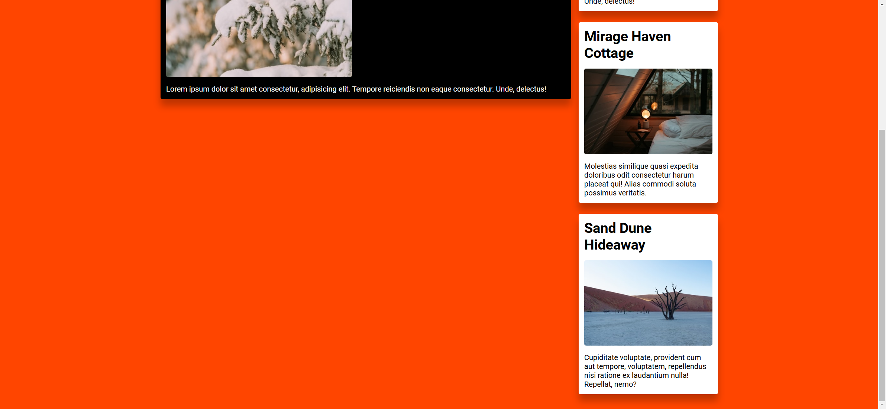

# Task Description: Re-implement the "Container Queries" Webpage

Your job is to design a webpage that mimics the provided "Container Queries" webpage. The initial webpage should look like this:



## Requirements

### General Layout and Styling

1. **Fonts and Colors**
   - Use the "Roboto" font from Google Fonts.
   - The background color of the body should be controlled by a CSS variable `--bg-color`.
   - The default value of `--bg-color` should be `rebeccapurple`.
   - When the screen width is 600px or wider, change the `--bg-color` to `orangered`.

2. **Container Queries**
   - Use container queries to style elements based on their container's properties.
   - When the `--theme` variable is set to `dark` on the `.primary-content` section, the `.card` elements inside it should have a black background and white text.

3. **Grid Layout**
   - Use a grid layout for the main content.
   - When the screen width is 760px or wider, the main content should have two columns: one for the `.primary-content` and one for the `.cards` section.

### Content

1. **Primary Content Section**
   - Use class name `primary-content` for this section.
   - Set the `--theme` variable to `dark` for this section.
   - Include the following content:
     - **Heading**: "Desert Oasis: Exploring Nature's Tranquility"
     - **Paragraphs**:
       ```
       Lorem ipsum dolor sit amet consectetur adipisicing elit. Exercitationem neque tenetur numquam officiis officia, eos eligendi animi architecto aliquam dignissimos, at minus, aperiam expedita. Officia ad nostrum harum deleniti quasi!
       ```
       ```
       Consectetur sunt, in sit iure dolor ratione odit necessitatibus velit animi tempore, tenetur alias accusantium impedit ad vitae, quis totam! Minus provident exercitationem sapiente ut ex repellat vel odio doloremque?
       ```
     - **Card**:
       - **Heading**: "Tranquil Desert Haven"
       - **Image**: `resource1.png`
       - **Paragraph**:
         ```
         Lorem ipsum dolor sit amet consectetur, adipisicing elit. Tempore reiciendis non eaque consectetur. Unde, delectus!
         ```

2. **Cards Section**
   - Use class name `cards` for this section.
   - Include the following cards:
     - **Card 1**:
       - **Heading**: "Serenity Oasis Retreat"
       - **Image**: `resource2.png`
       - **Paragraph**:
         ```
         Lorem ipsum dolor sit amet consectetur, adipisicing elit. Tempore reiciendis non eaque consectetur. Unde, delectus!
         ```
     - **Card 2**:
       - **Heading**: "Mirage Haven Cottage"
       - **Image**: `resource3.png`
       - **Paragraph**:
         ```
         Molestias similique quasi expedita doloribus odit consectetur harum placeat qui! Alias commodi soluta possimus veritatis.
         ```
     - **Card 3**:
       - **Heading**: "Sand Dune Hideaway"
       - **Image**: `resource4.png`
       - **Paragraph**:
         ```
         Cupiditate voluptate, provident cum aut tempore, voluptatem, repellendus nisi ratione ex laudantium nulla! Repellat, nemo?
         ```

### Additional Styling

1. **Wrapper**
   - Use class name `wrapper` for the main container.
   - Set the width to `min(100% - 3rem, 1200px)` and center it horizontally.

3. **Card Elements**
   - Use class name `card` for individual cards.
   
5. **Text Colors**
   - Set the color of `h1` and `p` elements to white.

### Interactions

- Scroll the page to view the full content. The scrolled webpage should look like this:



### Resources

- **Images**:
  - `resource1.png` for the first card in the primary content section.
  - `resource2.png` for the first card in the cards section.
  - `resource3.png` for the second card in the cards section.
  - `resource4.png` for the third card in the cards section.

### Notes

- The provided screenshots are rendered under a resolution of 1920x1080.
- Ensure to use the specified class names and IDs for elements as mentioned above for accurate auto-testing.
