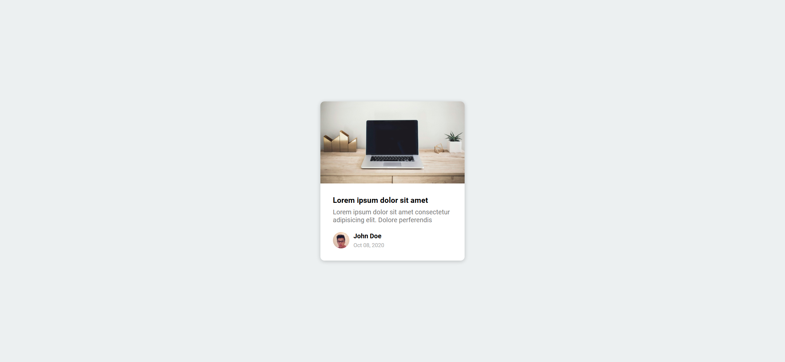

# Task Description: Re-implement the Content Placeholder Webpage

Your job is to design a webpage that initially displays animated placeholders and then loads actual content after a short delay. The initial webpage should look like this:

The provided screenshots are rendered under a resolution of 1920x1080.

## Requirements

### HTML Structure

1. **Card Container**:
   - Use a `div` with class `card` to contain the entire card.

2. **Card Header**:
   - Use a `div` with class `card-header` and ID `header` for the header section of the card.
   - Initially, this `div` should have the class `animated-bg`.

3. **Card Content**:
   - Use a `div` with class `card-content` to contain the content of the card.
   - Inside this `div`, include:
     - An `h3` element with class `card-title` and ID `title`. Initially, this element should have the classes `animated-bg` and `animated-bg-text`.
     - A `p` element with class `card-excerpt` and ID `excerpt`. Initially, this element should contain three `span` elements, each with the classes `animated-bg` and `animated-bg-text`.

4. **Author Section**:
   - Use a `div` with class `author` to contain the author information.
   - Inside this `div`, include:
     - A `div` with class `profile-img` and ID `profile_img`. Initially, this `div` should have the class `animated-bg`.
     - A `div` with class `author-info` to contain the author's name and date. Inside this `div`, include:
       - A `strong` element with class `animated-bg` and `animated-bg-text`, and ID `name`.
       - A `small` element with class `animated-bg` and `animated-bg-text`, and ID `date`.

### CSS Styling

1. **Fonts**:
   - Import the 'Roboto' font from Google Fonts.

2. **Global Styles**:
   - Set `box-sizing` to `border-box` for all elements.
   - Use the 'Roboto' font for the body.
   - Center the card both vertically and horizontally using flexbox.
   
3. **Card Styles**:
   - Add a box-shadow and border-radius to the card.
   
4. **Card Header**:
   - Ensure any images inside the card header cover the entire area.

5. **Card Content**:
   - Set the background color to white and add padding.

8. **Author Section**:
   - Display the author section as a flex container.
   - Style the author info section to be a flex container with column direction and space-around alignment. Add margin and set width.
   
9. **Animated Background**:
   - Use a linear gradient for the animated background.
   - Set the background size and add an animation for the background position.

### JavaScript Functionality

1. **Element Selection**:
   - Select elements by their IDs: `header`, `title`, `excerpt`, `profile_img`, `name`, and `date`.
   - Select all elements with the classes `animated-bg` and `animated-bg-text`.

2. **Content Loading**:
   - Use `setTimeout` to delay the execution of the `getData` function by 2.5 seconds.
   - In the `getData` function, update the inner HTML of the selected elements with the following content:
     - `header`: ``
     - `title`: `Lorem ipsum dolor sit amet`
     - `excerpt`: `Lorem ipsum dolor sit amet consectetur adipisicing elit. Dolore perferendis`
     - `profile_img`: ``
     - `name`: `John Doe`
     - `date`: `Oct 08, 2020`
   - Remove the `animated-bg` and `animated-bg-text` classes from the respective elements.

### Resources

- `resource1.png`: Used for the header image.
- `resource2.jpg`: Used for the profile image.
- Text content for the title: `Lorem ipsum dolor sit amet`
- Text content for the excerpt: `Lorem ipsum dolor sit amet consectetur adipisicing elit. Dolore perferendis`
- Text content for the name: `John Doe`
- Text content for the date: `Oct 08, 2020`
