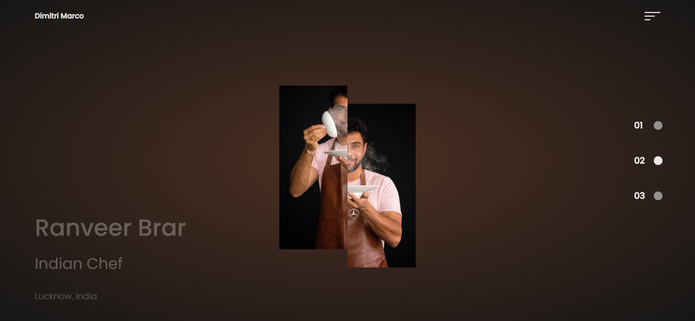
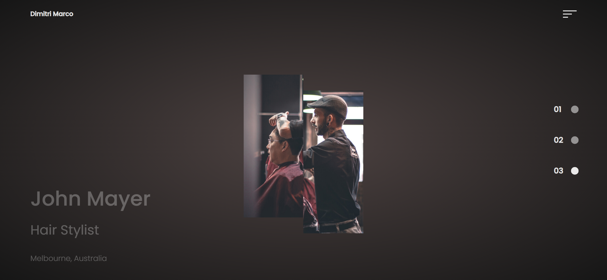
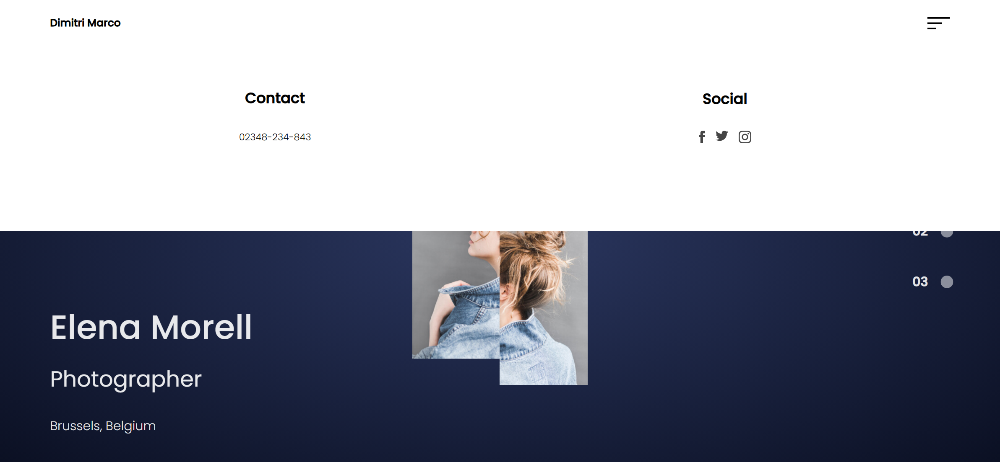
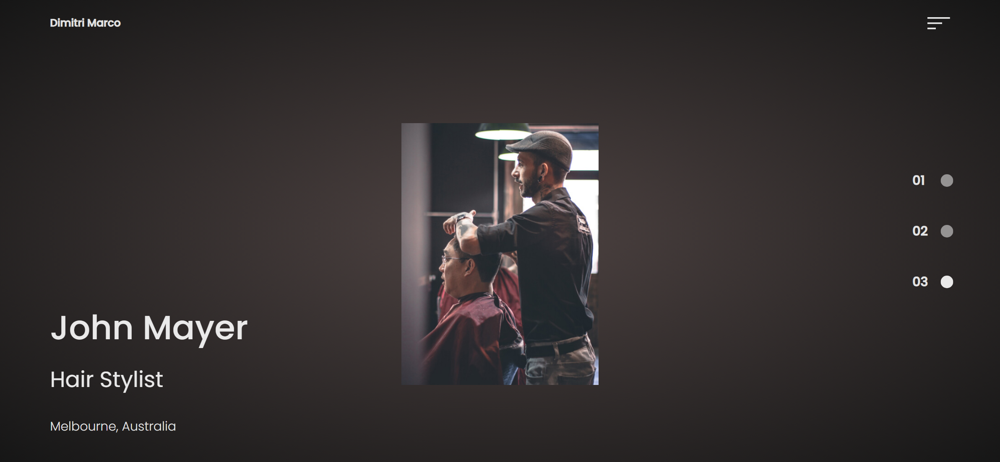

Your job is to design a webpage that showcases a portfolio with multiple sections, each representing a different profession. The webpage should include a navigation menu, a slider to switch between different sections, and interactive elements such as hover effects and animations. The provided screenshots are rendered under a resolution of 1920x1080.

### Initial Webpage
The initial webpage should be:

### Navigation Menu
- The navigation menu should be located at the top of the page.
- Use class name `menu` for the hamburger menu icon.
- Use class name `nav-open` for the navigation menu that slides down when the hamburger menu is clicked.
- The navigation menu should include:
  - A contact section with the text "Contact" and phone number "02348-234-843".
  - A social section with the text "Social" and three social media icons.

### Slider
- The slider should have three sections, each representing a different profession.
- Use class name `slide` for the slider dots.
- Use class name `page` for each section.
- Each section should include:
  - A `details` div with the person's name, profession, and location.
  - A `hero` div with two images, one on the left and one on the right.
  - Use class name `model-left` for the left image and `model-right` for the right image.

### Sections
1. **Photographer Section**
   - Name: Elena Morell
   - Profession: Photographer
   - Location: Brussels, Belgium
   - Left Image: `resource1.jpg`
   - Right Image: `resource2.jpg`
   

2. **Chef Section**
   - Name: Ranveer Brar
   - Profession: Indian Chef
   - Location: Lucknow, India
   - Left Image: `resource3.jpg`
   - Right Image: `resource4.jpg`
   

3. **Hair Stylist Section**
   - Name: John Mayer
   - Profession: Hair Stylist
   - Location: Melbourne, Australia
   - Left Image: `resource5.jpg`
   - Right Image: `resource6.jpg`
   

### Interactions
1. **Hamburger Menu**
   - Clicking the hamburger menu should open the navigation menu.
   
   - 
   
- Clicking the hamburger menu again should close the navigation menu.
   
   
   
2. **Slider Dots**
   - Clicking on the second slider dot should display the Chef section.
   - Clicking on the third slider dot should display the Hair Stylist section.
   
3. **Hover Effect**
   - Hovering over the hero image should animate the images to move to their original positions.
   

### External Resources
- Google Fonts: Poppins
- GSAP (GreenSock Animation Platform) for animations:
  - `https://cdnjs.cloudflare.com/ajax/libs/gsap/2.1.3/TweenMax.min.js`
  - `https://cdnjs.cloudflare.com/ajax/libs/gsap/2.1.3/TimelineMax.min.js`

### CSS Styling
- Use `style.css` for all CSS styling.
- The background should be a radial gradient.
- The navigation menu should slide down from the top.
- The slider should have a smooth transition between sections.
- The hero images should have a hover effect that animates them to their original positions.

### JavaScript
- Use `script.js` for all JavaScript functionality.
- Implement the slider functionality to switch between sections.
- Implement the hamburger menu functionality to open and close the navigation menu.
- Implement the hover effect for the hero images.
