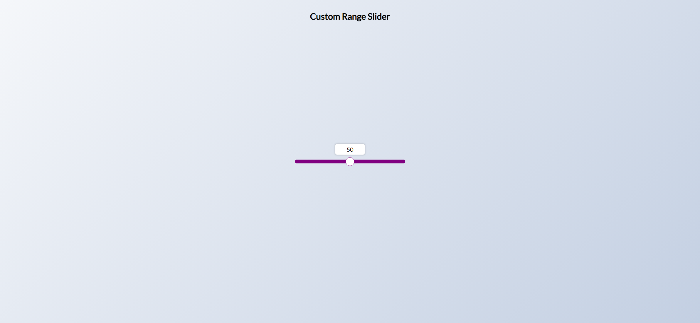
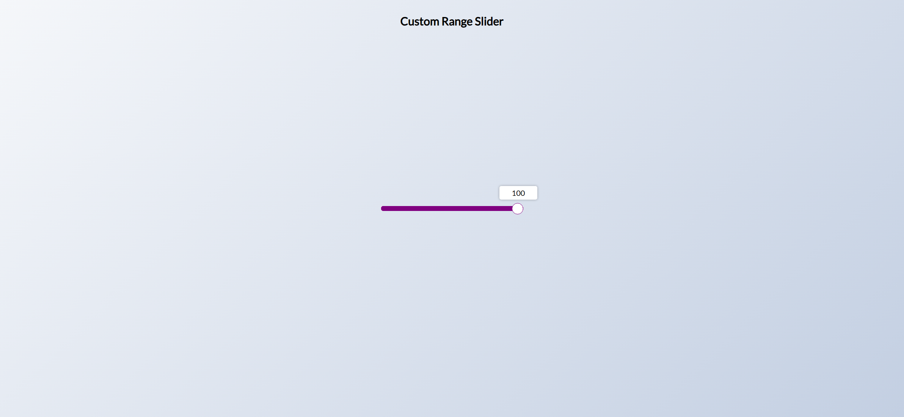

Your job is to design a webpage that features a custom range slider. The initial webpage should look like this:

The webpage consists of a heading and a range slider with a label that dynamically updates as the slider is moved. The label shows the current value of the slider and moves along with the slider thumb.

### Requirements:

1. **HTML Structure**:
    - The webpage should have a title of "Custom Range Slider".
    - Include a heading `<h2>` with the text "Custom Range Slider".
    - Create a `div` with the class name `range-container` to hold the range input and its label.
    - Inside the `div`, add an `<input>` element of type `range` with the ID `range`, a minimum value of `0`, and a maximum value of `100`.
    - Add a `<label>` element associated with the range input (using the `for` attribute) to display the current value of the slider.

2. **CSS Styling**:
    - Use the Google Font "Lato" for the entire webpage.
    - Center the content vertically and horizontally within the viewport.
    - Style the heading to be positioned at the top of the page.
    - Customize the appearance of the range input's track and thumb for different browsers (Chrome, Safari, Firefox, IE).
    - Style the label to be positioned above the slider thumb, with a white background, centered text, and a slight shadow.
    
3. **JavaScript Functionality**:
    - Add an event listener to the range input to update the label's position and text content as the slider is moved.
    - Calculate the label's position based on the slider's value and adjust it dynamically.
    - Use a scaling function to fine-tune the label's position.

4. **Interactions**:
    - When the slider is moved, the label should update to reflect the current value and move along with the slider thumb.

### Resources:
- The background gradient is defined in the CSS file.
- The font "Lato" is imported from Google Fonts.
- The text content for the heading is "Custom Range Slider".

### Screenshots:
- The initial webpage is rendered under a resolution of (1920, 1080).
- After moving the slider, the webpage should look like this:

### Element Identifiers:
- Use ID `range` for the range input element.
- Use class name `range-container` for the container `div`.

### Additional Notes:
- Ensure that the label moves smoothly with the slider thumb.
- The label should always display the current value of the slider.
- The label's position should be dynamically calculated to stay centered above the slider thumb.
