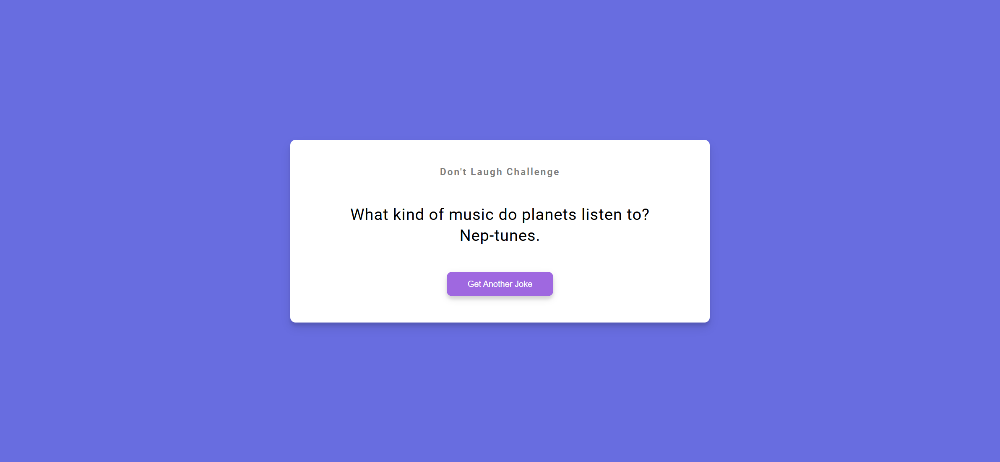
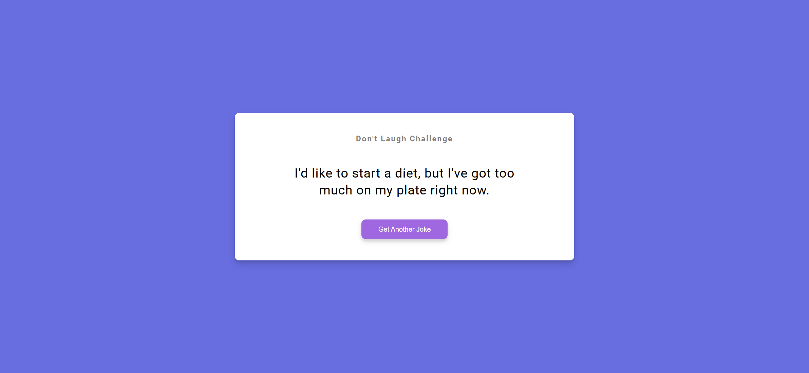

# Task Description: Re-implement the Dad Jokes Webpage

Your job is to design a webpage that displays random dad jokes fetched from an external API. The webpage should have a button that, when clicked, fetches a new joke and displays it on the page. Below are the detailed requirements and resources needed to re-implement the webpage.

## Initial Webpage

The initial webpage should look like this:

### Layout and Styling

1. **Fonts and Colors**:
   - Use the 'Roboto' font from Google Fonts.
   
2. **Container**:
   - Use class name `container` for the main container.
   
3. **Header**:
   - Use an `h3` element with the text "Don't Laugh Challenge".
   
4. **Joke Display**:
   - Use a `div` element with ID `joke` and class `joke` to display the joke.
   
5. **Button**:
   - Use a `button` element with ID `jokeBtn` and class `btn` with the text "Get Another Joke".
   - The button should have a box-shadow effect and a cursor pointer style.

### Functionality

1. **Fetching Jokes**:
   - Use the API `https://icanhazdadjoke.com` to fetch jokes.
   - Set the `Accept` header to `application/json` in the fetch request.

2. **Button Click Event**:
   - Add an event listener to the button with ID `jokeBtn` to fetch a new joke when clicked.
   - Display the fetched joke inside the `div` with ID `joke`.

### Interaction

After clicking the "Get Another Joke" button, the webpage should look like this:

### Notes

- The provided screenshots are rendered under a resolution of 1920x1080.
- Ensure that the button and joke display elements are styled and positioned as described.
- The webpage should be responsive and maintain its layout on different screen sizes.
