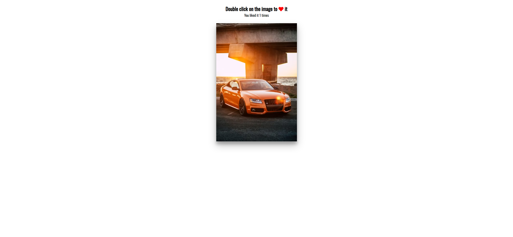

Your job is to design a webpage that allows users to double-click on an image to "like" it, represented by a heart icon. The initial webpage should be as shown below:


### Requirements:

1. **HTML Structure**:
    - The webpage should have a heading `<h3>` with the text "Double click on the image to" followed by a heart icon.
    - Below the heading, there should be a `<small>` tag displaying the text "You liked it" followed by a `<span>` with the ID `times` to show the number of times the image has been liked.
    - There should be a `div` with the class `loveMe` which will contain the image.

2. **CSS Styling**:
    - Use the Google Font `Oswald` for the entire webpage.
    - The body should have a text-align center, no overflow, and no margin.
    - The heading `<h3>` and `<small>` should be centered.
    - The heart icon should be red.
    - The `div` with class `loveMe` should have a specific height and width, and the background image should be:
      ```
      img.png
      ```
      - The background image should be centered and cover the entire `div`.
      - The `div` should have a cursor pointer, be centered on the page, and have a box-shadow.
    - The heart icon inside the `div` should be positioned absolutely and have an animation to grow and fade out.

3. **JavaScript Functionality**:
    - When the `div` with class `loveMe` is double-clicked, a heart icon should appear at the click position and then disappear after 1 second.
    - The number of times the image has been liked should be updated in the `<span>` with ID `times`.

### Interaction:

- The user should be able to double-click on the image to like it. After double-clicking, the webpage should look like this:



### Additional Details:

- The provided screenshots are rendered under a resolution of 1920x1080.
- Use the following IDs and class names for elements:
  - Use ID `times` for the `<span>` that displays the number of likes.
  - Use class name `loveMe` for the `div` containing the image.
  - Use class name `fa-heart` for the heart icon.

### Animations:

- The heart icon should grow and fade out over 0.6 seconds when it appears.

By following these instructions, you should be able to re-implement the webpage as described. Good luck!
