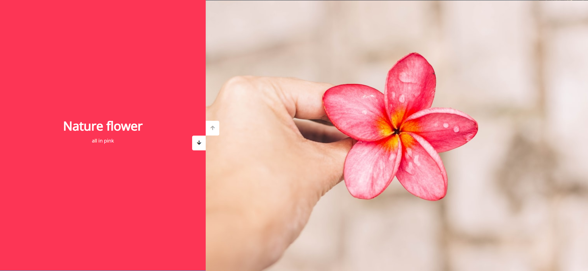
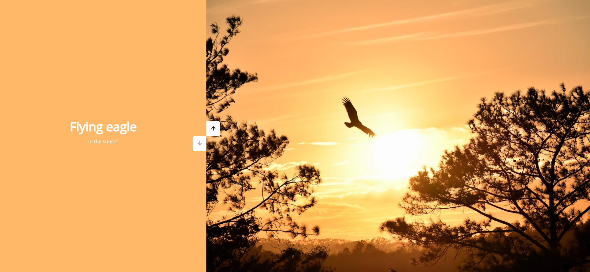

# Task Description: Vertical Slider Webpage

Your job is to design a webpage that features a vertical slider with images and text. The webpage should have interactive buttons to navigate through the slides. Below are the detailed instructions and resources required to re-implement the webpage.

## Initial Webpage

The initial webpage should look like this:

This screenshot is rendered under a resolution of 1920x1080.

## Layout and Structure

1. **HTML Structure**:
    - The webpage should have a `div` with class `slider-container` that contains all the elements of the slider.
    - Inside the `slider-container`, there should be two main `div` elements:
        - `left-slide`: This will contain the text content for each slide.
        - `right-slide`: This will contain the background images for each slide.
    - There should also be a `div` with class `action-buttons` that contains two buttons for navigation:
        - `down-button`: For navigating to the next slide.
        - `up-button`: For navigating to the previous slide.

2. **Text Content**:
    - The `left-slide` should contain four `div` elements, each with a unique background color and text content:
        - First `div`: 
            - Text: 
                - `h1`: "Nature flower"
                - `p`: "all in pink"
        - Second `div`: 
            - Text: 
                - `h1`: "Bluuue Sky"
                - `p`: "with it's mountains"
        - Third `div`: 
            - Text: 
                - `h1`: "Lonely castle"
                - `p`: "in the wilderness"
        - Fourth `div`: 
            - Text: 
                - `h1`: "Flying eagle"
                - `p`: "in the sunset"

3. **Images**:
    - The `right-slide` should contain four `div` elements, each with a unique background image:
        - First `div`: 
            - Background image: `url('resource1.png')`
        - Second `div`: 
            - Background image: `url('resource2.png')`
        - Third `div`: 
            - Background image: `url('resource3.png')`
        - Fourth `div`: 
            - Background image: `url('resource4.png')`

## Styling

1. **Fonts and Icons**:
    - Use the `Open Sans` font from Google Fonts.
    - Use Font Awesome for the arrow icons in the buttons.

## Interactions

1. **Buttons**:
    - The `down-button` should have the class `down-button`.
    - The `up-button` should have the class `up-button`.

2. **JavaScript**:
    - Implement the functionality to change slides when the buttons are clicked.
    - The slides should transition smoothly with a 0.5s ease-in-out effect.
    - When the `down-button` is clicked, the slides should move down.
    - When the `up-button` is clicked, the slides should move up.

## Screenshots After Interactions

1. **After Clicking Down Button**:
    - The webpage should look like this after clicking the down button:

    

2. **After Clicking Up Button**:
    - The webpage should look like this after clicking the up button:

    

These screenshots are rendered under a resolution of 1920x1080.

## Resources

- **Images**:
    - `resource1.png`
    - `resource2.png`
    - `resource3.png`
    - `resource4.png`

- **Text Content**:
    - "Nature flower"
    - "all in pink"
    - "Bluuue Sky"
    - "with it's mountains"
    - "Lonely castle"
    - "in the wilderness"
    - "Flying eagle"
    - "in the sunset"

- **Fonts and Icons**:
    - Font: `Open Sans` from Google Fonts
    - Icons: Font Awesome

Follow these instructions to re-implement the vertical slider webpage. Ensure that the layout, styling, and interactions match the provided screenshots and descriptions.
