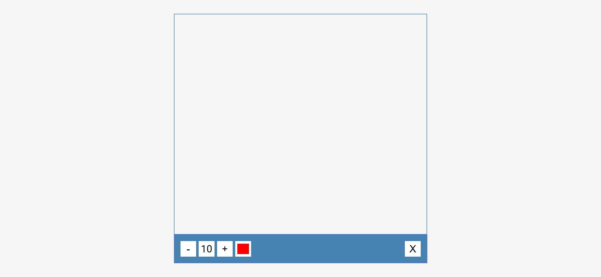
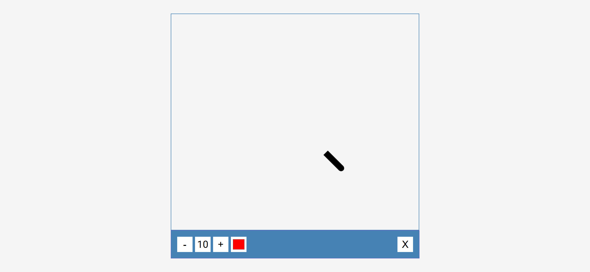

# Drawing App Implementation Task

Your task is to design a simple drawing application webpage. The webpage should allow users to draw on a canvas, change the brush size, change the brush color, and clear the canvas. Below are the detailed requirements and resources needed to re-implement the webpage.

## Initial Webpage

The initial webpage should look like this:


This screenshot is rendered under a resolution of 1920x1080.

## HTML Structure

The HTML structure should include:
- A `<canvas>` element with ID `canvas` and dimensions 800x700.
- A `div` element with class `toolbox` containing:
  - A button with ID `decrease` for decreasing brush size.
  - A `span` element with ID `size` to display the current brush size.
  - A button with ID `increase` for increasing brush size.
  - An input element of type `color` with ID `color` for selecting brush color.
  - A button with ID `clear` for clearing the canvas.

## CSS Styling

Use the following CSS styling:
- Import the Roboto font from Google Fonts.

## JavaScript Functionality

Implement the following functionalities using JavaScript:
- Drawing on the canvas with the mouse.
- Increasing and decreasing the brush size using the buttons with IDs `increase` and `decrease`.
- Changing the brush color using the input element with ID `color`.
- Clearing the canvas using the button with ID `clear`.

## Interaction Steps

1. **Increase Brush Size**:
   - Click the button with ID `increase`.
   - The brush size should increase and be displayed in the `span` with ID `size`.
   - 

2. **Decrease Brush Size**:
   - Click the button with ID `decrease`.
   - The brush size should decrease and be displayed in the `span` with ID `size`.
   - 

3. **Change Brush Color**:
   - Change the color using the input element with ID `color`.
   - The brush color should change to the selected color.
   - 

4. **Draw on Canvas**:
   - Click and drag the mouse on the canvas to draw.
   - The drawing should appear on the canvas.
   - 

5. **Clear Canvas**:
   - Click the button with ID `clear`.
   - The canvas should be cleared.
   - 

## Resources

- **Google Fonts**: Import the Roboto font using the following URL:
  ```css
  @import url('https://fonts.googleapis.com/css2?family=Roboto:wght@400;700&display=swap');
  ```

- **Text Content**:
  
  - The initial brush size displayed in the `span` with ID `size` is `10`.

By following the above instructions, you should be able to re-implement the drawing application webpage successfully.
