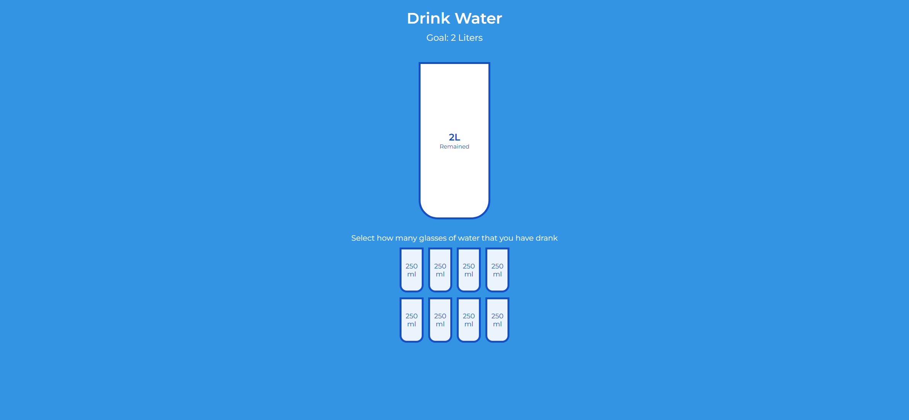
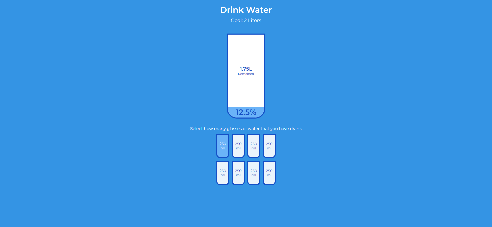
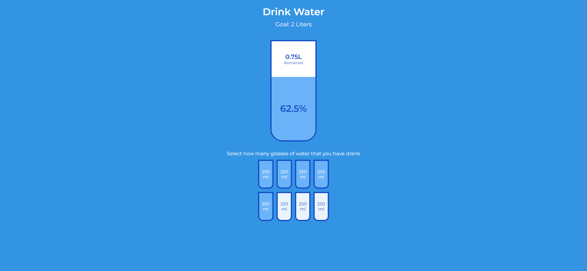

# Task Description: Drink Water Webpage

Your job is to design a webpage that helps users track their daily water intake. The webpage should have interactive elements that allow users to select the number of glasses of water they have consumed. Below are the detailed requirements and resources needed to re-implement the webpage.

## Initial Webpage

The initial webpage should look like this:



This screenshot is rendered under a resolution of 1920x1080.

## Resources

### Fonts
- Use the Montserrat font from Google Fonts:
  ```css
  @import url('https://fonts.googleapis.com/css?family=Montserrat:400,600&display=swap');
  ```

### Text Content
- The main heading text is "Drink Water".
- The subheading text is "Goal: 2 Liters".
- The instruction text is "Select how many glasses of water that you have drank".
- Each small cup has the text "250 ml".

## Layout and Styling

### Body
- Use a flexbox layout to center the content vertically and horizontally.
- Use the Montserrat font family.

### Cups Container
- Use class name `cups` for the container of small cups.
- The container should use flexbox to align and justify the small cups in the center.

### Remained Section
- Use ID `remained` for the remaining water section.
- The section should be centered with flexbox and should have a transition effect of `0.3s ease`.

### Percentage Section
- Use ID `percentage` for the percentage section.
- The section should have a transition effect of `0.3s ease`.

## Interactions

### JavaScript
- Use the provided JavaScript code to handle the interactions.
- The small cups should be clickable and should fill up when clicked.
- The main cup should update to show the percentage of water consumed and the remaining liters.

## Screenshots After Interactions

1. After clicking the first cup:
   

5. After clicking the fifth cup:
   

These screenshots are rendered under a resolution of 1920x1080.

## Summary

- Design a webpage with a main heading, subheading, and instruction text.
- Create a main cup and eight small cups for tracking water intake.
- Implement the provided JavaScript to handle interactions.
- Ensure the layout and styling match the provided descriptions and screenshots.

Good luck with your implementation!
