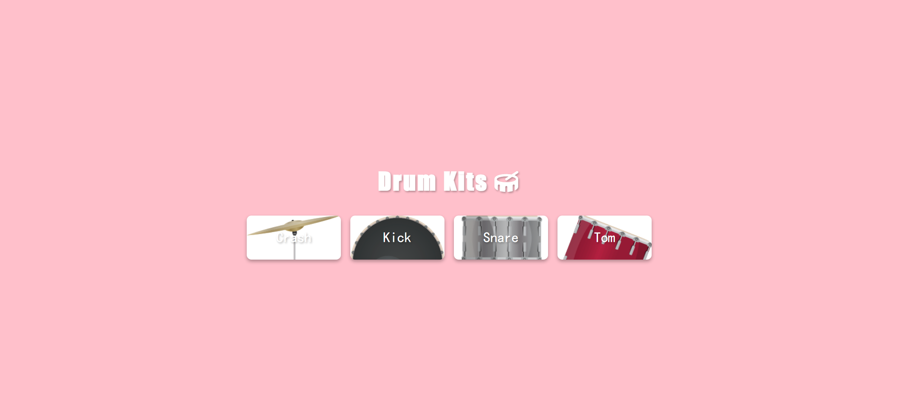

Your job is to design a webpage that simulates a drum kit. The webpage should allow users to click on buttons or press specific keys to play different drum sounds. Below are the detailed instructions to re-implement the webpage.

### Initial Webpage
The initial webpage should look like this:

### HTML Structure
1. The webpage should have a title "Drum Kits" with a drum icon next to it.
2. There should be a container to hold the drum kit buttons.

### CSS Styling
1. The body should have a pink background and the content should be centered both vertically and horizontally.
2. The title should have a font size of 50px, use the Impact font family, and have a white color with a shadow effect.
3. The container should have centered text alignment.
4. Each button should have padding, a white background, rounded corners, and a shadow effect. The button text should be white with a shadow effect and use the cursive font family.
5. When a button is hovered over, its text color should change to pink.
6. When a button is clicked, its background size should increase slightly.

### JavaScript Functionality
1. Create an array of drum kit names: `["crash", "kick", "snare", "tom"]`.
2. For each drum kit, create a button with the class `btn` and set its background image to the corresponding drum image (`images/crash.png`, `images/kick.png`, etc.).
3. Create an audio element for each drum kit with the source set to the corresponding sound file (`sounds/crash.mp3`, `sounds/kick.mp3`, etc.).
4. Add a click event listener to each button to play the corresponding sound.
5. Add a keydown event listener to the window to play the corresponding sound when the first letter of the drum kit name is pressed.

### Resources
- Font Awesome for the drum icon: `<link crossorigin="anonymous" href="https://cdnjs.cloudflare.com/ajax/libs/font-awesome/6.0.0-beta2/css/all.min.css" integrity="sha512-YWzhKL2whUzgiheMoBFwW8CKV4qpHQAEuvilg9FAn5VJUDwKZZxkJNuGM4XkWuk94WCrrwslk8yWNGmY1EduTA==" referrerpolicy="no-referrer" rel="stylesheet"/>`
- Background images for buttons: `images/crash.png`, `images/kick.png`, `images/snare.png`, `images/tom.png`
- Sound files for buttons: `sounds/crash.mp3`, `sounds/kick.mp3`, `sounds/snare.mp3`, `sounds/tom.mp3`

### Additional Notes
- The provided screenshots are rendered under a resolution of 1920x1080.
- Use the following class names and IDs for elements:
  - Use class name `container` for the container holding the buttons.
  - Use class name `btn` for each drum kit button.
- Describe any animations such as button scaling when clicked.

