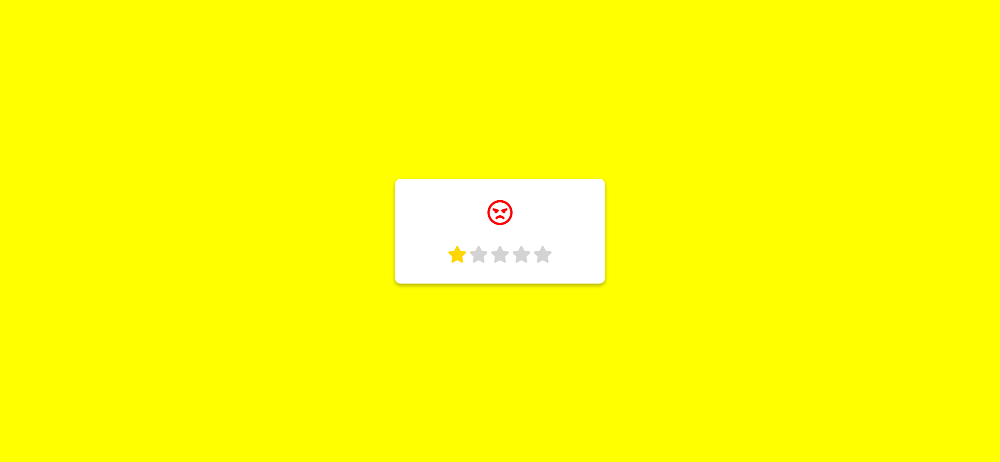
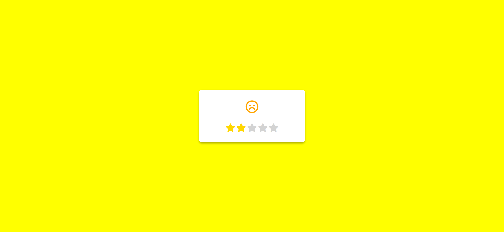
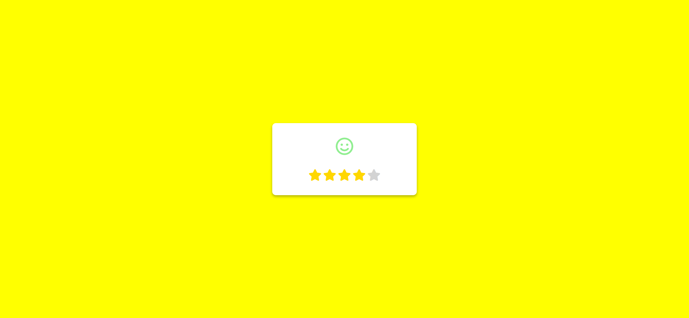

# Emoji Rating Webpage Implementation Task

Your task is to design a webpage that allows users to rate their experience using a 5-star rating system. Each star rating corresponds to a different emoji and color. The webpage should be interactive, updating the displayed emoji and star colors based on the user's rating.

## Initial Webpage

The initial webpage should look like this:


This screenshot is rendered under a resolution of 1920x1080.

## Resources

- **Font Awesome**: Used for the star and emoji icons. Include the following link in your HTML file to use Font Awesome icons:
  ```html
  <link crossorigin="anonymous" href="https://cdnjs.cloudflare.com/ajax/libs/font-awesome/6.0.0-beta2/css/all.min.css" integrity="sha512-YWzhKL2whUzgiheMoBFwW8CKV4qpHQAEuvilg9FAn5VJUDwKZZxkJNuGM4XkWuk94WCrrwslk8yWNGmY1EduTA==" referrerpolicy="no-referrer" rel="stylesheet"/>
  ```

## Layout and Styling

- The main container should be centered both vertically and horizontally.
- The container should have a shadow effect for a 3D appearance.
- The emoji container should be centered horizontally within the main container and positioned near the top.
- The rating container should be centered horizontally within the main container and positioned near the bottom.
- The stars should be light gray by default and turn gold when active.
- The emojis should change color based on the rating.

## HTML Structure

- Use a `div` with class `feedback-container` to hold the entire rating system.
- Inside the `feedback-container`, use a `div` with class `emoji-container` to hold the emojis.
- Use the following Font Awesome icons for the emojis:
  - Angry: `<i class="far fa-angry fa-3x"></i>`
  - Frown: `<i class="far fa-frown fa-3x"></i>`
  - Meh: `<i class="far fa-meh fa-3x"></i>`
  - Smile: `<i class="far fa-smile fa-3x"></i>`
  - Laugh: `<i class="far fa-laugh fa-3x"></i>`
- Use another `div` with class `rating-container` to hold the stars.
- Use the following Font Awesome icons for the stars:
  - `<i class="fas fa-star fa-2x"></i>`

## CSS Styling

- Ensure the following styles are applied:
  - The body should have no margin, be displayed as flex, and be centered.
  - The `feedback-container` should have a white background, specific dimensions, shadow, and rounded corners.
  - The `emoji-container` should be centered horizontally and positioned near the top.
  - The `rating-container` should be centered horizontally and positioned near the bottom.
  - The stars should be light gray by default and gold when active.
  - The emojis should change color based on the rating.

## JavaScript Interactivity

- Implement the following functionality:
  - When a star is clicked, update the rating by changing the color of the stars and the displayed emoji.
  - Use the `updateRating` function to handle the rating update.
  - The `updateRating` function should:
    - Add the `active` class to stars up to the clicked star.
    - Remove the `active` class from stars after the clicked star.
    - Change the emoji's position and color based on the rating.

## Interaction Screenshots

Here are the screenshots after each star is clicked:

- After clicking the 1st star:
  

- After clicking the 2nd star:
  

- After clicking the 3rd star:
  

- After clicking the 4th star:
  

- After clicking the 5th star:
  

## Element Identifiers

- Use class name `feedback-container` for the main container.
- Use class name `emoji-container` for the emoji container.
- Use class name `rating-container` for the rating container.
- Use class name `far` for the emoji icons.
- Use class name `fa-star` for the star icons.
- Use class name `active` for the active stars.

Follow these instructions to re-implement the webpage. Good luck!
