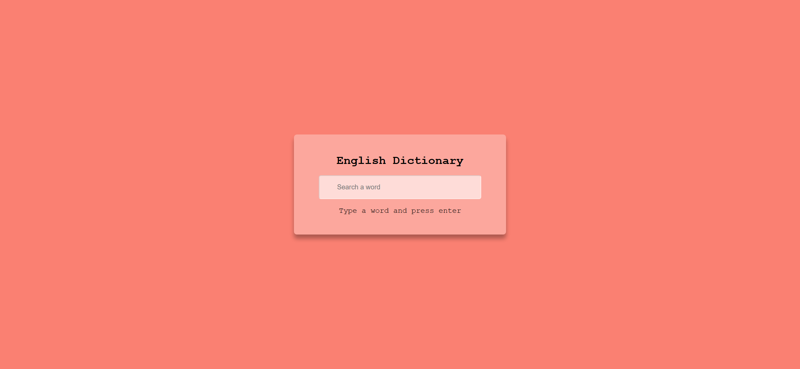
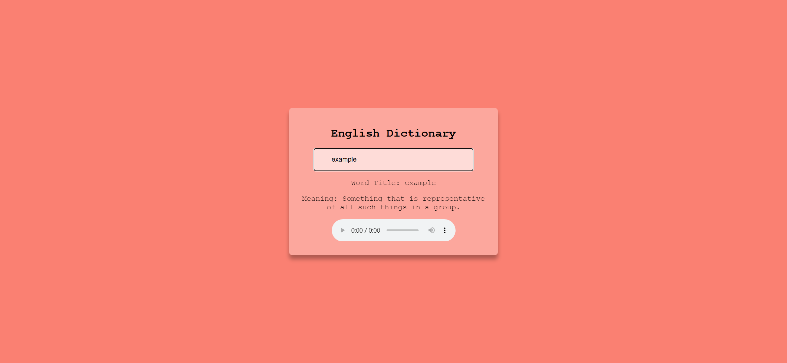

# Task Description: English Dictionary Webpage

Your job is to design a webpage that functions as an English Dictionary. The webpage should allow users to search for the meaning of a word and display the result, including the word's meaning and pronunciation audio if available. Below are the detailed requirements and resources needed to re-implement the webpage.

## Initial Webpage

The initial webpage should look like this:

This screenshot is rendered under a resolution of 1920x1080.

### Layout and Styling

- The webpage should have a salmon-colored background.
- Use the font family `'Courier New', Courier, monospace` for all text.

### Elements

- Use class name `container` for the main container.
- Use class name `heading` for the heading text "English Dictionary".
- Use class name `input` and ID `input` for the input field where users can type the word to search.
- Use class name `info-text` and ID `info-text` for the paragraph that provides instructions or status messages.
- Use class name `meaning-container` and ID `meaning-container` for the container that will display the search results.
- Use class name `title` and ID `title` for the span that will display the word title.
- Use class name `meaning` and ID `meaning` for the span that will display the word meaning.
- Use ID `audio` for the audio element that will play the pronunciation of the word.

### Text Content

- The initial text content for the info-text paragraph should be: "Type a word and press enter".
- The initial text content for the title and meaning spans should be: "___".

## Interaction

### Searching for a Word

When a user types a word into the input field and presses Enter, the webpage should fetch the meaning of the word from the Dictionary API (`https://api.dictionaryapi.dev/api/v2/entries/en/{word}`) and display the result.

### After Searching

After searching for the word "example", the webpage should look like this:

This screenshot is rendered under a resolution of 1920x1080.

### API Response Handling

- If the API returns a valid result, display the word title, meaning, and pronunciation audio.
- If the API does not return a valid result, display "N/A" for the meaning and hide the audio element.
- If an error occurs during the API request, display the message "an error happened, try again later" in the info-text paragraph.

### Event Listeners

- Add an event listener to the input field to listen for the "Enter" key press. When the Enter key is pressed, fetch the meaning of the word using the Dictionary API.

## Resources

- The Dictionary API endpoint: `https://api.dictionaryapi.dev/api/v2/entries/en/{word}`
