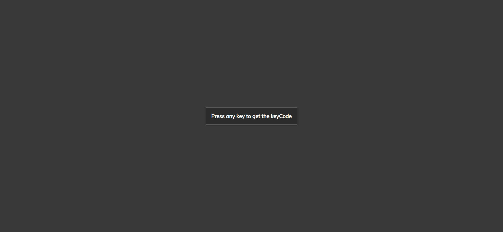
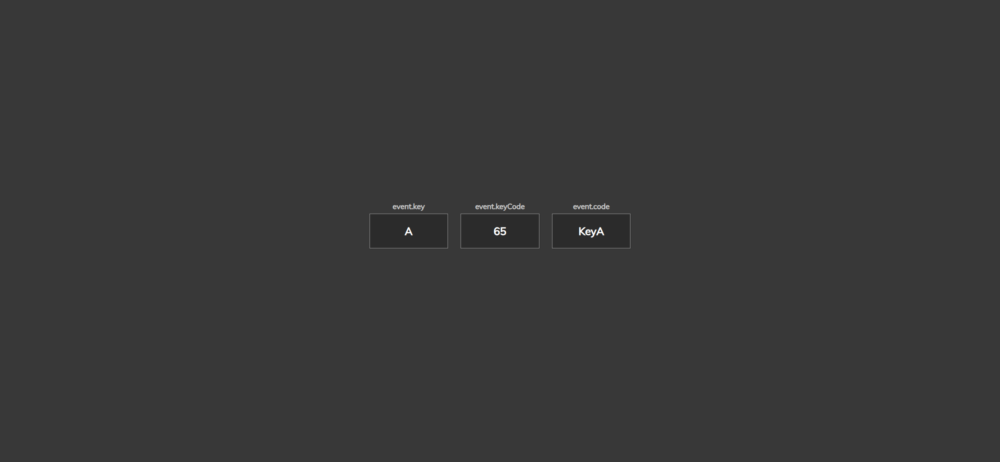
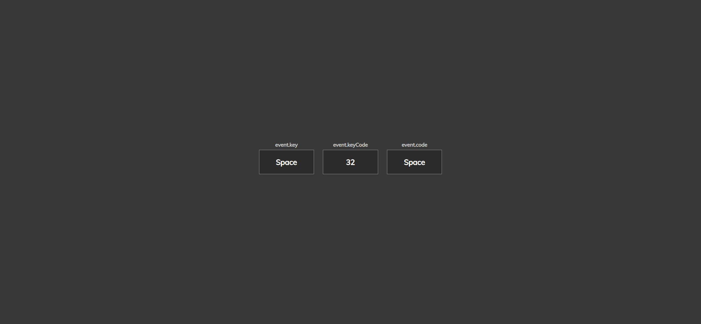

# Task Description: Event KeyCodes Webpage

Your job is to design a webpage that displays the key, keyCode, and code of any key pressed by the user. The initial webpage should be:

## Requirements

### HTML Structure
- The webpage should have a `div` with the ID `insert`.
- Inside the `div`, there should be another `div` with the class `key` and the text "Press any key to get the keyCode".

### CSS Styling
- Use the Google Font `Muli` from the URL: `https://fonts.googleapis.com/css?family=Muli&display=swap`.

### JavaScript Functionality
- Add an event listener for the `keydown` event on the `window` object.
- When a key is pressed, the content of the `insert` div should be updated to display three `div` elements with the class `key`:
  - The first `div` should display the key pressed (use "Space" if the spacebar is pressed) and a `small` element with the text `event.key`.
  - The second `div` should display the keyCode of the key pressed and a `small` element with the text `event.keyCode`.
  - The third `div` should display the code of the key pressed and a `small` element with the text `event.code`.

### Interaction Screenshots
- When the 'A' key is pressed, the webpage should look like this:

- When the 'Space' key is pressed, the webpage should look like this:

### Additional Notes
- The provided screenshots are rendered under a resolution of 1920x1080.
- Ensure that the IDs, class names, and text content are used exactly as specified to pass the auto-testing.
