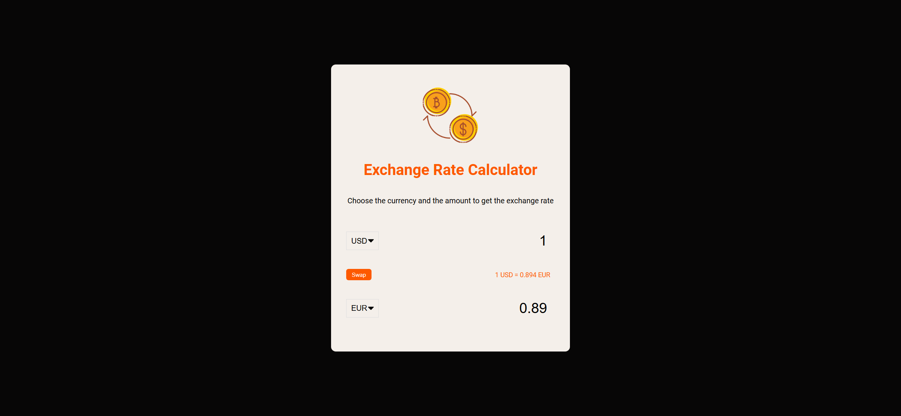
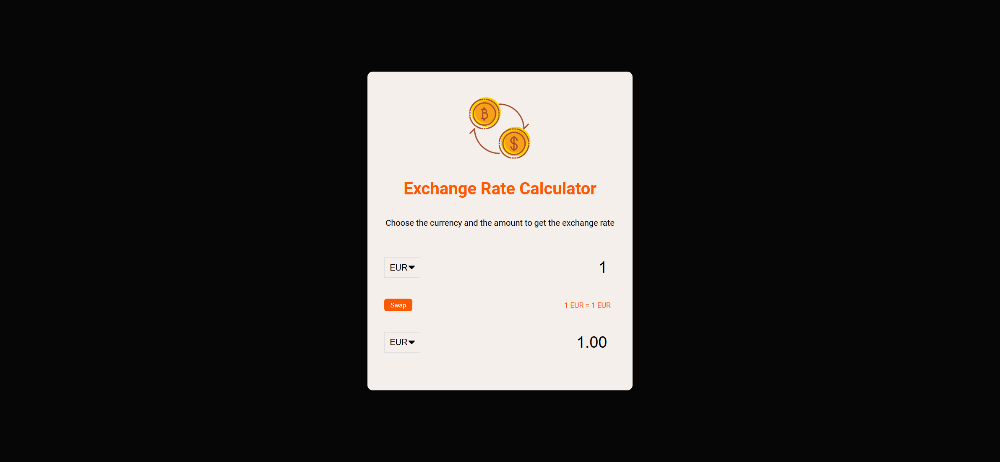
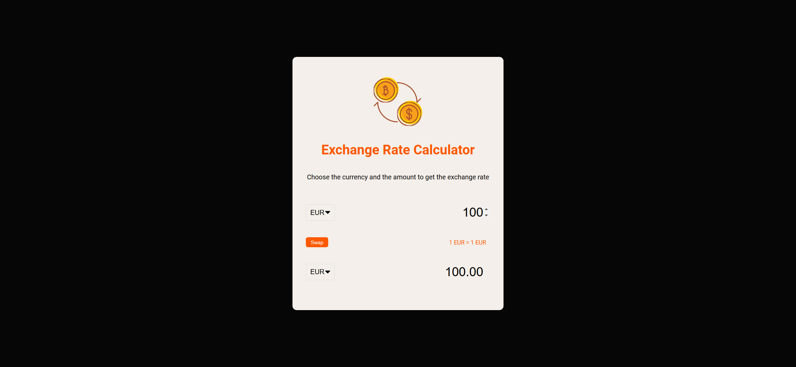
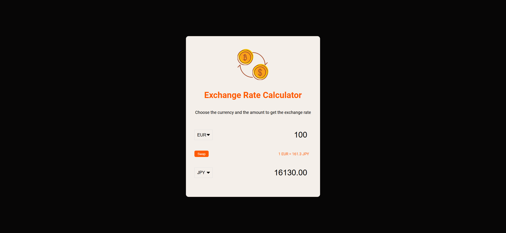
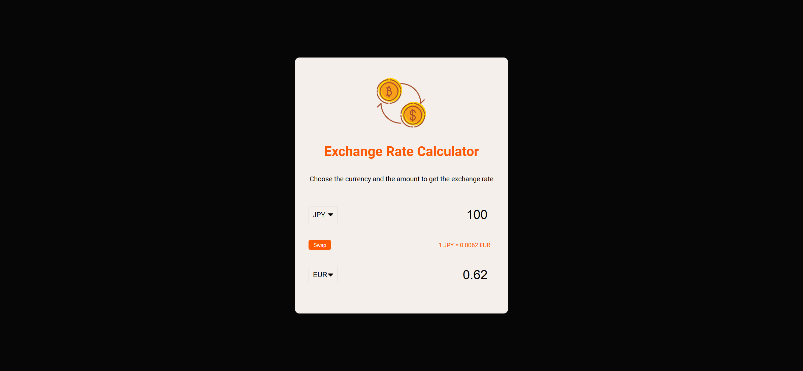

# Task Description: Exchange Rate Calculator Webpage

Your job is to design a webpage that functions as an exchange rate calculator. The webpage should allow users to select two different currencies, input an amount for the first currency, and then display the equivalent amount in the second currency based on the current exchange rate. Additionally, users should be able to swap the selected currencies and see the updated exchange rate and amount.

## Initial Webpage

The initial webpage should look like this:



### Resources

1. **Image**: `resource1.png` is used for the background image of the exchange rate calculator.
2. **Font**: The webpage uses the "Roboto" font, which can be imported from Google Fonts using the following URL:
   ```css
   @import url("https://fonts.googleapis.com/css2?family=Roboto:wght@400;700&display=swap");
   ```
3. **Text Content**:
   - The main heading text is "Exchange Rate Calculator".
   - The paragraph text is "Choose the currency and the amount to get the exchange rate".

### Layout and Styling

- The main container should have a class `wrapper` and should be centered both vertically and horizontally.

### Interactive Elements

1. **Currency Selection**:
   - Use ID `currency-one` for the first currency dropdown.
   - Use ID `currency-two` for the second currency dropdown.

2. **Amount Input**:
   - Use ID `amount-one` for the input field of the first currency.
   - Use ID `amount-two` for the input field of the second currency.

3. **Swap Button**:
   - Use ID `swap` for the button that swaps the selected currencies.

4. **Exchange Rate Display**:
   - Use ID `rate` for the element that displays the exchange rate.

### User Interactions

The following user interactions should be implemented:

1. **Select First Currency**:
   - When the user selects a currency from the first dropdown (`currency-one`), the exchange rate and the equivalent amount in the second currency should be updated.
   - Screenshot after selecting the first currency:
     

2. **Input Amount in First Currency**:
   - When the user inputs an amount in the first currency input field (`amount-one`), the equivalent amount in the second currency should be updated.
   - Screenshot after inputting amount in the first currency:
     

3. **Select Second Currency**:
   - When the user selects a currency from the second dropdown (`currency-two`), the exchange rate and the equivalent amount in the second currency should be updated.
   - Screenshot after selecting the second currency:
     

4. **Swap Currencies**:
   - When the user clicks the swap button (`swap`), the selected currencies should be swapped, and the exchange rate and the equivalent amount should be updated accordingly.
   - Screenshot after swapping currencies:
     


### API Usage

- The exchange rates should be fetched from the ExchangeRate-API using the following endpoint:
  ```
  https://api.exchangerate-api.com/v4/latest/{currency_code}
  ```
  Replace `{currency_code}` with the code of the selected currency.

### Resolution

The provided screenshots are rendered under a resolution of 1920x1080.

### Animations

- No specific animations are required for this task.
