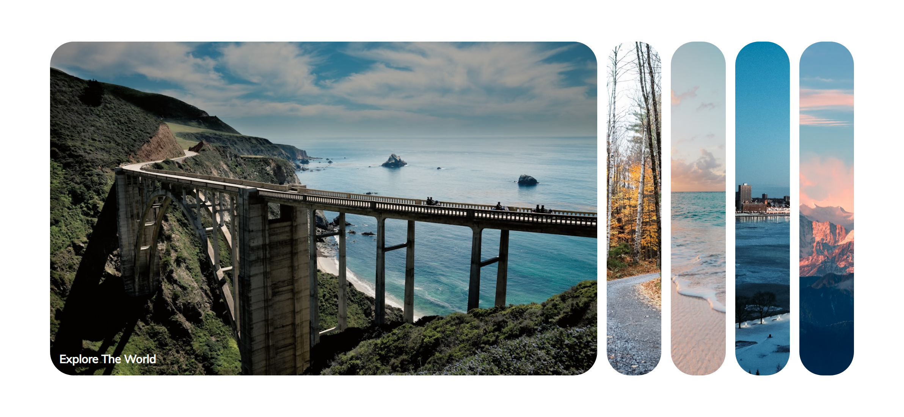
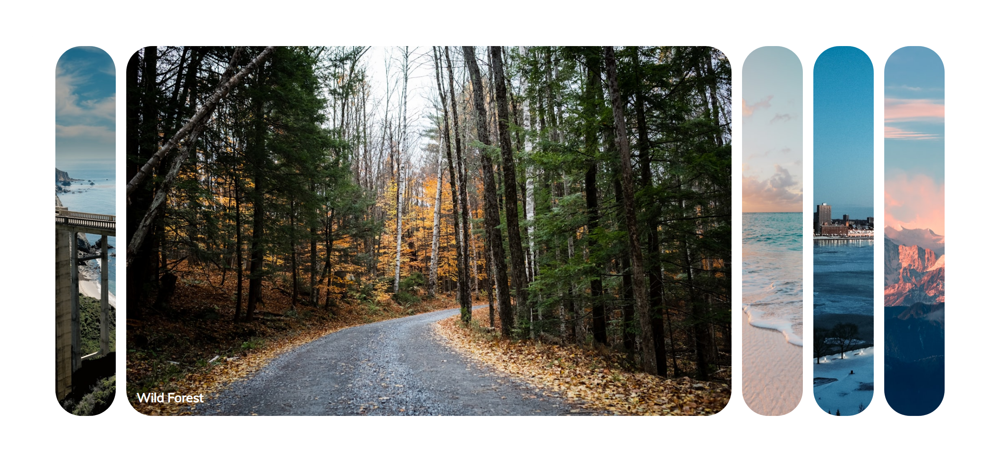
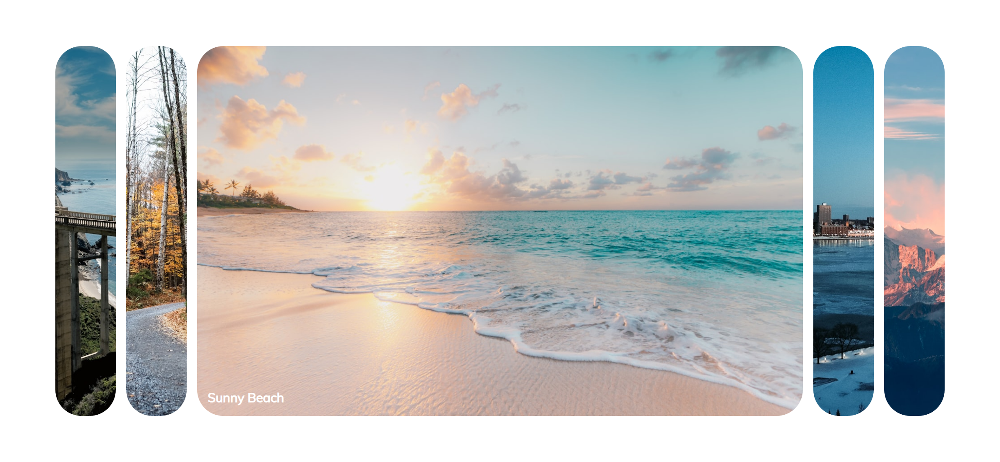
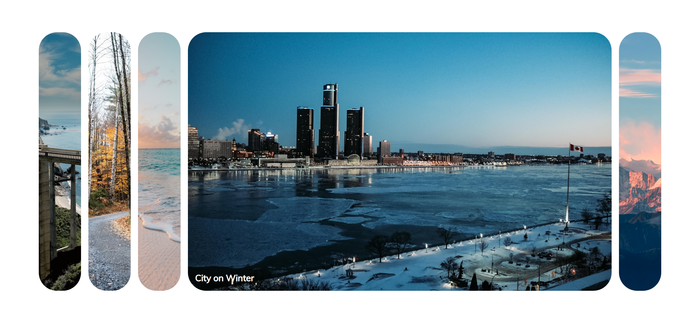

# Task Description: Expanding Cards Webpage

Your job is to design a webpage that features a set of expanding cards. The cards will expand when clicked, revealing more content. The initial webpage should look like this:

## Requirements

1. **HTML Structure**:
    - Create a `div` with the class `container`.
    - Inside the `container`, create five `div` elements with the class `panel`.
    - Each `panel` should have a `h3` element with the respective text content.
    - The `panel` elements should have background images as specified below.

2. **CSS Styling**:
    - Use the Google Font `Muli` for the entire webpage.
    - Each `panel` should:
        - Cover the background image.
    - When a `panel` has the class `active`, it should:
        - The `h3` inside should fade in with a transition effect.

3. **JavaScript Functionality**:
    - Add an event listener to each `panel` that:
        - Removes the `active` class from all panels.
        - Adds the `active` class to the clicked panel.

## Resources

- **Background Images**:
    - `resource1.png` for the first panel with the text "Explore The World".
    - `resource2.png` for the second panel with the text "Wild Forest".
    - `resource3.png` for the third panel with the text "Sunny Beach".
    - `resource4.png` for the fourth panel with the text "City on Winter".
    - `resource5.png` for the fifth panel with the text "Mountains - Clouds".

- **Text Content**:
    - First panel: "Explore The World"
    - Second panel: "Wild Forest"
    - Third panel: "Sunny Beach"
    - Fourth panel: "City on Winter"
    - Fifth panel: "Mountains - Clouds"

## Interaction Screenshots

The provided screenshots are rendered under a resolution of 1920x1080.

- After clicking the second panel:
    

- After clicking the third panel:
    

- After clicking the fourth panel:
    

- After clicking the fifth panel:
    

## Element Identifiers

- Use class name `container` for the main container.
- Use class name `panel` for each card.
- Use class name `active` for the expanded card.
- Use `h3` tags inside each `panel` for the text content.

Follow these guidelines to re-implement the webpage. Good luck!
