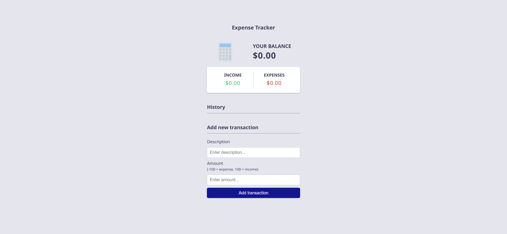
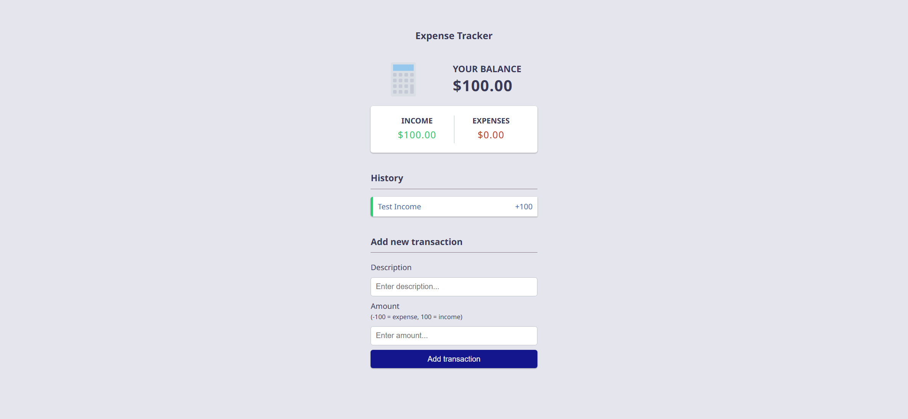
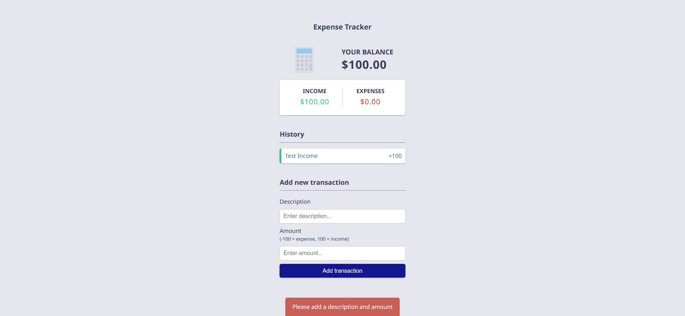

# Expense Tracker Webpage Implementation Guide

Your task is to re-implement an Expense Tracker webpage. This guide will provide you with the necessary details to recreate the webpage, including the layout, styles, and functionalities. The provided screenshots are rendered under a resolution of 1920x1080.

## Initial Webpage

The initial webpage should look like this:

## Layout and Structure

1. **Header Section**:
    - The header contains an image and a balance container.
    - The image source is `resource1.png` with alt text "Expense Tracker".
    - The balance container displays the text "Your Balance" and the current balance amount with ID `balance`.

2. **Income and Expense Section**:
    - This section contains two parts: Income and Expenses.
    - Each part displays a heading and the respective amount.
    - Use ID `money-plus` for the income amount and ID `money-minus` for the expense amount.

3. **History Section**:
    - This section displays the transaction history.
    - Use an unordered list with class `list` and ID `list` to list the transactions.

4. **Add New Transaction Section**:
    - This section contains a form to add new transactions.
    - The form has two input fields: one for the description (ID `text`) and one for the amount (ID `amount`).
    - The form also has a button with class `btn` to add the transaction.

5. **Notification Section**:
    - This section displays a notification message when the user tries to add a transaction without providing a description or amount.
    - Use a div with ID `notification` to display the notification message.

## Styles

- The webpage uses the "Noto Sans" font from Google Fonts.

## Functionalities

1. **Add Transaction**:
    - When the user submits the form, a new transaction should be added to the transaction history.
    - The balance, income, and expense amounts should be updated accordingly.
    - If the user tries to add a transaction without providing a description or amount, a notification should be displayed.

2. **Delete Transaction**:
    - Each transaction in the history should have a delete button.
    - When the delete button is clicked, the transaction should be removed from the history, and the balance, income, and expense amounts should be updated.

## Screenshots of Interactions

1. **After Adding a Transaction**:
    
- The webpage should look like this after adding a valid transaction:
    

    
2. **After Adding an Invalid Transaction**:
    - The webpage should look like this after attempting to add an invalid transaction:

    

3. **After Deleting a Transaction**:
    - The webpage should look like this after deleting a transaction:

    

## Resources

- **Image**: `resource1.png` is used for the header image.
- **Font**: "Noto Sans" from Google Fonts.

## IDs and Class Names

- Use ID `balance` for the balance amount.
- Use ID `money-plus` for the income amount.
- Use ID `money-minus` for the expense amount.
- Use ID `list` for the transaction history list.
- Use ID `text` for the description input field.
- Use ID `amount` for the amount input field.
- Use class `btn` for the add transaction button.
- Use ID `notification` for the notification message.

## Animations

- The notification message should appear and disappear with a fade effect.

By following this guide, you should be able to recreate the Expense Tracker webpage with the same layout, styles, and functionalities.
