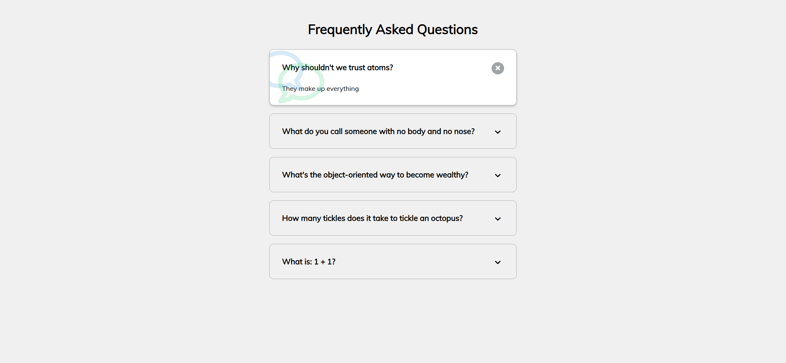
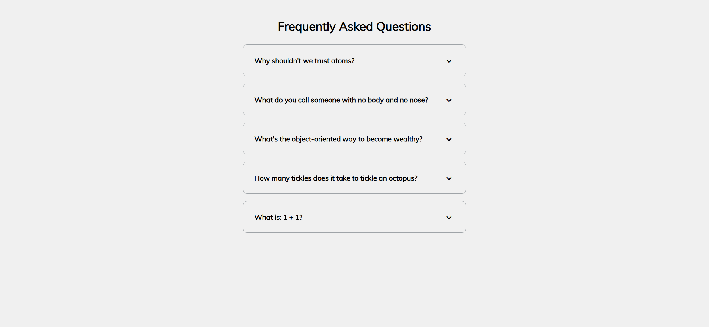
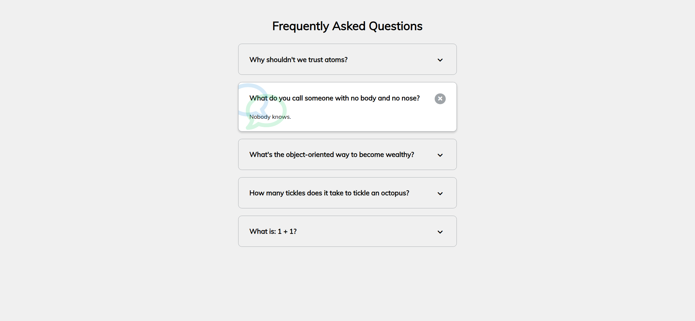
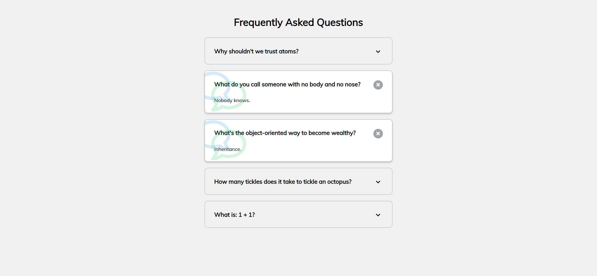
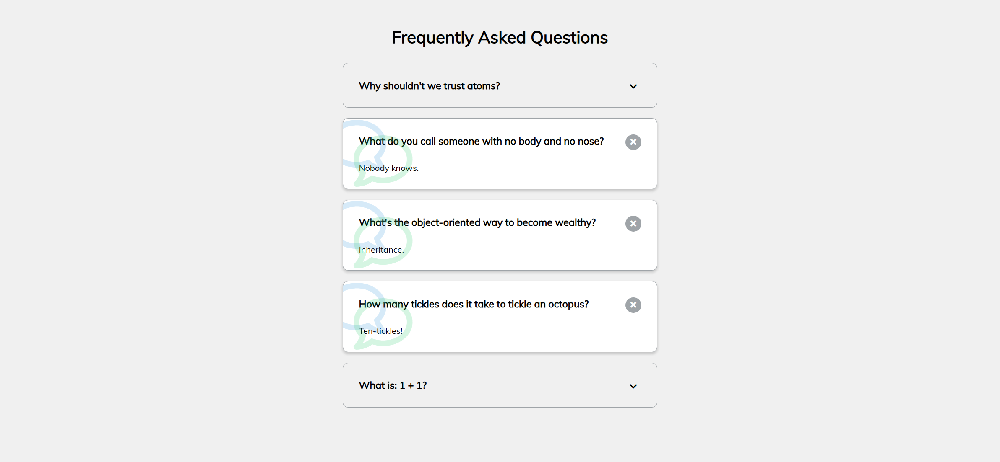
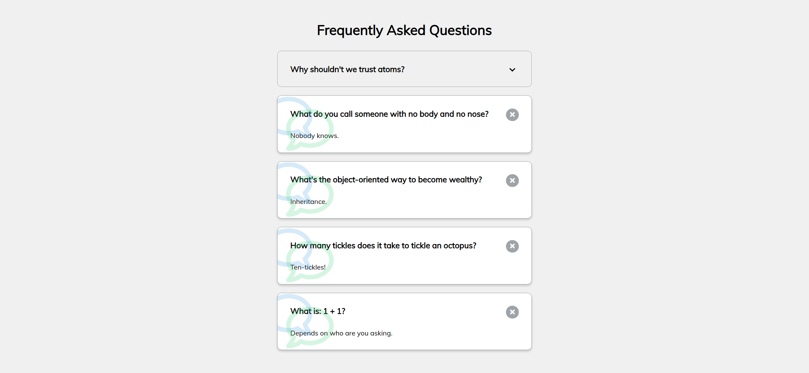

Your job is to design a webpage that displays a list of Frequently Asked Questions (FAQs) with toggle functionality to show or hide the answers. The initial webpage should be .

### Requirements:

1. **HTML Structure**:
    - The webpage should have a title "Frequently Asked Questions".
    - Each FAQ should be contained within a `div` with the class `faq`.
    - Each `faq` div should contain:
        - An `h3` element with the class `faq-title` for the question.
        - A `p` element with the class `faq-text` for the answer.
        - A `button` element with the class `faq-toggle` containing two `i` elements with Font Awesome icons (`fa-chevron-down` and `fa-times`).

2. **CSS Styling**:
    - Use the Google Font "Muli" for the entire webpage.
    - When an FAQ is active, it should have a white background, a box shadow, and display the answer text.
    
3. **JavaScript Functionality**:
    - Add an event listener to each `faq-toggle` button to toggle the `active` class on the parent `faq` div when clicked.

### Text Content:
- The text content for each FAQ is as follows:
    1. **Question**: "Why shouldn't we trust atoms?" **Answer**: "They make up everything."
    2. **Question**: "What do you call someone with no body and no nose?" **Answer**: "Nobody knows."
    3. **Question**: "What's the object-oriented way to become wealthy?" **Answer**: "Inheritance."
    4. **Question**: "How many tickles does it take to tickle an octopus?" **Answer**: "Ten-tickles!"
    5. **Question**: "What is: 1 + 1?" **Answer**: "Depends on who are you asking."

### Interactions:
- The provided screenshots are rendered under a resolution of (1920, 1080)..
- When the first FAQ is toggled, the state should look like .
- When the second FAQ is toggled, the state should look like .
- When the third FAQ is toggled, the state should look like .
- When the fourth FAQ is toggled, the state should look like .
- When the fifth FAQ is toggled, the state should look like .

### Specific Element Identifiers:
- Use class name `faq` for each FAQ container.
- Use class name `faq-title` for each FAQ question.
- Use class name `faq-text` for each FAQ answer.
- Use class name `faq-toggle` for each toggle button.
- Use Font Awesome icons `fa-chevron-down` and `fa-times` within the toggle button.

### External Resources:
- Font Awesome for icons: `<link rel="stylesheet" href="https://cdnjs.cloudflare.com/ajax/libs/font-awesome/5.14.0/css/all.min.css" integrity="sha512-1PKOgIY59xJ8Co8+NE6FZ+LOAZKjy+KY8iq0G4B3CyeY6wYHN3yt9PW0XpSriVlkMXe40PTKnXrLnZ9+fkDaog==" crossorigin="anonymous" />`
- Google Fonts for "Muli": `@import url('https://fonts.googleapis.com/css?family=Muli&display=swap');`
