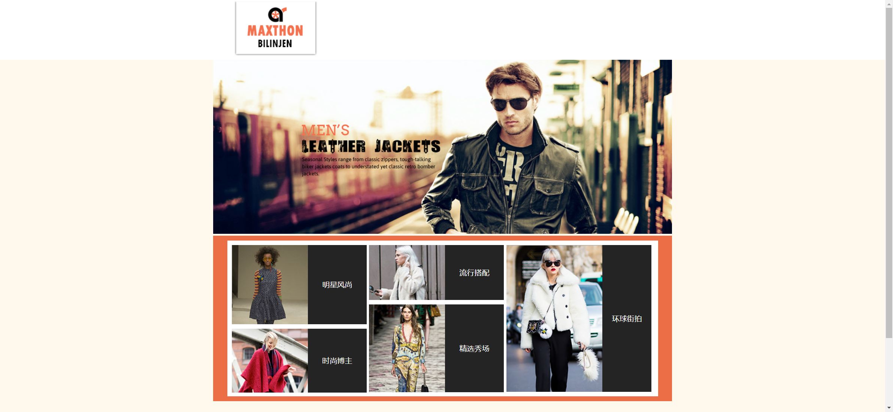
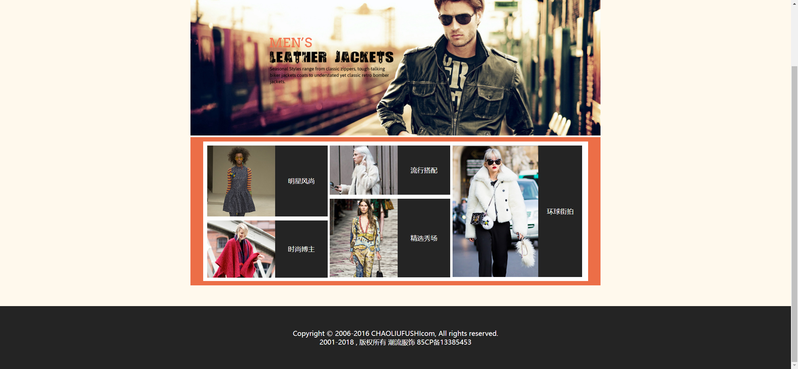

# Task Description for Re-implementing the Fashion Match Webpage

Your job is to design a webpage that replicates the provided fashion match webpage. The webpage consists of a navigation bar, a content section with various fashion categories, and a footer. Below are the detailed instructions and resources needed to re-implement the webpage.

## Initial Webpage
The initial webpage should look like this:


## Resources
- **Logo Image**: `images/logo.png` is used for the logo in the navigation bar.
- **Banner Image**: `images/banner.jpg` is used as the banner image in the content section.
- **Fashion Category Images**:
  - `images/pic01.jpg` for "明星风尚"
  - `images/pic02.jpg` for "时尚博主"
  - `images/pic03.jpg` for "流行搭配"
  - `images/pic04.jpg` for "精选秀场"
  - `images/pic05.jpg` for "环球街拍"
- **Background Images**:
  - `images/head_bg.jpg` for the navigation bar background.
  - `images/xuanfu.png` for the hover effect on navigation links.

## Layout and Styling
- **Navigation Bar**:
  - Use ID `nav` for the navigation bar.
  - Use class `dh` for the navigation links.
  - The navigation bar should have a background image (`images/head_bg.jpg`), be centered, and have a height of 128px.
  - Navigation links should have a hover effect with the background image (`images/xuanfu.png`).

- **Content Section**:
  - Use ID `content` for the main content section.
  - Use IDs `left`, `middle`, and `right` for the three columns within the container.
  - Each fashion category should be represented using `dl`, `dt`, and `dd` elements.
  
- **Footer**:
  - Use the `footer` tag for the footer section.
  - The footer should have a height of 150px, background color of `#242424`, and centered text.

## Interactions
- **Scrolling**:
  - The page should be scrollable. The screenshot after scrolling is:
    

  
  

## Text Content
- **Footer Text**:
  ```
  Copyright © 2006-2016 CHAOLIUFUSHIcom, All rights reserved.
  2001-2018 , 版权所有 潮流服饰 85CP备13385453
  ```

## Additional Notes
- The provided screenshots are rendered under a resolution of 1920x1080.
- Ensure that all interactive elements (click, hover) use the specified IDs or class names as mentioned above.
